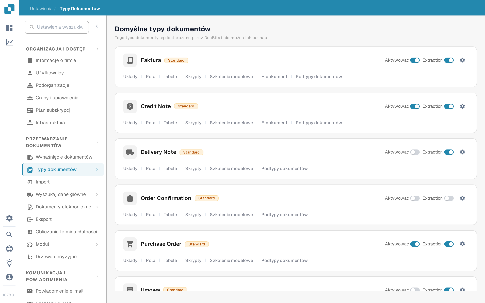
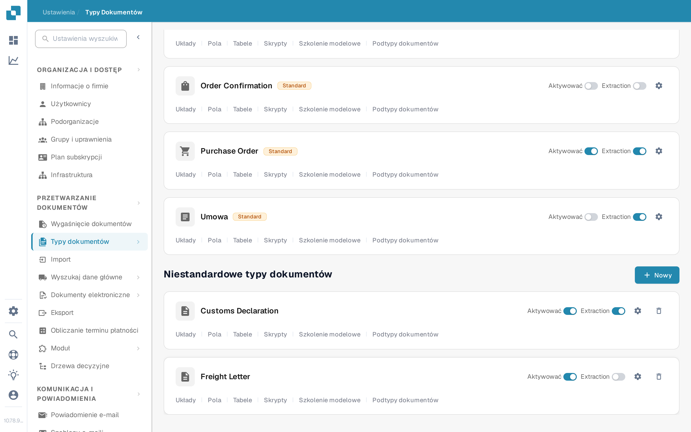
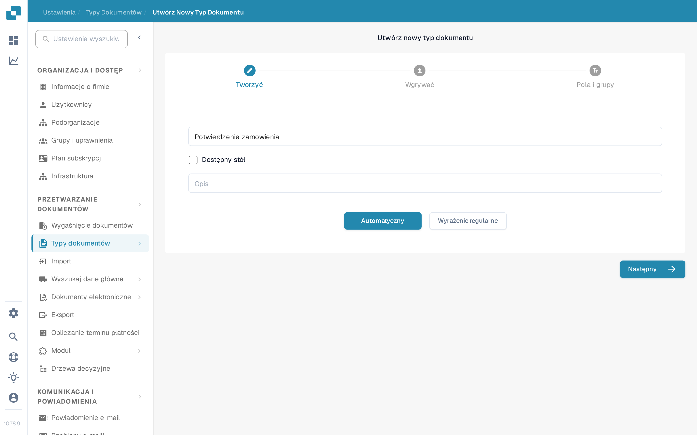

# Dodawanie i edytowanie typów dokumentów

Administratorzy mogą utworzyć niestandardowy typ dokumentu lub zmienić ustawienia istniejącego. Otwórz **Ustawienia → Przetwarzanie dokumentów → Typy dokumentów**. Strona oddziela wbudowane **Domyślne typy dokumentów** od **Niestandardowych typów dokumentów**.

<figure><figcaption>
Użyj karty typu dokumentu, aby otworzyć ustawienie, które chcesz zmienić.
</figcaption></figure>

## Tworzenie niestandardowego typu dokumentu

1. Przewiń do sekcji **Niestandardowe typy dokumentów** i wybierz **+ Nowy**. Otworzy się kreator **Utwórz Nowy Typ Dokumentu**. Domyślnych typów dostarczanych przez DocBits nie można usunąć; dla nowej kategorii utwórz typ niestandardowy.
2. W sekcji **Tworzyć** podaj czytelną **Nazwę** oraz **Opis**. Wybierz **Dostępny stół**, jeśli ten typ dokumentu ma zawierać tabele pozycji. Wybierz **Automatyczny** do szkolenia modelu na przykładowych dokumentach albo **Wyrażenie regularne** do rozpoznawania opartego na wzorcach.
3. Wybierz **Następny**, aby utworzyć typ dokumentu i kontynuować konfigurację. **Następny zapisuje nowy typ już w tym momencie**; nie jest to tylko podgląd. Unikaj wpisywania nazwy testowej w organizacji produkcyjnej.
4. Dla opcji **Automatyczny** wgraj co najmniej **10 przykładowych dokumentów** przed kontynuowaniem. Dla **Wyrażenia regularnego** utwórz co najmniej **dwa wzorce**. Wymagania te wynikają z obecnego procesu tworzenia. Szczegóły szkolenia opisuje sekcja [Szkolenie modelu](model-training/README.md).
5. W sekcji **Pola i grupy** utwórz potrzebne grupy i co najmniej jedno pole. Jeśli wybrano **Dostępny stół**, przejdź do **Tabel i kolumn** i skonfiguruj tabelę. Wybierz **Zakończ**, gdy wymagana konfiguracja jest gotowa.

<figure><figcaption>
Przycisk Nowy uruchamia kreatora niestandardowego typu dokumentu.
</figcaption></figure>

<figure><figcaption>
Wybierz typ i metodę rozpoznawania, zanim wybierzesz Następny.
</figcaption></figure>

## Edytowanie istniejącego typu dokumentu

Znajdź kartę typu w sekcji **Domyślne typy dokumentów** lub **Niestandardowe typy dokumentów**. Elementy na każdej karcie mają różne zadania:

| Element | Co robi |
| --- | --- |
| **Aktywować** | Włącza lub wyłącza przetwarzanie tego typu dokumentu. Przed zmianą sprawdź aktualny stan. |
| **Extraction** | Przełącza między trybami ekstrakcji **Flex** i **Fix**; nie włącza ani nie wyłącza typu dokumentu. Najedź kursorem na przełącznik, aby zobaczyć aktualny tryb. |
| **Ustawienia** (koło zębate) | Otwiera **Więcej ustawień** dla tego typu dokumentu. |
| **Układy** | Otwiera układ walidacji. Zobacz [Nawigacja w Menedżerze Układów](layout-manager/navigating-the-layout-manager.md). |
| **Pola** | Otwiera konfigurację pól. Zobacz [Dodawanie i Edytowanie Pól](fields/adding-and-editing-fields.md). |
| **Tabele** | Otwiera kolumny tabeli dla tego typu dokumentu. |
| **Skrypty** | Otwiera skrypty przetwarzania, gdy ta funkcja jest dostępna. |
| **Szkolenie modelowe** | Otwiera dane treningowe i opcje modelu. |
| **E-dokument** | Otwiera ustawienia dokumentów elektronicznych, jeśli są dostępne. Zobacz [Dokumenty elektroniczne](edi/README.md). |
| **Podtypy dokumentów** | Otwiera ustawienia podtypów; zobacz [Podtypy Dokumentów](document-sub-types.md). |

Linki widoczne na karcie zależą od włączonych funkcji organizacji i od typu dokumentu. Otwórz odpowiednią sekcję, wprowadź tam zamierzoną zmianę i sprawdź przykładowy dokument w widoku walidacji, zanim użyjesz zaktualizowanego typu w normalnym przetwarzaniu.
