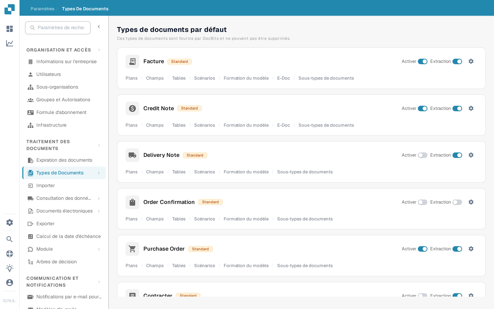
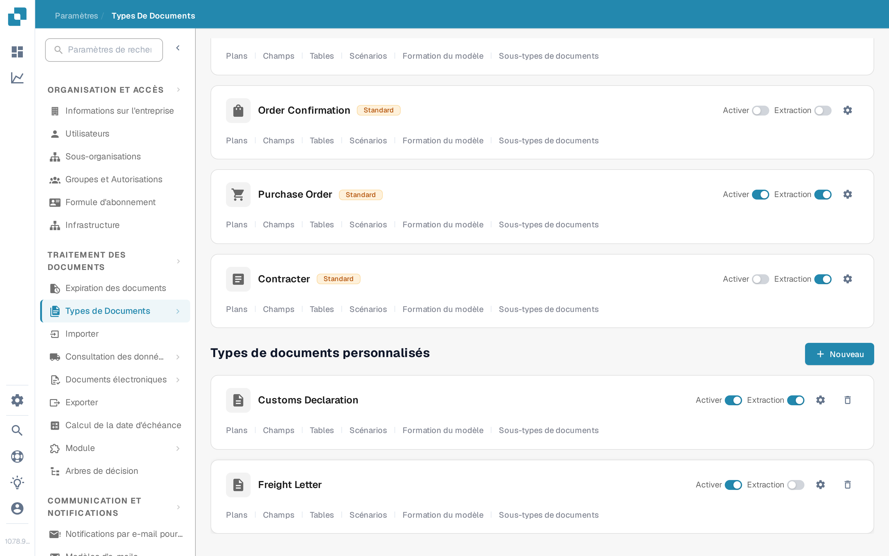
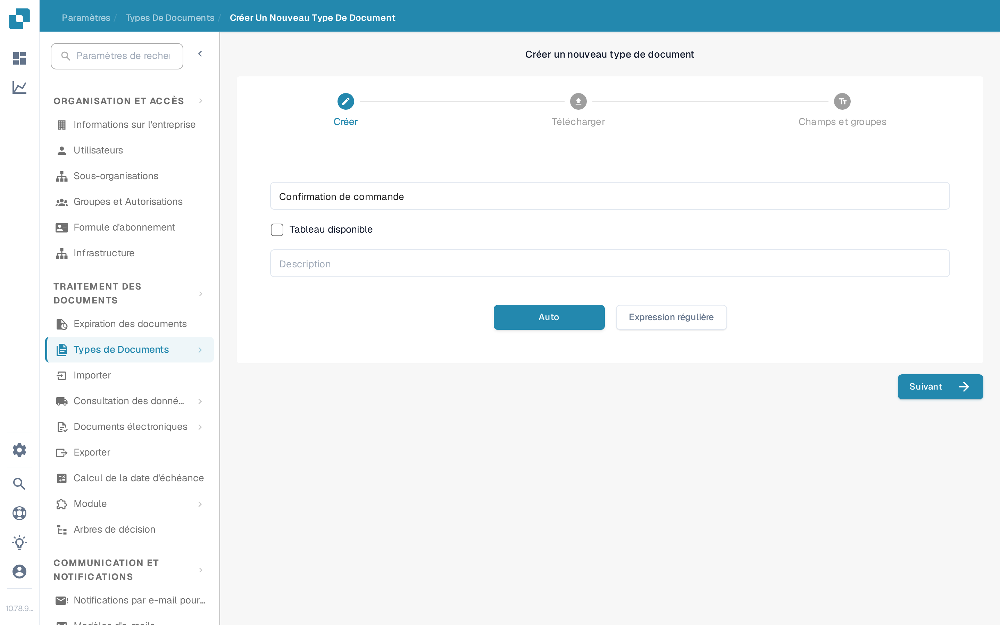

# Ajouter/Modifier des Types de Documents

Les administrateurs peuvent créer un type de document personnalisé ou modifier les paramètres d'un type existant. Ouvrez **Paramètres → Traitement des documents → Types de Documents**. La page sépare les **Types de documents par défaut** intégrés des **Types de documents personnalisés**.

<figure><figcaption>
Utilisez la carte d'un type de document pour ouvrir le paramètre que vous souhaitez modifier.
</figcaption></figure>

## Créer un type de document personnalisé

1. Faites défiler jusqu'à **Types de documents personnalisés** et sélectionnez **+ Nouveau**. Les types par défaut fournis par DocBits ne peuvent pas être supprimés ; créez un type personnalisé pour une nouvelle catégorie.
2. Dans **Créer**, saisissez un **Nom** clair et une **Description**. Sélectionnez **Tableau disponible** si ce type de document nécessite des tables de lignes. Choisissez **Auto** pour l'entraînement du modèle avec des documents exemples ou **Expression régulière** pour une reconnaissance basée sur des motifs.
3. Sélectionnez **Suivant** pour créer le type de document et poursuivre la configuration. **Suivant enregistre le nouveau type dès ce moment** ; il ne s'agit pas d'un simple aperçu. Évitez de saisir un nom de test dans une organisation de production.
4. Pour **Auto**, téléversez au moins **10 documents exemples** avant de continuer. Pour **Expression régulière**, créez au moins **deux motifs**. Ces exigences proviennent du flux de création actuel. Voir [Formation de Modèle](model-training/README.md) pour les détails de l'entraînement.
5. Sous **Champs et groupes**, créez les groupes dont vous avez besoin et au moins un champ. Si **Tableau disponible** a été sélectionné, continuez vers **Tables et colonnes** et configurez la table. Sélectionnez **Terminer** lorsque la configuration requise est terminée.

<figure><figcaption>
Le bouton Nouveau démarre l'assistant de création d'un type de document personnalisé.
</figcaption></figure>

<figure><figcaption>
Choisissez le type et la méthode de reconnaissance avant de sélectionner Suivant.
</figcaption></figure>

## Modifier un type de document existant

Trouvez la carte du type sous **Types de documents par défaut** ou **Types de documents personnalisés**. Les commandes de chaque carte ont des rôles différents :

| Commande | Ce qu'elle fait |
| --- | --- |
| **Activer** | Active ou désactive le traitement de ce type de document. Vérifiez l'état actuel avant de le modifier. |
| **Extraction** | Bascule entre les modes d'extraction **Flex** et **Fix** ; elle n'active ni ne désactive le type de document. Survolez le commutateur pour voir le mode actuel. |
| **Paramètres** (engrenage) | Ouvre **Plus de paramètres** pour ce type de document. |
| **Plans** | Ouvre la mise en page de validation. Voir [Navigation dans le Gestionnaire de Mise en Page](layout-manager/navigating-the-layout-manager.md). |
| **Champs** | Ouvre la configuration des champs. Voir [Ajout et Édition de Champs](fields/adding-and-editing-fields.md). |
| **Tables** | Ouvre les colonnes de table de ce type de document. |
| **Scénarios** | Ouvre les scripts de traitement lorsque cette fonctionnalité est disponible. |
| **Formation du modèle** | Ouvre les données d'entraînement et les options du modèle. |
| **E-Doc** | Ouvre les paramètres des documents électroniques lorsqu'ils sont disponibles. Voir [Paramètres e-docs](edi/README.md). |
| **Sous-types de documents** | Ouvre les paramètres des sous-types ; voir [Sous-Types de Document](document-sub-types.md). |

Les liens affichés sur une carte dépendent des fonctionnalités activées de l'organisation et du type de document. Ouvrez la section concernée, effectuez la modification prévue à cet endroit, puis vérifiez un document exemple dans la vue de validation avant d'utiliser le type mis à jour dans le traitement régulier.
