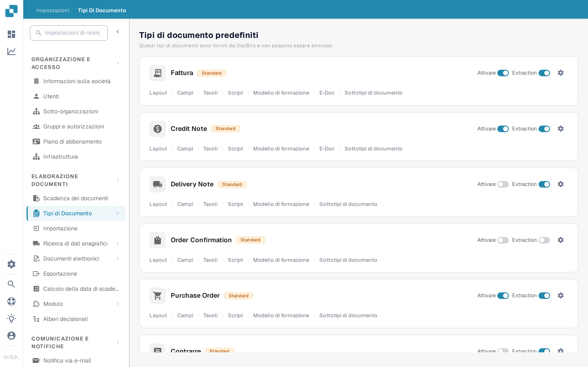
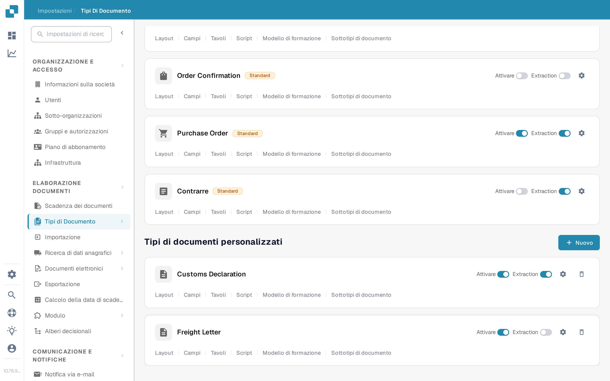

# Aggiungere e modificare tipi di documento

Gli amministratori possono creare un tipo di documento personalizzato o modificare le impostazioni di uno esistente. Aprire **Impostazioni → Elaborazione documenti → Tipi di documento**. La pagina separa i **Tipi di documento predefiniti** integrati dai **Tipi di documenti personalizzati**.

<figure><figcaption>
Usare una carta di tipo di documento per aprire l'impostazione che si desidera modificare.
</figcaption></figure>

## Creare un tipo di documento personalizzato

1. Scorrere fino a **Tipi di documenti personalizzati** e selezionare **Nuovo**. I tipi predefiniti forniti da DocBits non possono essere eliminati; creare un tipo personalizzato per una nuova categoria.
2. In **Creare**, inserire un **Nome** chiaro e una **Descrizione**. Selezionare **Tabella disponibile** se questo tipo di documento richiede tabelle con righe di dettaglio. Scegliere **Auto** per l'addestramento del modello con documenti di esempio oppure **Regex** per il riconoscimento basato su espressioni regolari.
3. Selezionare **Avanti** per creare il tipo di documento e proseguire la configurazione. **Avanti salva il nuovo tipo in questo punto**; non è solo un'anteprima. Evitare di inserire un nome di prova in un'organizzazione di produzione.
4. Per **Auto**, caricare almeno **10 documenti di esempio** prima di continuare. Per **Regex**, creare almeno **due espressioni regolari**. Questi requisiti derivano dall'attuale flusso di creazione. I dettagli sull'addestramento sono nella pagina [Addestramento del Modello](model-training/README.md).
5. In **Campi e gruppi**, creare i gruppi necessari e almeno un campo. Se è stata selezionata **Tabella disponibile**, proseguire con la configurazione delle tabelle e configurarle. Selezionare **Finish** quando la configurazione richiesta è completa.

<figure><figcaption>
Il pulsante Nuovo avvia la procedura guidata per il tipo di documento personalizzato.
</figcaption></figure>

<figure><figcaption>
Scegliere il tipo e il metodo di riconoscimento prima di selezionare Avanti.
</figcaption></figure>

## Modificare un tipo di documento esistente

Trovare la carta del tipo sotto **Tipi di documento predefiniti** o **Tipi di documenti personalizzati**. I controlli su ogni carta hanno funzioni diverse:

| Controllo | Funzione |
| --- | --- |
| **Attivare** | Accende o spegne l'elaborazione di questo tipo di documento. Verificare lo stato attuale prima di modificarlo. |
| **Extraction** | Passa tra le modalità di estrazione **Flex** e **Fix**; non attiva né disattiva il tipo di documento. Passare il mouse sull'interruttore per vedere la modalità attuale. |
| **Impostazioni** (ingranaggio) | Apre **Altre impostazioni** per quel tipo di documento. |
| **Layout** | Apre il layout di validazione. Vedere [navigare il Layout Manager](layout-manager/navigating-the-layout-manager.md). |
| **Campi** | Apre la configurazione dei campi. Vedere la pagina dei [Campi](fields/adding-and-editing-fields.md). |
| **Tavoli** | Apre le colonne della tabella per questo tipo di documento. |
| **Script** | Apre gli script di elaborazione quando la funzione è disponibile. |
| **Modello di formazione** | Apre i dati di addestramento e le opzioni del modello. |
| **E-Doc** | Apre le impostazioni dei documenti elettronici quando disponibili. Vedere [Documenti elettronici](edi/README.md). |
| **Sottotipi di documento** | Apre le impostazioni dei sottotipi; vedere [Sottotipi di Documento](document-sub-types.md). |

I collegamenti mostrati su una carta dipendono dalle funzioni abilitate dell'organizzazione e dal tipo di documento. Aprire la sezione pertinente, apportare lì la modifica prevista e verificare un documento di esempio nella vista di validazione prima di usare il tipo aggiornato nell'elaborazione ordinaria.
