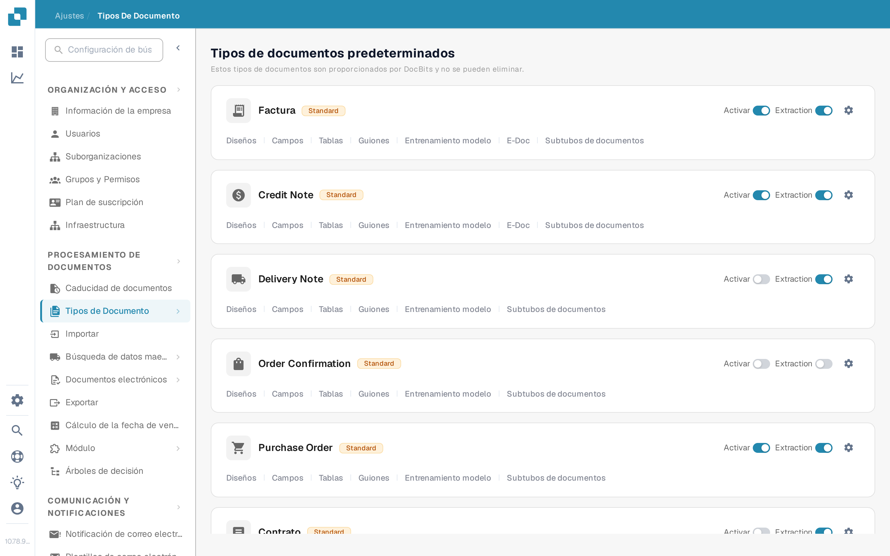
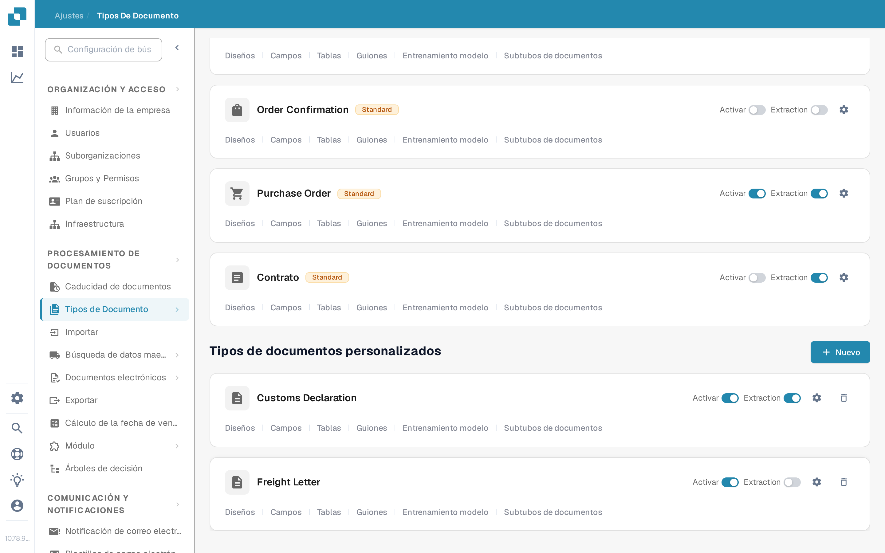

# Agregar y editar tipos de documentos

Los administradores pueden crear un tipo de documento personalizado o cambiar la configuración de uno existente. Abra **Configuración → Procesamiento de documentos → Tipos de documentos**. La página separa los **Tipos de documentos predeterminados** integrados de los **Tipos de documentos personalizados**.

<figure><figcaption>
Use una tarjeta de tipo de documento para abrir la configuración que desee cambiar.
</figcaption></figure>

## Crear un tipo de documento personalizado

1. Desplácese hasta **Tipos de documentos personalizados** y seleccione **+ Nuevo**. Los tipos predeterminados incluidos en DocBits no se pueden eliminar; cree un tipo personalizado para una nueva categoría.
2. En **Crear**, introduzca un **Nombre** claro y una **Descripción**. Seleccione **Tabla disponible** si este tipo de documento necesita tablas con líneas de posición. Elija **Auto** para el entrenamiento del modelo con documentos de muestra o **Regex** para el reconocimiento basado en patrones.
3. Seleccione **Siguiente** para crear el tipo de documento y continuar con la configuración. **Siguiente guarda el nuevo tipo en este momento**; no es solo una vista previa. Evite introducir un nombre de prueba en una organización de producción.
4. Para **Auto**, cargue al menos **10 documentos de muestra** antes de continuar. Para **Regex**, cree al menos **dos patrones**. Estos requisitos provienen del flujo de creación actual. Consulte [Entrenamiento del modelo](model-training/README.md) para obtener detalles sobre el entrenamiento.
5. En **Campos y grupos**, cree los grupos que necesite y al menos un campo. Si se seleccionó **Tabla disponible**, continúe con **Tablas y columnas** y configure la tabla. Seleccione **Finalizar** cuando la configuración necesaria esté completa.

<figure><figcaption>
El botón Nuevo inicia el asistente de tipos de documentos personalizados.
</figcaption></figure>

<figure><figcaption>
Elija el tipo y el método de reconocimiento antes de seleccionar Siguiente.
</figcaption></figure>

## Editar un tipo de documento existente

Busque la tarjeta del tipo en **Tipos de documentos predeterminados** o **Tipos de documentos personalizados**. Los controles de cada tarjeta tienen funciones distintas:

| Control | Qué hace |
| --- | --- |
| **Activar** | Activa o desactiva el procesamiento de este tipo de documento. Compruebe el estado actual antes de cambiarlo. |
| **Extracción** | Alterna entre los modos de extracción **Flex** y **Fix**; no activa ni desactiva el tipo de documento. Pase el cursor sobre el interruptor para ver el modo actual. |
| **Configuración** (engranaje) | Abre **Más configuraciones** para ese tipo de documento. |
| **Diseños** | Abre el diseño de validación. Consulte [navegación por el Gestor de diseños](layout-manager/navigating-the-layout-manager.md). |
| **Campos** | Abre la configuración de campos. Consulte [agregar y editar campos](fields/adding-and-editing-fields.md). |
| **Tablas** | Abre las columnas de tabla para este tipo de documento. |
| **Scripts** | Abre los scripts de procesamiento cuando esa función esté disponible. |
| **Entrenamiento del modelo** | Abre los datos de entrenamiento y las opciones del modelo. |
| **E-Doc** | Abre la configuración de documentos electrónicos cuando esté disponible. Consulte [Configuración de E-Doc](edi/README.md). |
| **Subtipos de documentos** | Abre la configuración de subtipos; consulte [Subtipos de documentos](document-sub-types.md). |

Los enlaces que se muestran en una tarjeta dependen de las funciones habilitadas de la organización y del tipo de documento. Abra la sección correspondiente, realice allí el cambio previsto y compruebe un documento de muestra en la vista de validación antes de usar el tipo actualizado en el procesamiento habitual.
