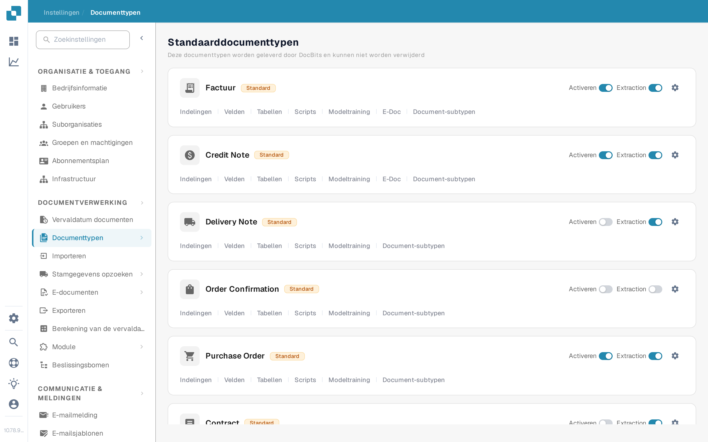
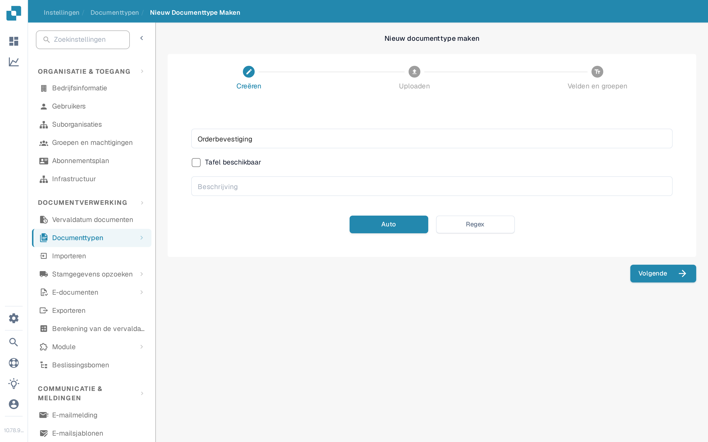

# Documenttypen toevoegen/bewerken

Beheerders kunnen een aangepast documenttype maken of de instellingen van een bestaand type wijzigen. Open **Instellingen → Documentverwerking → Documenttypen**. De pagina maakt onderscheid tussen de ingebouwde **Standaarddocumenttypen** en **Aangepaste documenttypen**.

<figure><figcaption>
Gebruik de kaart van een documenttype om de instelling te openen die u wilt wijzigen.
</figcaption></figure>

## Een aangepast documenttype maken

1. Scroll naar **Aangepaste documenttypen** en selecteer **+ Nieuw**. De standaardtypen die door DocBits worden geleverd, kunnen niet worden verwijderd; maak een aangepast type aan voor een nieuwe categorie.
2. In **Creëren** voert u een duidelijke **Naam** en een **Beschrijving** in. Selecteer **Tafel beschikbaar** als dit documenttype tabellen met regels nodig heeft. Kies **Auto** voor modeltraining met voorbeelddocumenten of **Regex** voor herkenning op basis van patronen.
3. Selecteer **Volgende** om het documenttype aan te maken en de configuratie voort te zetten. **Volgende slaat het nieuwe type vanaf dit moment op**; het is niet slechts een voorbeeldweergave. Voer geen testnaam in binnen een productieorganisatie.
4. Voor **Auto** uploadt u minimaal **10 voorbeelddocumenten** voordat u doorgaat. Voor **Regex** maakt u minimaal **twee patronen** aan. Deze vereisten komen uit de huidige aanmaakstroom. Zie [Modeltraining](model-training/README.md) voor trainingsdetails.
5. Onder **Velden en groepen** maakt u de benodigde groepen en ten minste één veld aan. Als **Tafel beschikbaar** is geselecteerd, gaat u verder naar **Tabellen en kolommen** en configureert u de tabel. Selecteer **Voltooien** wanneer de vereiste configuratie is voltooid.

<figure><figcaption>
Met de knop Nieuw start u de wizard voor het maken van een aangepast documenttype.
</figcaption></figure>

<figure><figcaption>
Kies het type en de herkenningsmethode voordat u op Volgende selecteert.
</figcaption></figure>

## Een bestaand documenttype bewerken

Zoek de kaart van het type onder **Standaarddocumenttypen** of **Aangepaste documenttypen**. De besturingselementen op elke kaart hebben verschillende functies:

| Besturingselement | Wat het doet |
| --- | --- |
| **Activeren** | Schakelt de verwerking van dit documenttype in of uit. Controleer de huidige status voordat u dit wijzigt. |
| **Extraction** | Wisselt tussen de extractiemodi **Flex** en **Fix**; het activeert of deactiveert het documenttype niet. Beweeg de muis over de schakelaar om de huidige modus te zien. |
| **Instellingen** (tandwiel) | Opent **Meer instellingen** voor dit documenttype. |
| **Indelingen** | Opent de validatie-indeling. Zie [Navigeren in de Lay-outbouwer](layout-manager/navigating-the-layout-manager.md). |
| **Velden** | Opent de veldconfiguratie. Zie [Velden toevoegen en bewerken](fields/adding-and-editing-fields.md). |
| **Tabellen** | Opent de tabelkolommen van dit documenttype. |
| **Scripts** | Opent verwerkingsscripts wanneer die functie beschikbaar is. |
| **Modeltraining** | Opent trainingsgegevens en modelopties. |
| **E-Doc** | Opent de instellingen voor elektronische documenten wanneer beschikbaar. Zie [e-docs](edi/README.md). |
| **Document-subtypen** | Opent de subtypinstellingen; zie [Document Sub Types](document-sub-types.md) (Document-subtypen). |

De links die op een kaart worden getoond, zijn afhankelijk van de ingeschakelde functies van de organisatie en het documenttype. Open de betreffende sectie, voer de beoogde wijziging daar door en controleer een voorbeelddocument in de validatieweergave voordat u het bijgewerkte type in de normale verwerking gebruikt.
