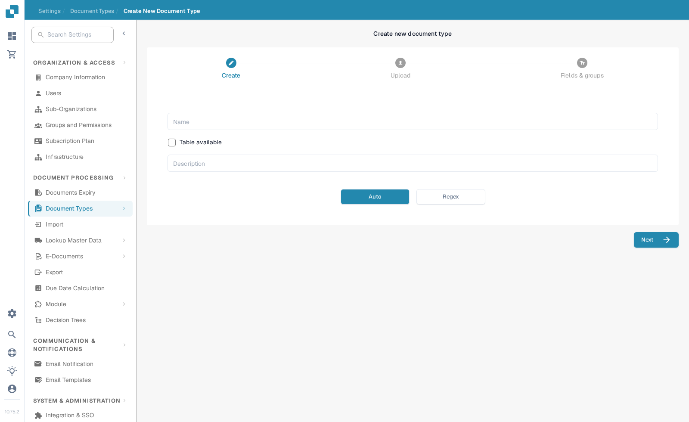

# Adding and editing document types

Administrators can create a custom document type or change the settings of an existing one. Open **Settings → Document Processing → Document Types**. The page separates the built-in **Default Document Types** from **Custom Document Types**.

<figure><figcaption>
Use a document type card to open the setting you want to change.
</figcaption></figure>

## Create a custom document type

1. Scroll to **Custom Document Types** and select **+ New**. The default types supplied by DocBits cannot be deleted; create a custom type for a new category.
2. On **Create**, enter a clear **Name** and a **Description**. Select **Table available** if this document type needs line-item tables. Choose **Auto** for model training with sample documents or **Regex** for pattern-based recognition.
3. Select **Next** to create the document type and continue the setup. **Next saves the new type at this point**; it is not just a preview. Avoid entering a test name in a production organization.
4. For **Auto**, upload at least **10 sample documents** before continuing. For **Regex**, create at least **two patterns**. These requirements come from the current creation flow. See [Model Training](model-training/README.md) for training details.
5. Under **Fields & groups**, create the groups you need and at least one field. If **Table available** was selected, continue to **Tables & columns** and configure the table. Select **Finish** when the required setup is complete.

<figure><figcaption>
The New button starts the custom document type wizard.
</figcaption></figure>

<figure><figcaption>
Choose the type and recognition method before selecting Next.
</figcaption></figure>

## Edit an existing document type

Find the type's card under **Default Document Types** or **Custom Document Types**. The controls on each card have different jobs:

| Control | What it does |
| --- | --- |
| **Activate** | Turns processing for this document type on or off. Check the current state before changing it. |
| **Extraction** | Switches between the **Flex** and **Fix** extraction modes; it does not activate or deactivate the document type. Hover over the switch to see the current mode. |
| **Settings** (gear) | Opens **More Settings** for that document type. |
| **Layouts** | Opens the validation layout. See [navigating the Layout Manager](layout-manager/navigating-the-layout-manager.md). |
| **Fields** | Opens field configuration. See [adding and editing fields](fields/adding-and-editing-fields.md). |
| **Tables** | Opens table columns for this document type. |
| **Scripts** | Opens processing scripts when that feature is available. |
| **Model Training** | Opens training data and model options. |
| **E-Doc** | Opens electronic document settings when available. See [E-Doc settings](edi/README.md). |
| **Document Sub Types** | Opens subtype settings; see [Document Sub Types](document-sub-types.md). |

The links shown on a card depend on the organization's enabled features and the document type. Open the relevant section, make the intended change there, and check a sample document in the validation view before using the updated type in regular processing.
