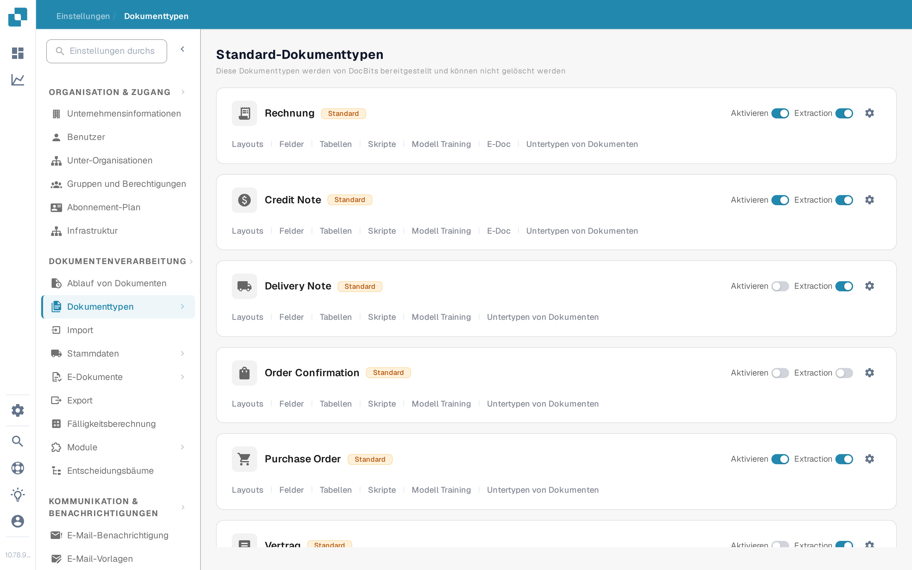
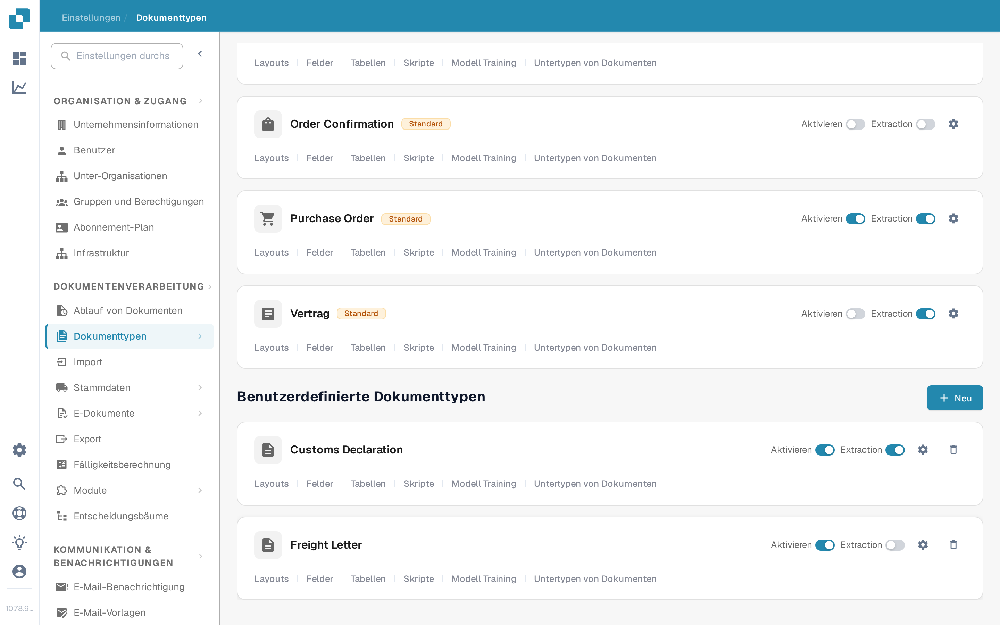
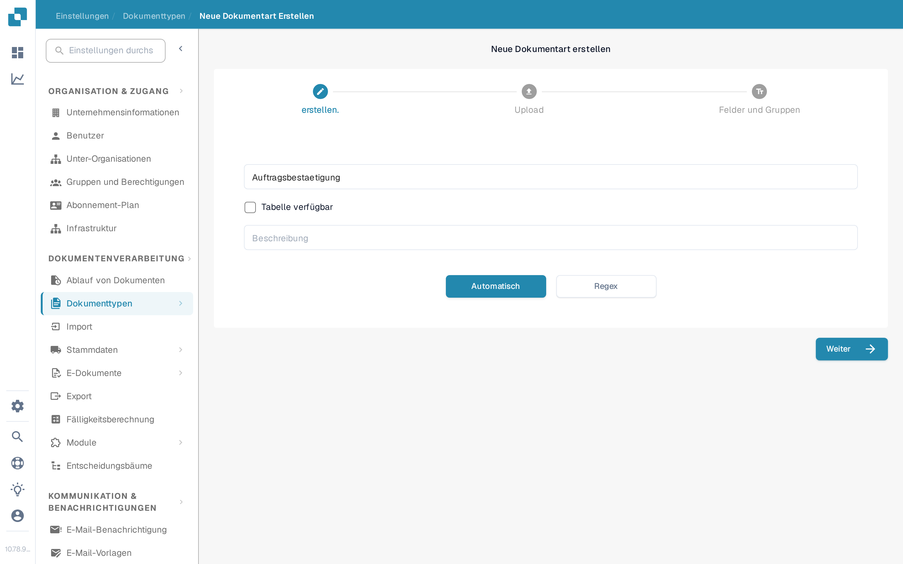

# Hinzufügen und Bearbeiten von Dokumenttypen

Administratoren können einen benutzerdefinierten Dokumenttyp anlegen oder die Einstellungen eines bestehenden ändern. Öffnen Sie **Einstellungen → Dokumentenverarbeitung → Dokumenttypen**. Die Seite trennt die mitgelieferten **Standard-Dokumenttypen** von den **Benutzerdefinierten Dokumenttypen**.

<figure><figcaption>
Öffnen Sie über eine Dokumenttyp-Karte die Einstellung, die Sie ändern möchten.
</figcaption></figure>

## Einen benutzerdefinierten Dokumenttyp erstellen

1. Scrollen Sie zu **Benutzerdefinierte Dokumenttypen** und wählen Sie **+ Neu**. Die Standardtypen von DocBits können nicht gelöscht werden; legen Sie für eine neue Kategorie einen benutzerdefinierten Typ an.
2. Unter **Erstellen** vergeben Sie einen klaren **Namen** und eine **Beschreibung**. Wählen Sie **Tabelle verfügbar**, wenn dieser Dokumenttyp Positionstabellen benötigt. Wählen Sie **Automatisch** für das Modelltraining mit Beispieldokumenten oder **Regex** für die erkennung über Muster.
3. Wählen Sie **Weiter**, um den Dokumenttyp zu erstellen und mit der Einrichtung fortzufahren. **Weiter speichert den neuen Typ an dieser Stelle**; es ist keine reine Vorschau. Vermeiden Sie einen Testnamen in einer Produktionsorganisation.
4. Für **Automatisch** laden Sie mindestens **10 Beispieldokumente** hoch, bevor Sie fortfahren. Für **Regex** legen Sie mindestens **zwei Muster** an. Diese Anforderungen stammen aus dem aktuellen Erstellungsablauf. Einzelheiten zum Training finden Sie unter [Modelltraining](model-training/README.md).
5. Unter **Felder und Gruppen** legen Sie die benötigten Gruppen und mindestens ein Feld an. Wenn **Tabelle verfügbar** ausgewählt wurde, fahren Sie mit **Tabellen und Spalten** fort und konfigurieren Sie die Tabelle. Wählen Sie **Fertigstellen**, sobald die erforderliche Einrichtung abgeschlossen ist.

<figure><figcaption>
Die Schaltfläche Neu startet den Assistenten für den benutzerdefinierten Dokumenttyp.
</figcaption></figure>

<figure><figcaption>
Wählen Sie Typ und Erkennungsmethode, bevor Sie Weiter auswählen.
</figcaption></figure>

## Einen bestehenden Dokumenttyp bearbeiten

Suchen Sie die Karte des Typs unter **Standard-Dokumenttypen** oder **Benutzerdefinierte Dokumenttypen**. Die Schaltflächen auf jeder Karte haben unterschiedliche Aufgaben:

| Schaltfläche | Funktion |
| --- | --- |
| **Aktivieren** | Schaltet die Verarbeitung dieses Dokumenttyps ein oder aus. Prüfen Sie den aktuellen Zustand, bevor Sie ihn ändern. |
| **Extraction** | Wechselt zwischen den Extraktionsmodi **Flex** und **Fix**; er aktiviert oder deaktiviert den Dokumenttyp nicht. Fahren Sie mit der Maus über den Schalter, um den aktuellen Modus zu sehen. |
| **Einstellungen** (Zahnrad) | Öffnet **Weitere Einstellungen** für diesen Dokumenttyp. |
| **Layouts** | Öffnet das Validierungslayout. Siehe [Navigieren im Layout-Manager](layout-manager/navigating-the-layout-manager.md). |
| **Felder** | Öffnet die Feldkonfiguration. Siehe [Hinzufügen und Bearbeiten von Feldern](fields/adding-and-editing-fields.md). |
| **Tabellen** | Öffnet die Tabellenspalten für diesen Dokumenttyp. |
| **Skripte** | Öffnet die Verarbeitungsskripte, wenn diese Funktion verfügbar ist. |
| **Modell Training** | Öffnet Trainingsdaten und Modelloptionen. |
| **E-Doc** | Öffnet die E-Dokument-Einstellungen, sofern verfügbar. Siehe [E-Dokumente](edi/README.md). |
| **Untertypen von Dokumenten** | Öffnet die Untertyp-Einstellungen; siehe [Dokumentuntertypen](document-sub-types.md). |

Die auf einer Karte angezeigten Links hängen von den aktivierten Funktionen der Organisation und vom Dokumenttyp ab. Öffnen Sie den betreffenden Bereich, nehmen Sie dort die gewünschte Änderung vor und prüfen Sie ein Beispieldokument in der Validierungsansicht, bevor Sie den aktualisierten Typ im regulären Betrieb verwenden.
