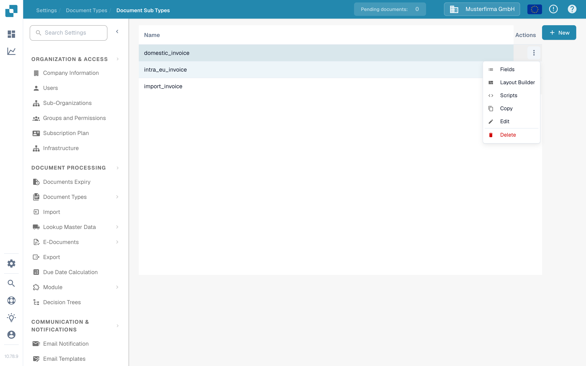
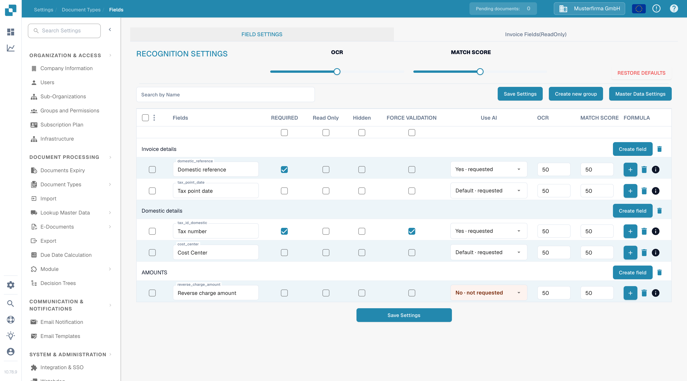
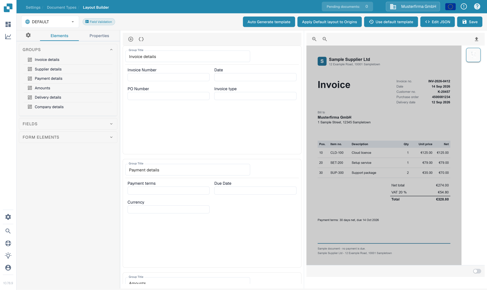
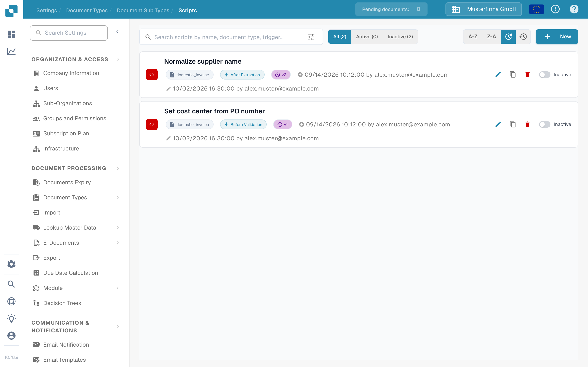

# Configure subtypes

Use a document subtype when invoices of the same document type need different fields, a different validation layout, or their own processing scripts. First [create a subtype](creating-a-new-sub-type.md), then open **Settings → Document Types**, choose the document type, and open **Document Sub Types**. In the subtype row, open **Actions** (the three dots). The menu offers **Fields**, **Layout Builder**, and **Scripts**; it also contains [Copy, Edit, and Delete](using-actions.md).

<figure><figcaption>
Choose the part of the subtype that you want to configure.
</figcaption></figure>

## Fields

Select **Fields** to decide what information users see and enter for this subtype. You can create a field in a group, mark an existing field as required, read only, or hidden, and adjust recognition options. Select **Save Settings** after making changes. Use [Adding and Editing Fields](fields/adding-and-editing-fields.md) for the steps, [Configuring Field Properties](fields/configuring-field-properties-1.md) for the column options, and [Master Data Settings](fields/master-data-settings.md) when a field should use lookup data.

<figure><figcaption>
Field settings in the documentation test organization. No customer data is shown.
</figcaption></figure>

## Layout Builder

Select **Layout Builder** to arrange groups and fields on the document validation screen. The left side lists elements; the right side accepts a sample document for preview. Review the result and select **Save** when the layout is ready. The [Layout Builder guide](../../../setup/document-types/layout-builder.md) explains elements, the document preview, and saving a layout.

<figure><figcaption>
Subtype layout before adding a sample document.
</figcaption></figure>

## Scripts

Select **Scripts** to view scripts for this subtype. In an empty list, select **Create Script** or **New** to start. The search and **All**, **Active**, and **Inactive** filters help find existing scripts. Follow [Creating and Editing Scripts](script/creating-and-editing-scripts.md) to create one, and [Script Activation and Management](script/script-activation-and-management.md) before enabling it for processing.

<figure><figcaption>
No scripts have been created in the documentation test subtype.
</figcaption></figure>
