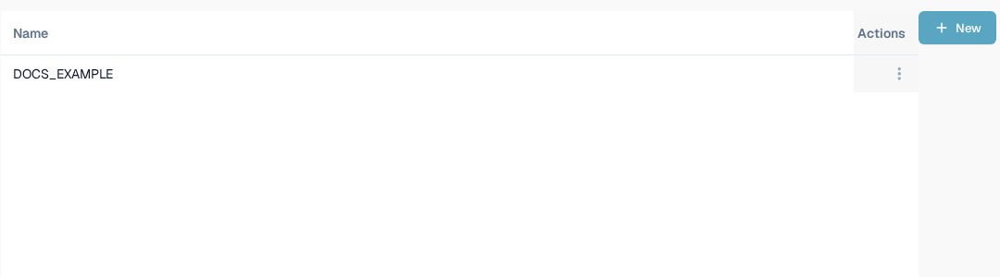
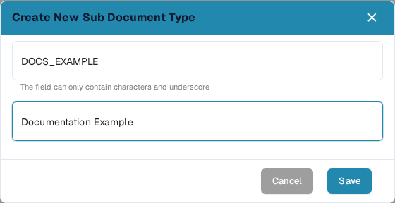

# Creating a new Sub Type

Create a document subtype when one type of document needs its own field settings, validation layout, or scripts. You need access to **Settings → Document Types**.

## 1. Open the document type

Open **Settings → Document Types**. In the card for the relevant document type, select **Document Sub Types**. The example below uses **Invoice**; choose the type that matches your documents. Other links in the card lead to settings for the whole document type.

<figure><figcaption>
Open subtypes for the document type you want to configure.
</figcaption></figure>

## 2. Start a new subtype

On **Document Sub Types**, select **+ New**. Existing subtypes appear in the list; the three-dot **Actions** menu is for an existing row. If **+ New** does not respond to a mouse click, focus the button with the keyboard and press **Enter**.

<figure><figcaption>
The documentation test organization contains only a synthetic example subtype.
</figcaption></figure>

## 3. Name and save it

Enter a **Name** using letters and underscores, then enter a descriptive **Title**. Both fields are required. The names in this screenshot are examples only. Select **Save** to create the subtype, or **Cancel** to leave without creating it.

<figure><figcaption>
Only Name and Title are entered at creation time.
</figcaption></figure>

After saving, the new subtype appears in the list. To set its fields, layout, or scripts, open its **Actions** menu and follow [Configure subtypes](configure-subtypes.md). These settings are made after creation, not in the **+ New** dialog.
