# Custom Validation Rules

## Overview

Custom validation rules let an administrator define **their own checks** on the data DocBits extracts from a document — without writing a script and without waiting for a product change.

A rule answers three questions:

1. **Where** is the problem shown? On a header field, or on a cell of a table row.
2. **When** does the rule apply? Always, or only for documents (or rows) that meet a condition — see [Rule Conditions (Applies when)](rule-conditions-applies-when.md).
3. **What** must be true? A field must be filled, match a format, lie in a range, match a list, compare correctly with another field, or add up.

When the check fails, DocBits marks the field or cell on the **validation screen** and shows your message — exactly like a built-in check. With the severity **Error** the document cannot be validated until the problem is fixed; with **Warning** the user only sees a hint.

Rules are defined per **document type** and run on every document of that type: during processing and every time the document is saved.

### Problems they solve

| Business requirement | Without custom rules | With a custom rule |
| --- | --- | --- |
| German invoices over 250 EUR must show the supplier's tax ID | a script, or users have to remember it | **Required** on Supplier Tax ID, *applies when* origin is DE and total amount is greater than 250 |
| A supplier's invoice numbers always look like `INV-123456` | typos reach the ERP | **Pattern** `^INV-\d{6}$` on Invoice Number for that supplier |
| Every article line needs a quantity above zero | lines with quantity 0 are exported | **Range** (minimum 0.01) on the Quantity column |
| The due date must not be before the invoice date | wrong payment runs | **Compare fields**: Due Date on or after Invoice Date |
| The lines must add up to the net amount | only the fixed built-in check | **Formula** `sum(row.NET_AMOUNT) == header.total_net_amount` with your own tolerance |
| Only currencies your ERP knows are allowed | export errors in the ERP | **List of Values** on Currency |
| Tell users about unusual values without blocking them | not possible | any rule with the severity **Warning** |


While the feature is in beta, the settings described below only appear when the **Document Types** settings page is opened with `?beta=true` appended to the address.


## Enable custom validation rules

Custom validation rules are switched on **per document type**. There is no organisation-wide switch.

1. Go to **Settings → Global Settings → Document Types**.
2. On the card of the document type, click the **settings** (gear) icon.
3. Open the **Custom Validation Rules** section and turn the toggle on.
4. Click **Manage validation rules** to open the rule list.

<figure>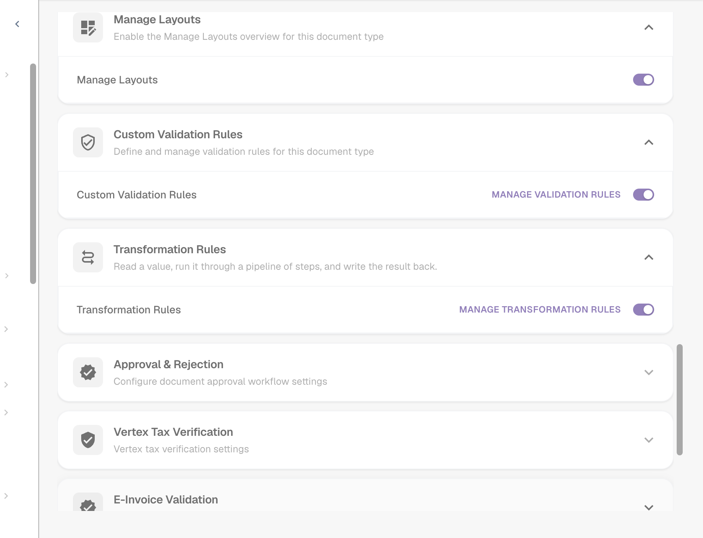<figcaption>
The toggles for Manage Layouts, Custom Validation Rules and Transformation Rules
</figcaption></figure>

From now on the card of the document type also shows a **Validation Rules** link, and a **Logs** link for the execution logs.

<figure>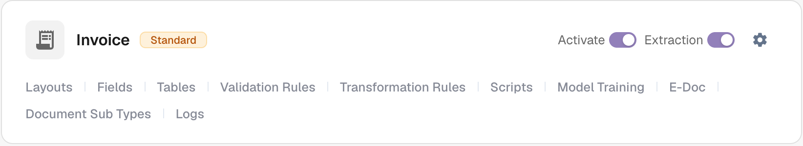<figcaption>
The links on the document type card
</figcaption></figure>


**The toggle replaces the built-in amount checks.** While custom validation rules are on for a document type, the hard-coded checks "total amount = net amount + tax amount" and the line amount / discount checks are **not** run for it; the configurable rules take their place. Recreate the checks you rely on as rules (see the [recipes](#recipes)) before you switch it on. Turning the toggle off restores the built-in checks. All other field validations (required fields, formats, master data) keep running.


## The rule list

**Document Types → (document type) → Validation Rules** lists every rule of the document type.

<figure>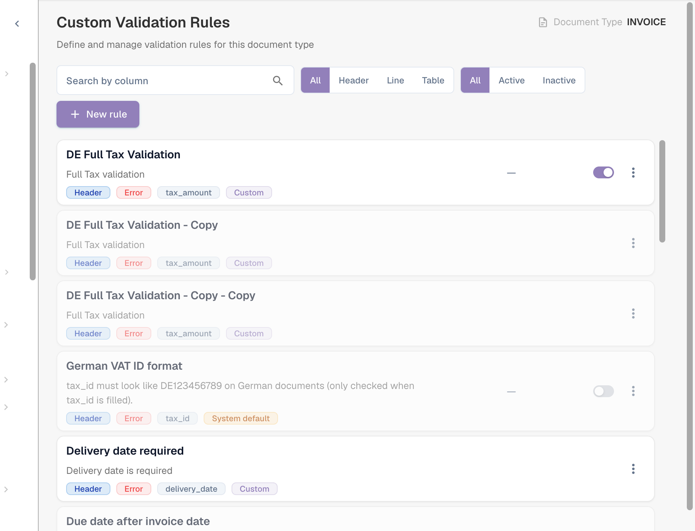<figcaption>
The rule list with level, severity, target field and source of each rule
</figcaption></figure>

Each card shows the rule's name and description, and the badges for its **level** (Header / Line / Table), **severity** (Error / Warning), the **field** the error is attached to and its **source**. Use the switch on the right to activate or deactivate a rule, and the **⋮** menu to duplicate or delete it. Filter the list by level (**All / Header / Line / Table**) and by state (**All / Active / Inactive**), or search it.

### System default, Customized and Custom rules

| Source | What it is | What you can do |
| --- | --- | --- |
| **System default** | A rule shipped with DocBits for all organisations. | It cannot be edited directly — the builder shows "This is a system default rule and cannot be edited." Click **Customize** to create your own editable copy, or switch it off to stop it for your organisation. |
| **Customized** | A system default that your organisation has changed or switched off. | Edit it like your own rule. **Reset to Default** deletes your copy and brings back the original. |
| **Custom** | A rule your organisation created. | Edit, **Duplicate**, **Delete**. |

Changes to system defaults never affect other organisations.

## Create a rule

Click **New rule**. The builder has three steps. **Test rule** and **Save** are at the top right.

### Step 1 — Name & scope

<figure>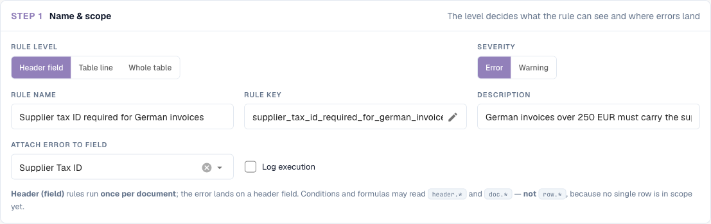<figcaption>
Step 1 for a header field rule
</figcaption></figure>

| Setting | What it does |
| --- | --- |
| **Rule level** | What the rule looks at and where the error is shown — see [Rule levels](#rule-levels). |
| **Severity** | **Error** marks the field invalid and blocks validation. **Warning** shows the message but never blocks. |
| **Rule Name** | Shown in the list, in the logs and to administrators. Make it describe the rule ("Supplier tax ID required for German invoices"). |
| **Rule key** | A technical key generated from the name. It stays the same when you rename the rule later. Click the pencil to choose your own key before the first save; after that it is fixed. |
| **Description** | Optional explanation for other administrators. |
| **Table name** | *Table line only.* The table whose rows are checked, for example `INVOICE_TABLE`. |
| **Attach error to field / column** | The field (or, for table lines, the column) that shows the error on the validation screen. |
| **Log execution** | Writes one log entry per evaluation, including why the rule applied or not. See [Logs](#logs). |

#### Rule levels

| Level | Runs | Error is shown on | Can read | Typical rule |
| --- | --- | --- | --- | --- |
| **Header field** | once per document | a header field | `header.*`, `doc.*` | "Supplier tax ID is required for German invoices" |
| **Table line** | once for every row of the selected table | the cell of the failing row | `row.*` (the current row), `header.*`, `doc.*` | "Quantity must be greater than zero" |
| **Whole table** | once per document, looking at all rows together | a header field | totals over the rows (`sum()`, `count()`, `min()`, `max()`), `header.*`, `doc.*` | "The line net amounts must add up to the net amount" |

<figure>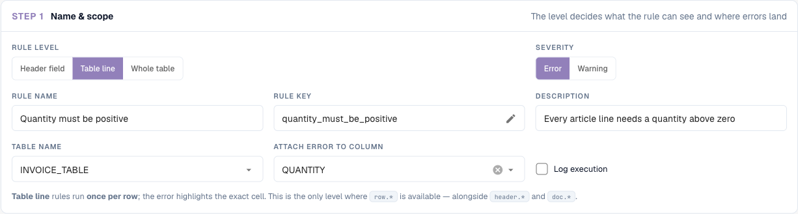<figcaption>
A table line rule: the table and the column that shows the error
</figcaption></figure>

### Step 2 — Applies when

Decide whether the rule runs for every document or only for some. Leave it empty to check every document. Otherwise add condition lines — for example "Document Origin is Deutsch" and "Total Amount greater than 250" — and combine them with **All** / **ANY** and nested groups.

<figure><figcaption>
The check only runs for German documents above 250 with EUR or no currency
</figcaption></figure>

For table line rules, the condition can also use the columns of the current row, and it is evaluated **row by row**: rows that do not match are simply not checked.

<figure><figcaption>
Only article lines (rows with an item number) are checked
</figcaption></figure>

Conditions are explained in detail — every field, operator and comparison rule, with many examples — on [Rule Conditions (Applies when)](rule-conditions-applies-when.md).

### Step 3 — Check: what must be true

Pick one check. The settings below the cards change with the check you pick.

<figure>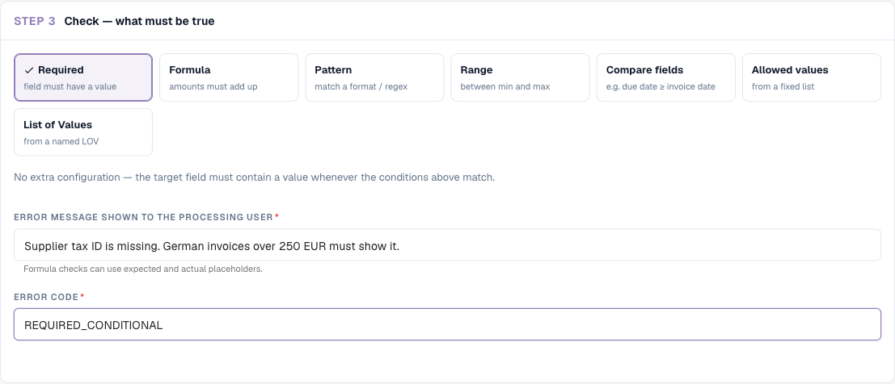<figcaption>
The seven checks. Required needs no further settings
</figcaption></figure>

#### Required — field must have a value

Fails when the field is empty (missing, or only spaces). No further settings.

Use it together with **Applies when** to make a field **conditionally** required. A field that must always be filled is better configured as a required field in the field settings.

> *Supplier Tax ID is required* — applies when *Document Origin is Deutsch* and *Total Amount greater than 250*.

#### Formula — amounts must add up

An arithmetic comparison. The expression contains exactly **one** comparison (`==`, `!=`, `>`, `>=`, `<`, `<=`); both sides can use `+ - * /`, numbers, brackets and field references.

<figure>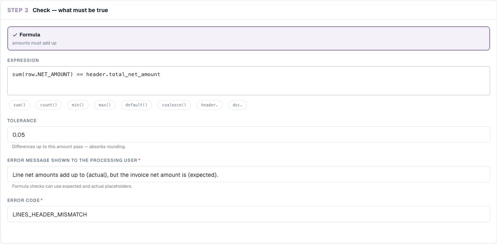<figcaption>
A whole-table formula with a tolerance and placeholders in the message
</figcaption></figure>

* Click the chips under the expression to insert functions and field prefixes: `sum()`, `count()`, `min()`, `max()`, `default()`, `coalesce()`, `header.`, `doc.`. While you type a field name, a list of matching fields opens.
* `sum(row.NET_AMOUNT)`, `count(row.ITEM_NUMBER)`, `min(...)`, `max(...)` work over all rows and are only available at the level **Whole table**. `count()` counts the rows in which the column is filled.
* `default(header.discount, 0)` uses `0` when the field is empty; `coalesce(header.a, header.b, 0)` uses the first filled value.
* **Tolerance**: for `==` and `!=`, differences up to this amount count as equal. Use `0.01` or `0.05` to absorb rounding. It has no effect on `<`, `>`, `<=` and `>=`.
* Empty or unreadable amounts count as `0`. A division by zero skips the rule instead of raising an error.
* In the error message, `{actual}` is replaced by the result of the left side and `{expected}` by the result of the right side.

Examples:

| Purpose | Level | Expression | Tolerance |
| --- | --- | --- | --- |
| Header totals are consistent | Header field | `header.total_amount == header.total_net_amount + header.total_tax_amount` | 0.01 |
| Lines add up to the net amount | Whole table | `sum(row.NET_AMOUNT) == header.total_net_amount` | 0.05 |
| Line amount = quantity × unit price | Table line | `row.NET_AMOUNT == row.QUANTITY * row.UNIT_PRICE` | 0.01 |
| Tax not higher than 19 % of the net amount | Header field | `header.total_tax_amount <= header.total_net_amount * 0.19` | – |
| At least one line | Whole table | `count(row.ITEM_NUMBER) >= 1` | 0 |

#### Pattern — match a format / regex

The value must match a **regular expression**. The expression searches the value, so anchor it with `^` (start) and `$` (end) when the whole value must match. Tick **Case-insensitive match** if case does not matter.

| Format | Regular expression |
| --- | --- |
| `INV-` followed by six digits | `^INV-\d{6}$` |
| German VAT ID | `^DE\d{9}$` |
| Purchase order starting with 45 and 10 digits long | `^45\d{8}$` |
| Only digits | `^\d+$` |
| IBAN (rough check) | `^[A-Z]{2}\d{2}[A-Z0-9]{11,30}$` |

#### Range — between min and max

The value must be a number between **Minimum** and **Maximum** (both included). Fill in one or both. A value that is not a number fails. Formatted amounts such as `1.234,56` are understood.

<figure>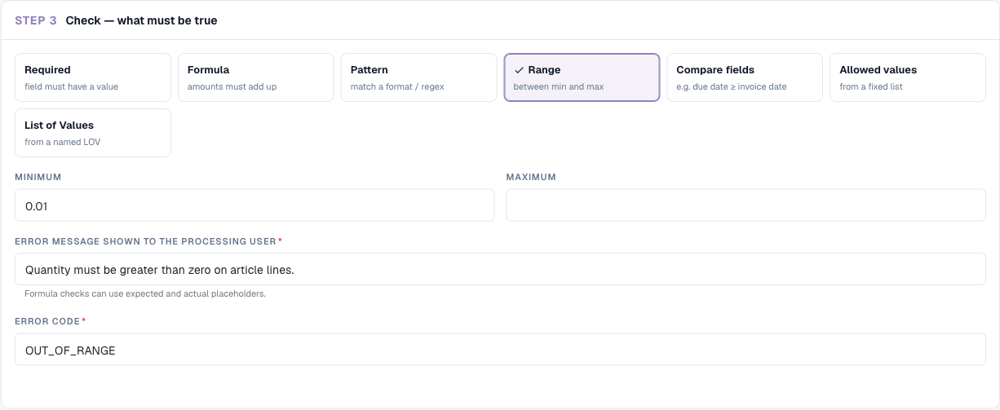<figcaption>
Range with a minimum only: quantities must be at least 0.01
</figcaption></figure>

#### Compare fields — e.g. due date ≥ invoice date

Compares the value of a field with another field, with **today** or with a fixed value, using *equal to*, *not equal to*, *greater than*, *less than*, *on or after (≥)* or *on or before (≤)*. Numbers are compared as numbers and dates as dates.

* Due Date **on or after (≥)** Invoice Date
* Invoice Date **on or before (≤)** today — no invoices dated in the future
* Discount **less than** 100

#### Allowed values — from a fixed list

The value must be one of the values you type, **one value per line**. Optionally case-insensitive. Good for short, stable lists (`EUR`, `CHF`, `USD`).

#### List of Values — from a named LOV

Like *Allowed values*, but the values come from a shared **List of Values** managed under **Settings › List of Values**. Pick the list instead of retyping it; when the list changes, the rule uses the new values (after a short caching delay). Only the list entries' values count, not their labels.


Except for **Required**, every check **passes when the value is empty**. A Pattern rule on the Purchase Order does not complain about invoices without a purchase order. If an empty value is a problem too, add a Required rule, or limit the rule with *Applies when … is not empty*.


#### Error message and error code

* **Error message shown to the processing user** — the text on the validation screen. Say what is wrong **and** what to do: "Supplier tax ID is missing. German invoices over 250 EUR must show it."
* **Error code** — a short technical code, for example `REQUIRED_CONDITIONAL`, `FORMAT_MISMATCH`, `OUT_OF_RANGE`, `DATE_ORDER`, `LINES_HEADER_MISMATCH`, `VALUE_NOT_ALLOWED`. It appears in exports and logs and lets you group errors.

## Test rule

Click **Test rule** to run the current version of the rule — saved or not — against a document. Enter a **Document ID**, or switch to **By Document JSON** and paste extracted data. **Nothing is saved**, and the document is not changed.

The result is one of three outcomes:

| Outcome | Meaning |
| --- | --- |
| **Rule failed — error raised** | The condition matched and the check failed. The message is shown exactly as the user would see it. |
| **Rule passed** | The condition matched and the check passed. Table line rules show the result per row ("4 of 4 checked rows passed"). |
| **Rule skipped — scope not matched** | The *Applies when* condition was false for this document, so nothing was checked and no error was raised. |

<figure>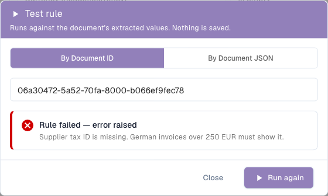<figcaption>
The German invoice has no supplier tax ID: the rule fails with the configured message
</figcaption></figure>

<figure>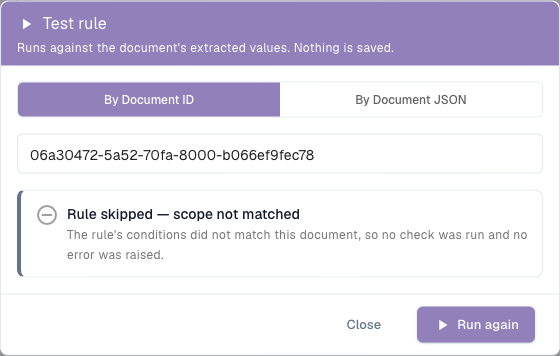<figcaption>
The same rule with the threshold raised to 1000: the invoice (469.18) is not in scope, so the rule is skipped
</figcaption></figure>

<figure>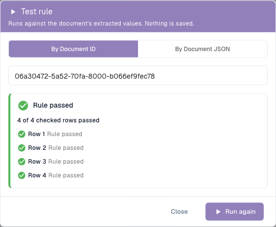<figcaption>
A table line rule reports every checked row
</figcaption></figure>

Test every new rule on at least one document that should fail, one that should pass and one that should be skipped.

## When rules run

* **During processing**, together with the other validations, after extraction and transformation rules.
* **On every save** of the document on the validation screen.
* **After a rule change**, existing documents are **not** re-checked all at once. Each document is re-checked with the new rules the next time it is saved or reprocessed. Documents that are already exported are not affected.
* Rules run in order of priority (then by key). A field shows **one** error: if two rules fail on the same field, the first one wins; later rules do not overwrite it.
* Warnings are collected separately and never hide an error.
* If a rule cannot be evaluated — for example a division by zero in a formula — it is skipped. A broken rule never marks a document invalid by mistake.

## Logs

Switch on **Log execution** in a rule to record every evaluation. Open **Document Types → (document type) → Logs** and search by **Rule key**, **Rule ID** or **Document**; filter by rule type, outcome and date.

<figure>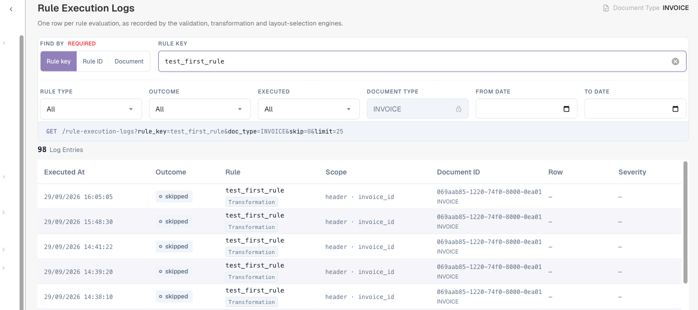<figcaption>
One row per evaluation, with outcome, scope, document and row
</figcaption></figure>

Open an entry to see its details, including the **condition trace**: each line of *Applies when* with the expected value, the actual value of the document and whether it passed. See [Read the condition trace](rule-conditions-applies-when.md#read-the-condition-trace-in-the-logs).

The same page shows the logs of transformation and layout selection rules.

## Recipes

Copy these rules as a starting point. Field and column keys are those of the standard **Invoice** document type; adjust them to your document types.

**1. Supplier tax ID for German invoices above 250 EUR**
Header field · Error · attach to *Supplier Tax ID* · Applies when **All**: *Document Origin* is *Deutsch*, *Total Amount* greater than *250* · Check **Required** · Message "Supplier tax ID is missing. German invoices over 250 EUR must show it." · Code `REQUIRED_CONDITIONAL`.

**2. Header totals add up** (replaces the built-in check)
Header field · Error · attach to *Total Amount* · always · **Formula** `header.total_amount == header.total_net_amount + header.total_tax_amount`, tolerance `0.01` · Message "Total {actual} does not equal net plus tax ({expected})."

**3. Lines add up to the net amount** (replaces the built-in check)
Whole table · Error · attach to *Total Net Amount* · always · **Formula** `sum(row.NET_AMOUNT) == header.total_net_amount`, tolerance `0.05` · Message "Line net amounts add up to {actual}, but the invoice net amount is {expected}." · Code `LINES_HEADER_MISMATCH`.

**4. Quantity must be positive on article lines**
Table line · Error · table `INVOICE_TABLE`, column `QUANTITY` · Applies when *row.ITEM_NUMBER* is not empty · **Range** minimum `0.01` · Code `OUT_OF_RANGE`.

**5. Line amount = quantity × unit price**
Table line · Warning · column `NET_AMOUNT` · always · **Formula** `row.NET_AMOUNT == row.QUANTITY * row.UNIT_PRICE`, tolerance `0.01`.

**6. Invoice number format of one supplier**
Header field · Error · *Invoice Number* · Applies when *Supplier ID* is *20723* · **Pattern** `^INV-\d{6}$`.

**7. Due date not before invoice date**
Header field · Error · *Due Date* · always · **Compare fields** Due Date *on or after (≥)* Invoice Date · Code `DATE_ORDER`.

**8. No invoices dated in the future**
Header field · Error · *Invoice Date* · always · **Compare fields** Invoice Date *on or before (≤)* today.

**9. Only approved currencies (hint only)**
Header field · **Warning** · *Currency* · always · **List of Values** *approved_currencies* · Code `VALUE_NOT_ALLOWED`.

**10. Purchase order required above 5,000**
Header field · Error · *Purchase Order* · Applies when *Total Amount* greater than *5000* · **Required**.

## Best practices

* **Start as a warning.** Save a new rule with the severity **Warning**, watch it for a few days (Test rule, logs), then switch it to **Error**.
* **One rule, one message.** Several small rules with clear messages are easier to understand than one big formula.
* **Use Applies when instead of copies.** One rule with a condition is better than five copies for five suppliers.
* **Be tolerant with money.** Always give amount formulas a tolerance.
* **Name rules after the business rule**, not after the technique ("Due date not before invoice date", not "Compare rule 3").
* **Switch Log execution off** once a rule works; it writes an entry on every save.

## Troubleshooting

| Symptom | What to check |
| --- | --- |
| The rule never raises an error | Is the feature enabled for the document type and the rule **Active**? Run **Test rule** on the document: "skipped" means *Applies when* was false. |
| An empty field is not reported | Only **Required** reports empty values. Add a Required rule. |
| The built-in total checks disappeared | Expected while custom rules are on. Recreate them as Formula rules (recipes 2 and 3). |
| A changed rule has no effect on a document | Documents are re-checked on their next save. Save or reprocess the document. |
| A Pattern matches values it should not | Patterns search inside the value. Anchor with `^` and `$`. |
| Only one of two errors is shown on a field | A field shows the first failing rule only. Adjust the priorities or attach one of the rules to another field. |
| Table columns are missing in *Applies when* | They are only available at the level **Table line**. |
| The system default rule cannot be changed | Click **Customize** to create your own copy. |

## Related

* [Rule Conditions (Applies when)](rule-conditions-applies-when.md) — conditions in depth
* [Transformation Rules](transformation-rules.md) — correct values before they are validated
* [Layout Selection Rules](layout-manager/layout-selection-rules.md) — choose the layout a document uses
* [Setting Validation and Match Score](fields/setting-validation-and-match-score.md) — validation settings per field
