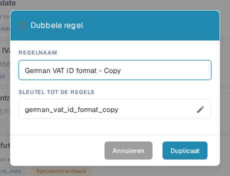

# Een aangepaste validatieregel dupliceren

Gebruik **Duplicaat** wanneer een regel een nuttig uitgangspunt is en u een aparte kopie wilt. DocBits kopieert de definitie van de regel; u kiest de naam en de sleutel van de nieuwe regel. De originele regel blijft in de lijst.

1. Ga naar **Instellingen → Documenttypen**, open het documenttype dat u wilt configureren en selecteer **Aangepaste validatieregels**. De pagina toont het geselecteerde documenttype boven de regelkaarten. Zie [Documenttypen](README.md) voor de andere instellingen die daar beschikbaar zijn.
2. Zoek de bronregel. Gebruik het zoekveld of de filters voor bereik en status als de lijst lang is. Open het actiemenu met de drie puntjes van de regel en selecteer **Duplicaat**. U kunt een systeemstandaard of een aangepaste regel kopiëren.
3. Houd bij **REGELNAAM** de voorgestelde naam eindigend op “Copy” aan, of voer een duidelijkere naam in. De **SLEUTEL TOT DE REGELS** wordt uit die naam gegenereerd. Selecteer het potloodpictogram als u de sleutel zelf wilt bewerken.
4. Selecteer **Duplicaat** om de aparte regel aan te maken. DocBits vernieuwt de lijst na het opslaan. Selecteer **Annuleren** om het venster te sluiten zonder een kopie aan te maken.

<figure><figcaption>
Het Nederlandse venster »Dubbele regel« in de DocBits Sandbox-testorganisatie. De gekopieerde naam en de sleutel kunnen vóór het kiezen van Duplicaat worden gewijzigd.
</figcaption></figure>

De knop **Duplicaat** heeft zowel een naam als een sleutel nodig. Als het opslaan mislukt, toont DocBits een fout; corrigeer de naam of de sleutel en probeer het opnieuw. Controleer de nieuwe regel voordat u deze activeert of wijzigt, want een kopie start met de definitie van de bronregel.
