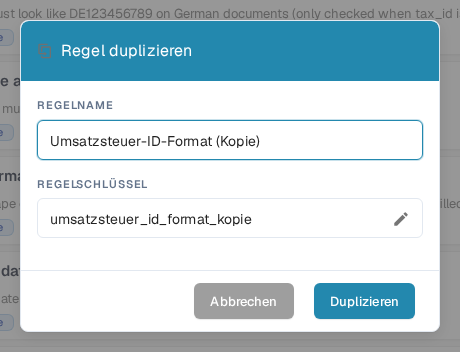

# Benutzerdefinierte Validierungsregel duplizieren

Nutzen Sie **Duplizieren**, wenn eine Regel ein sinnvoller Ausgangspunkt ist und Sie eine separate Kopie davon möchten. DocBits kopiert die Definition der Regel; Sie wählen den Namen und den Schlüssel der neuen Regel. Die Originalregel bleibt in der Liste.

1. Öffnen Sie **Einstellungen → Dokumenttypen**, wählen Sie den Dokumenttyp, den Sie konfigurieren möchten, und öffnen Sie über die Aktionen des Dokumenttyps **Validierungsregeln** (bei aktivierter Funktion „Benutzerdefinierte Validierungsregeln“). Die Seite zeigt den gewählten Dokumenttyp über den Regelkarten. Siehe [Dokumenttypen](../../../../admin-section/settings/global-settings/document-types/README.md) für die weiteren Einstellungen dort.
2. Suchen Sie die Quellregel. Bei einer langen Liste nutzen Sie das Suchfeld oder die Filter für Bereich und Status. Öffnen Sie das Menü mit den drei Punkten der Regel und wählen Sie **Duplizieren**. Kopieren können Sie sowohl eine Systemstandard-Regel als auch eine benutzerdefinierte Regel.
3. Geben Sie bei **Regelname** den vorgeschlagenen Namen mit dem Zusatz „Copy“ bei oder wählen Sie einen klareren Namen. Der **Regelschlüssel** wird aus dem Namen erzeugt. Wählen Sie das Stiftsymbol, wenn Sie den Schlüssel selbst bearbeiten möchten.
4. Wählen Sie **Duplizieren**, um die separate Regel anzulegen. DocBits aktualisiert die Liste nach dem Speichern. Mit **Abbrechen** schließen Sie das Dialogfenster, ohne eine Kopie anzulegen.

<figure><figcaption>
Das deutsche Dialogfenster »Regel duplizieren« in der DocBits-Sandbox-Testorganisation. Der kopierte Name und der Schlüssel lassen sich vor dem Duplizieren ändern.
</figcaption></figure>

Die Schaltfläche **Duplizieren** benötigt sowohl einen Namen als auch einen Schlüssel. Beim Speichern zeigt DocBits eine Fehlermeldung an; korrigieren Sie dann Name oder Schlüssel und versuchen Sie es erneut. Prüfen Sie die neue Regel, bevor Sie sie aktivieren oder ändern, denn eine Kopie startet mit der Definition der Quellregel.
