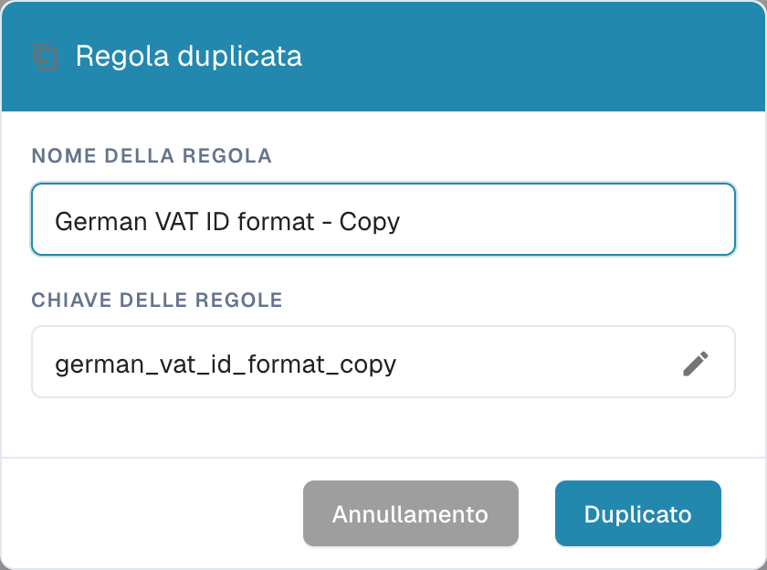

# Duplicare una regola di convalida personalizzata

Usa **Duplicato** quando una regola è un buon punto di partenza e vuoi una copia separata. DocBits copia la definizione della regola; tu scegli nome e chiave della nuova regola. La regola originale resta nell'elenco.

1. Apri **Impostazioni → Tipi di documento**, seleziona il tipo di documento da configurare, attiva la funzione **Regole di convalida personalizzate**, poi scegli **Gestisci le regole di convalida**. La pagina mostra il tipo di documento selezionato sopra le schede delle regole. Vedi [Tipi di documento](README.md) per le altre impostazioni disponibili.
2. Trova la regola di origine. Se l'elenco è lungo, usa il campo di ricerca o i filtri di ambito e stato. Apri il menu a tre punti della regola e seleziona **Duplicato**. Puoi copiare una regola predefinita di sistema o una regola personalizzata.
3. In **NOME DELLA REGOLA** conserva il nome suggerito che termina in “Copy” oppure inserisci un nome più chiaro. La **CHIAVE DELLE REGOLE** viene generata da quel nome. Seleziona l'icona a matita se devi modificare la chiave tu stesso.
4. Seleziona **Duplicato** per creare la regola separata. DocBits aggiorna l'elenco dopo il salvataggio. Seleziona **Annullamento** per chiudere la finestra senza creare una copia.

<figure><figcaption>
La finestra italiana «Regola duplicata» nell'organizzazione di test DocBits Sandbox. Il nome copiato e la chiave possono essere modificati prima di selezionare Duplicato.
</figcaption></figure>

Il pulsante **Duplicato** richiede un nome e una chiave. Se il salvataggio non riesce, DocBits mostra un messaggio di errore; correggi il nome o la chiave e riprova. Verifica la nuova regola prima di attivarla o modificarla, perché una copia parte dalla definizione della regola di origine.
