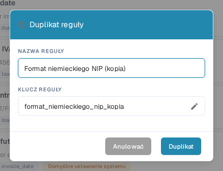

# Duplikowanie niestandardowej reguły walidacji

Użyj opcji **Duplikat**, gdy istniejąca reguła jest dobrym punktem wyjścia i chcesz uzyskać jej oddzielną kopię. DocBits kopiuje definicję reguły; Ty wybierasz nazwę i klucz nowej reguły. Reguła źródłowa pozostaje na liście.

1. Przejdź do **Ustawienia → Typy dokumentów**, otwórz typ dokumentu, który chcesz skonfigurować, i wybierz **Niestandardowe reguły walidacji**. Strona pokazuje wybrany typ dokumentu nad kartami reguł. Pozostałe ustawienia tego ekranu opisano na stronie [Typy dokumentów](README.md).
2. Znajdź regułę źródłową. Przy długiej liście użyj pola wyszukiwania lub filtrów zakresu i statusu. Otwórz menu trzech kropek tej reguły i wybierz **Duplikat**. Skopiować możesz zarówno regułę domyślną systemową, jak i regułę niestandardową.
3. W polu **NAZWA REGUŁY** pozostaw sugerowaną nazwę z końcówką „Copy” lub wpisz czytelniejszą nazwę. **KLUCZ REGUŁY** jest generowany na podstawie tej nazwy. Wybierz ikonę ołówka, jeśli chcesz edytować klucz ręcznie.
4. Wybierz **Duplikat**, aby utworzyć oddzielną regułę. DocBits odświeży listę po zapisaniu. Wybierz **Anulować**, aby zamknąć okno bez tworzenia kopii.

<figure><figcaption>
Polskie okno »Duplikat reguły« w organizacji testowej DocBits Sandbox. Skopiowaną nazwę i klucz można zmienić przed wyborem przycisku Duplikat.
</figcaption></figure>

Przycisk **Duplikat** wymaga zarówno nazwy, jak i klucza. Jeśli zapis się nie powiedzie, DocBits wyświetli błąd; popraw nazwę lub klucz i spróbuj ponownie. Przed aktywacją lub zmianą sprawdź nową regułę, ponieważ kopia startuje z definicją reguły źródłowej.
