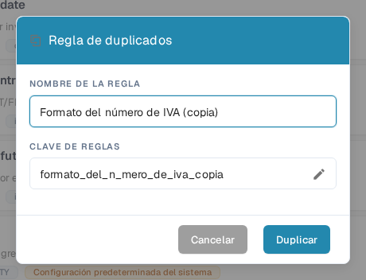

# Duplicar una regla de validación personalizada

Utilice **Duplicar** cuando una regla sea un buen punto de partida y quiera una copia independiente. DocBits copia la definición de la regla; usted elige el nombre y la clave de la nueva regla. La regla original permanece en la lista.

1. Vaya a **Configuración → Tipos de documento**, abra el tipo de documento que desea configurar y seleccione **Reglas de validación personalizadas** (la función debe estar activada en el tipo de documento). La página muestra el tipo de documento seleccionado sobre las tarjetas de reglas. Consulte [Tipos de documento](README.md) para ver los demás ajustes disponibles allí.
2. Busque la regla de origen. Si la lista es larga, use el campo de búsqueda o los filtros de ámbito y estado. Abra el menú de acciones de los tres puntos de la regla y seleccione **Duplicar**. Puede copiar tanto una regla predeterminada del sistema como una regla personalizada.
3. En **NOMBRE DE LA REGLA**, mantenga el nombre sugerido con el sufijo “Copy” o escriba un nombre más claro. La **CLAVE DE REGLAS** se genera a partir de ese nombre. Seleccione el icono del lápiz si necesita editar la clave usted mismo.
4. Seleccione **Duplicar** para crear la regla independiente. DocBits actualiza la lista después de guardar. Seleccione **Cancelar** para cerrar el cuadro de diálogo sin crear una copia.

<figure><figcaption>
El cuadro de diálogo español «Regla de duplicados» en la organización de pruebas DocBits Sandbox. El nombre y la clave copiados pueden modificarse antes de seleccionar Duplicar.
</figcaption></figure>

El botón **Duplicar** necesita tanto un nombre como una clave. Si el guardado falla, DocBits muestra un error; corrija el nombre o la clave e inténtelo de nuevo. Revise la nueva regla antes de activarla o modificarla, porque una copia comienza con la definición de la regla de origen.
