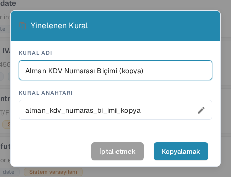

# Özel Doğrulama Kuralını Çoğaltma

Bir kural iyi bir başlangıç noktasıysa ve ondan ayrı bir kopya istiyorsanız **Kopyalamak** seçeneğini kullanın. DocBits kuralın tanımını kopyalar; yeni kuralın adını ve anahtarını siz seçersiniz. Orijinal kural listede kalır.

1. **Ayarlar → Belge Türleri** bölümüne gidin, yapılandırmak istediğiniz belge türünü açın, **Özel Doğrulama Kuralları** işlevini etkinleştirin ve **Doğrulama Kurallarını Yönetin** bağlantısını seçin. Sayfa, seçili belge türünü kural kartlarının üzerinde gösterir. Diğer ayarlar için bkz. [Belge Türleri](../../../../admin-section/settings/global-settings/document-types/README.md).
2. Kaynak kuralı bulun. Liste uzunsa arama alanını ya da kapsam ve durum filtrelerini kullanın. Kuralın üç noktalı işlem menüsünü açıp **Kopyalamak** seçeneğini işaretleyin. Sistem varsayılanı ya da özel bir kuralı kopyalayabilirsiniz.
3. **KURAL ADI** alanında “Copy” ile biten önerilen adı koruyun veya daha açık bir ad yazın. **KURAL ANAHTARI** bu addan üretilir. Anahtarı kendiniz düzenlemeniz gerekiyorsa kalem simgesini seçin.
4. Ayrı kuralı oluşturmak için **Kopyalamak** düğmesini seçin. DocBits kaydetmeden sonra listeyi yeniler. Kopya oluşturmadan pencereyi kapatmak için **İptal etmek** seçeneğini kullanın.

<figure><figcaption>
DocBits Sandbox test kuruluşunda Türkçe Yinelenen Kural penceresi. Kopyalanan ad ve anahtar, Kopyalamak seçilmeden önce değiştirilebilir.
</figcaption></figure>

**Kopyalamak** düğmesi hem bir ad hem de bir anahtar gerektirir. Kaydetme başarısız olursa DocBits bir hata gösterir; adı veya anahtarı düzeltip yeniden deneyin. Kopya, kaynak kuralın tanımıyla başladığı için yeni kuralı etkinleştirmeden veya değiştirmeden önce gözden geçirin.
