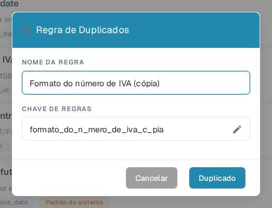

# Duplicar uma Regra de Validação Personalizada

Use **Duplicado** quando uma regra for um bom ponto de partida e você quiser uma cópia separada dela. O DocBits copia a definição da regra; você escolhe o nome e a chave da nova regra. A regra original permanece na lista.

1. Acesse **Configurações → Tipos de Documento**, abra o tipo de documento que deseja configurar e selecione **Regras de Validação Personalizadas** (a função precisa estar ativada nas configurações do tipo de documento). A página mostra o tipo de documento selecionado acima dos cartões de regras. Veja [Tipos de Documento](README.md) para as outras configurações disponíveis ali.
2. Encontre a regra de origem. Use o campo de pesquisa ou os filtros de escopo e status se a lista for longa. Abra o menu de ações de três pontos da regra e selecione **Duplicado**. Você pode copiar uma regra padrão do sistema ou uma regra personalizada.
3. Em **NOME DA REGRA**, mantenha o nome sugerido com o sufixo “Copy” ou escolha um nome mais claro. A **CHAVE DE REGRAS** é gerada a partir do nome. Selecione o ícone de lápis se precisar editar a chave você mesmo.
4. Selecione **Duplicado** para criar a regra separada. O DocBits atualiza a lista após salvar. Selecione **Cancelar** para fechar o diálogo sem criar uma cópia.

<figure><figcaption>
O diálogo português Regra de Duplicados na organização de teste DocBits Sandbox. O nome copiado e a chave podem ser alterados antes de selecionar Duplicado.
</figcaption></figure>

O botão **Duplicado** precisa de um nome e de uma chave. Se a gravação falhar, o DocBits mostra um erro; corrija o nome ou a chave e tente novamente. Revise a nova regra antes de ativá-la ou alterá-la, porque uma cópia começa com a definição da regra de origem.
