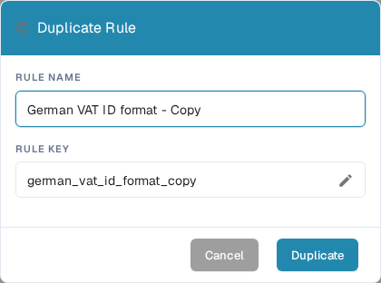

# Duplicate a Custom Validation Rule

Use **Duplicate** when a rule is a useful starting point and you want a separate copy. DocBits copies the rule's definition; you choose the new rule's name and key. The original rule stays in the list.

1. Go to **Settings → Document Types**, open the document type you want to configure, and select **Custom Validation Rules**. The page shows the selected document type above its rule cards. See [Document Types](README.md) for the other settings available there.
2. Find the source rule. Use the search field or the scope and status filters if the list is long. Open its three-dot actions menu and select **Duplicate**. You can copy a system default or a custom rule.
3. In **Rule Name**, keep the suggested name ending in “Copy” or enter a clearer name. The **Rule Key** is generated from that name. Select the pencil icon if you need to edit the key yourself.
4. Select **Duplicate** to create the separate rule. DocBits refreshes the list after saving. Select **Cancel** to close the dialog without creating a copy.

<figure><figcaption>
The English Duplicate Rule dialog in the DocBits Sandbox test organization. The copied name and key can be changed before selecting Duplicate.
</figcaption></figure>

The **Duplicate** button needs both a name and a key. If saving fails, DocBits shows an error; correct the name or key and try again. Review the new rule before activating or changing it, because a copy starts with the source rule's definition.
