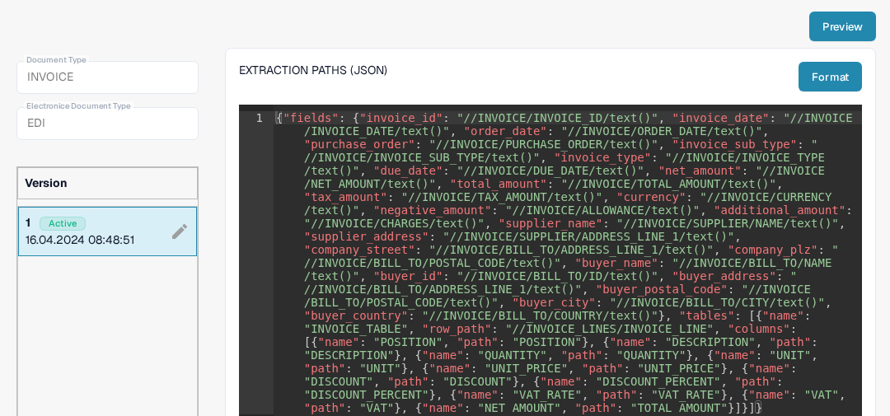
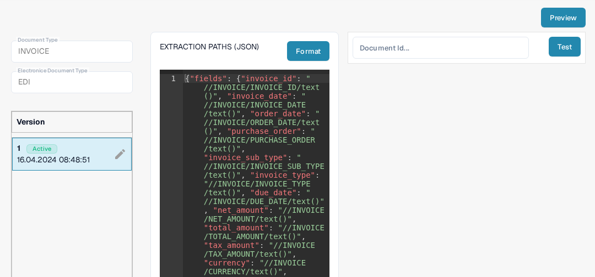

# EDI Extraction Paths File Guide

The **Extraction Paths** configuration tells DocBits where to find invoice values in a structured EDI/XML document. It maps document fields and table columns to XPath expressions. Change this configuration only if you manage electronic document formats for your organization.

## Open the extraction paths

1. Go to **Settings → Document Types**.
2. Open **E-Doc** for the document type you want to configure. The screenshots below use **Invoice**.
3. Expand **EDI** and select **EXTRACTION PATHS**. The row is marked **JSON**.

<figure><figcaption>EDI has separate Transformation, Preview and Extraction Paths entries.</figcaption></figure>

If you need to change another EDI component, use the corresponding [Transformation](edi-transformation-file-guide.md) or [Preview](edi-preview-file-guide.md) guide.

## Read the mapping

The detail page shows the selected document type and EDI format on the left, its versions below, and the JSON mapping on the right. The **Active** badge identifies the version currently in use. **Format** arranges the JSON for reading; it does not activate a version.

<figure><figcaption>The active EDI mapping for invoices in the documentation test organization.</figcaption></figure>

The JSON has two main parts:

* `fields` maps a DocBits field such as `invoice_id` to the value's XPath in the XML.
* `tables` identifies a repeating row with `row_path` and maps each table column with its `name` and `path`.

For example, the current invoice mapping includes `"invoice_id": "//INVOICE/INVOICE_ID/text()"`. Its invoice table uses `"row_path": "//INVOICE_LINES/INVOICE_LINE"`. Your XML structure and DocBits field names may differ; copy paths from your own sample document rather than this example.

## Create and check a change

The pencil beside the active version creates a **draft**. Make your JSON changes in that draft. Check the field names and paths against your XML before activating it. The draft's checkmark activates that version; activating a new version replaces the previously active one. Use the trash icon only to delete an unwanted draft.

Click **Preview** to show the test panel. Enter the DocBits **Document ID** of an uploaded EDI document and click **Test**. Compare the returned values with the source document. The screenshot shows the empty test panel; no example result is claimed.

<figure><figcaption>Test the selected mapping with a real EDI document ID before activating a draft.</figcaption></figure>

Need the document ID? Open the uploaded document in DocBits and copy its ID. For background on these files, see [EDI Settings](README.md) and the [EDI video guide](edi-videos.md).
