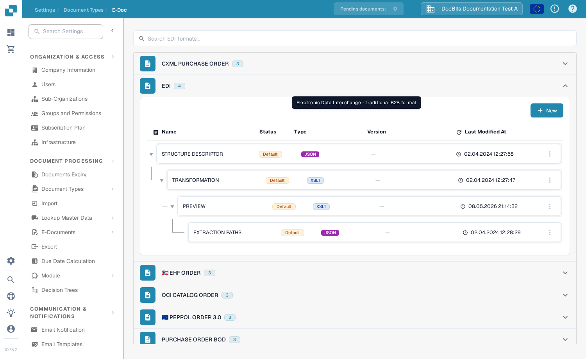

# EDI Mappings

An EDI mapping tells DocBits how to interpret the fields in an electronic business document. Use the guide for the message type you receive or send; the four types below have different purposes.

In the current application, open **Settings** → **Document Types** → **E-Doc**. Find **EDI** in the format list and expand it. The list shows a hierarchy of mapping parts such as **Structure Descriptor**, **Transformation**, **Preview**, and **Extraction Paths**. Select the relevant format before changing a mapping.

<figure><figcaption>Current English Sandbox view in DocBits Documentation Test A. The EDI group is expanded; no mapping was edited or tested.</figcaption></figure>

* [EDI 810 (Invoice) Mapping](edi-810-invoice-mapping.md) is for invoice messages.
* [EDI 850 (Purchase Order) Mapping](edi-850-purchase-order-mapping.md) is for purchase orders.
* [EDI 855 (Purchase Order Acknowledgement) Mapping](edi-855-purchase-order-acknowledgement-mapping.md) is for acknowledgements.
* [EDI 856 (Advance Shipment Notice) Mapping](edi-856-advance-shipment-notice-mapping.md) is for shipment notices.

If you are new to EDI in DocBits, begin with the [EDI Settings overview](../README.md) before opening a message-specific mapping. Check a mapping with a synthetic message of the same type before using it for live documents. This page does not verify a completed EDI exchange.
