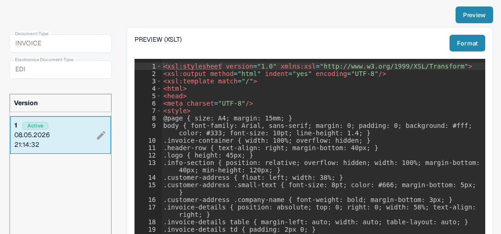
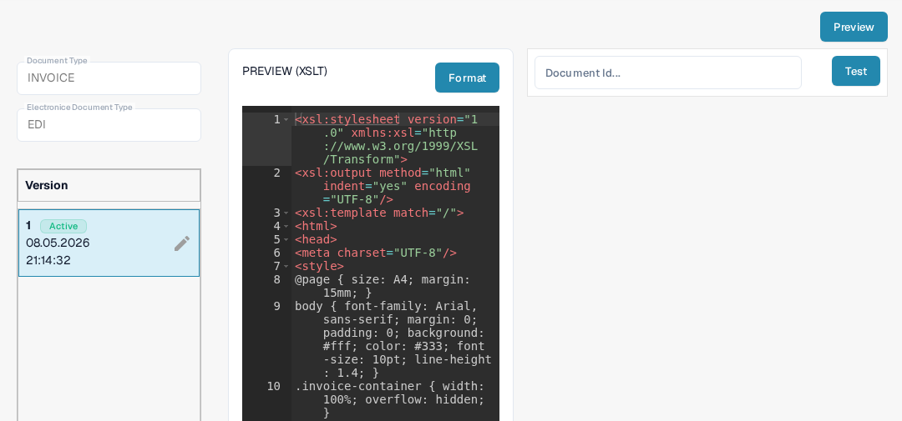

# EDI Preview File Guide

The **PREVIEW** file controls how a structured EDI document is displayed for a person to read. In DocBits it is an **XSLT** configuration, separate from the **EXTRACTION PATHS** JSON mapping. Use this guide if you maintain electronic document formats for your organization.

## Find the Preview file

1. Go to **Settings → Document Types** and open **E-Doc** for the relevant document type.
2. Expand the electronic format, such as **EDI** for **Invoice**.
3. Select the **PREVIEW** row marked **XSLT**. Do not select the **Preview** button yet; that button opens a test panel after you enter the configuration.

<figure><figcaption>Choose PREVIEW (XSLT) in the EDI list.</figcaption></figure>

## Understand the editor and versions

The detail page shows the document type, electronic format and available versions on the left. **Active** marks the version currently in use. The editor on the right contains an XSLT stylesheet. Its HTML and CSS control layout and appearance; XSLT inserts values from the structured document. **Format** arranges the source for reading and does not activate a version.

<figure><figcaption>Invoice EDI Preview configuration in the documentation test organization.</figcaption></figure>

The pencil beside the active version creates a **draft** for edits. After checking your changes, activate the draft with its checkmark. An activated version replaces the previously active one. Delete only an unwanted draft with the trash icon.

## Test a preview

Click the **Preview** button at the top right to open a test panel. Enter the **Document ID** of an uploaded EDI document and click **Test**. Inspect the displayed document to check whether labels, values and table rows are readable. The image shows the empty panel; it does not show a successful render.

<figure><figcaption>Use a real document ID to test the selected Preview version before activation.</figcaption></figure>

For field-to-XML mapping, use the [Extraction Paths guide](edi-extraction-paths-file-guide.md). For the source conversion step, see the [Transformation guide](edi-transformation-file-guide.md). The [EDI video guide](edi-videos.md) provides a walkthrough.
