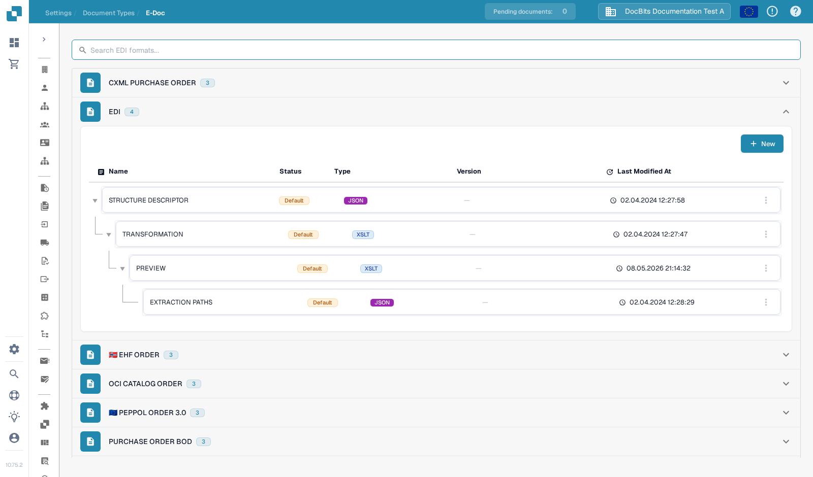
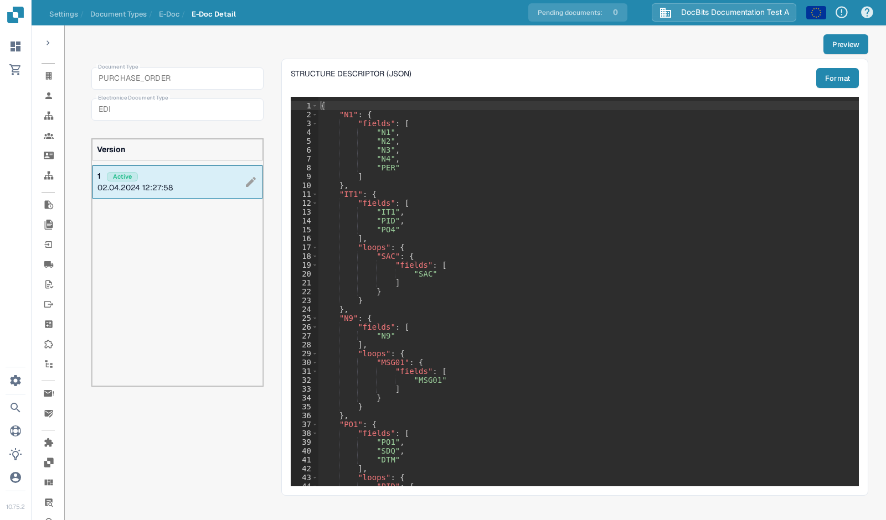
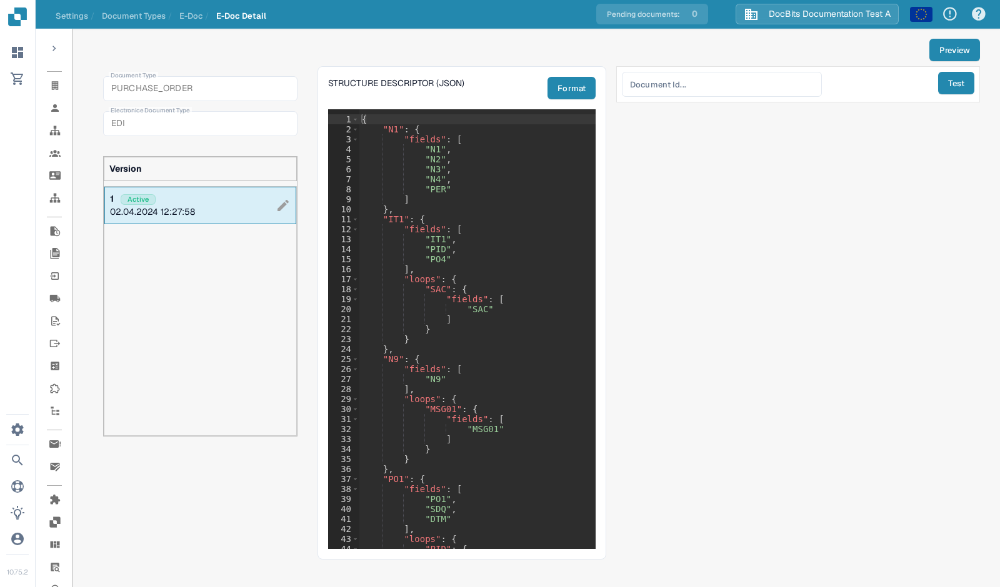

# EDI Structure Descriptor File Guide

## 1. Overview

The **Structure Descriptor File** is a **JSON** file that defines how repeating EDI segments (for example `N1`–`N4`) are grouped into structured output. It is the first step of EDI processing:

* **Accurate parsing** of related segments as single units.
* **Consistent output** for the [Transformation](edi-transformation-file-guide.md) and downstream systems.

_For a full example with segment details, see_ [_Structure Descriptor Example_](edi-structure-descriptor.md)_._

## 2. Access & Basic Editing

#### **Accessing the File**

1. Go to **Settings** → **Document Types** and open **E-Doc** for the document type you want to configure (for example _Purchase Order_). You need administrator access in your organization to edit these files.

    <figure><figcaption>Open E-Doc for your document type; the EDI format lists its configuration files.</figcaption></figure>

2. Expand the **EDI** format. Its configuration files are listed together: **STRUCTURE DESCRIPTOR**, **TRANSFORMATION**, **PREVIEW** and **EXTRACTION PATHS**.
3. Click the **STRUCTURE DESCRIPTOR** row, marked **JSON**, to open it.

#### **Draft Management**

The left column shows the file **Version** list. The version marked **Active** is the one DocBits uses.

* **Create a Draft**: Click the ✏️ pencil icon next to the active version to begin editing. The active file itself cannot be edited directly.
* **Delete Drafts**: Use the 🗑️ trashcan icon to remove unused drafts.
* **Activate Changes**: Click the ✅ checkmark icon on a draft to approve and publish your changes.
  * <mark style="color:red;">**Note**</mark>: Activating a new version will **automatically deactivate** the previous one.

<figure><figcaption>The Structure Descriptor file with its version list; the pencil creates a draft you can edit.</figcaption></figure>

## 3. Preview Function (Preview Parsed Output)

The **Preview Function** lets you test how an uploaded EDI file is parsed with the currently shown Structure Descriptor, before activating any change.

#### Usage

* Upload an EDI file via the standard upload flow.
* Copy the **Document ID** of the uploaded file.
* Open the **Structure Descriptor** file as described above.
* Click **Preview** in the upper right to open the test panel.

    
<figure><figcaption>The test panel: enter a Document ID and press Test.</figcaption></figure>

* Enter the **Document ID** into the field and press **Test**.
* The resulting **structured output** is displayed next to the editor.

This is especially useful for debugging mappings and validating structural groupings in real time. A representative EDI document of your own format is required; the result shown depends on the uploaded file.

## 6. Video Walkthrough

A video guide for this file type is available on the [Videos page.](../edi-videos.md)\
Use it to follow along with setup, editing, and previewing.
