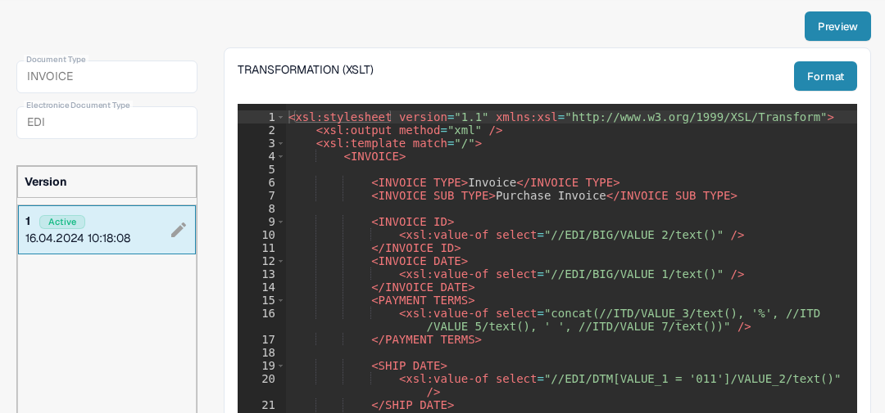
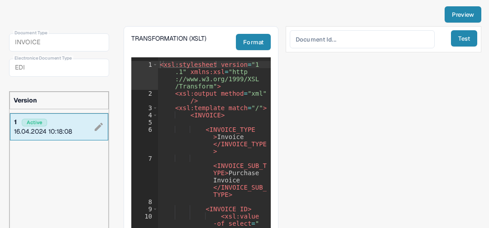

# EDI Transformation File Guide

The **TRANSFORMATION** configuration converts the EDI input into the structured XML used by DocBits. It is an **XSLT** stylesheet. This guide is for people who maintain an electronic document format; you need a representative EDI document to verify a change.

## Open the transformation

1. Go to **Settings → Document Types** and open **E-Doc** for the document type you want to configure.
2. Expand **EDI** and select **TRANSFORMATION**, marked **XSLT**. The screenshots use **Invoice** in a documentation test organization.

<figure><figcaption>Choose TRANSFORMATION (XSLT) in the EDI format list.</figcaption></figure>

## Read the stylesheet and version

The left side shows the selected document type, EDI format and versions. **Active** marks the version currently in use. The stylesheet appears in the editor on the right. The current invoice example uses `xsl:value-of` to copy values such as an invoice ID and date from the EDI input into an `INVOICE` XML structure. Your document may use different EDI paths. **Format** arranges the source for reading; it does not activate a version.

<figure><figcaption>The active invoice EDI transformation in the test organization.</figcaption></figure>

The pencil beside the active version creates a **draft** for changes. Review and test the draft before activating it with its checkmark. An activated version replaces the previously active version. The trash icon deletes an unwanted draft.

## Test before activation

Click **Preview** in the upper right to open the test panel. Enter the **Document ID** of an uploaded EDI document and click **Test**. Check the returned output against the original document and your expected XML fields. The screenshot shows only the empty panel; no successful transformation result is claimed.

<figure><figcaption>Test the selected transformation with a representative EDI document ID.</figcaption></figure>

After transformation, DocBits uses [Extraction Paths](edi-extraction-paths-file-guide.md) to map XML values to fields. The [Preview file](edi-preview-file-guide.md) controls the readable display. See the [EDI video guide](edi-videos.md) for a walkthrough.
