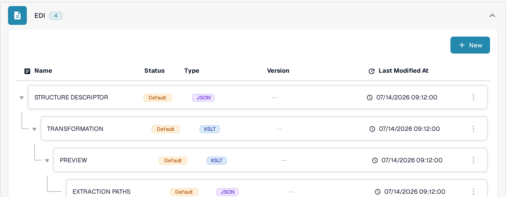
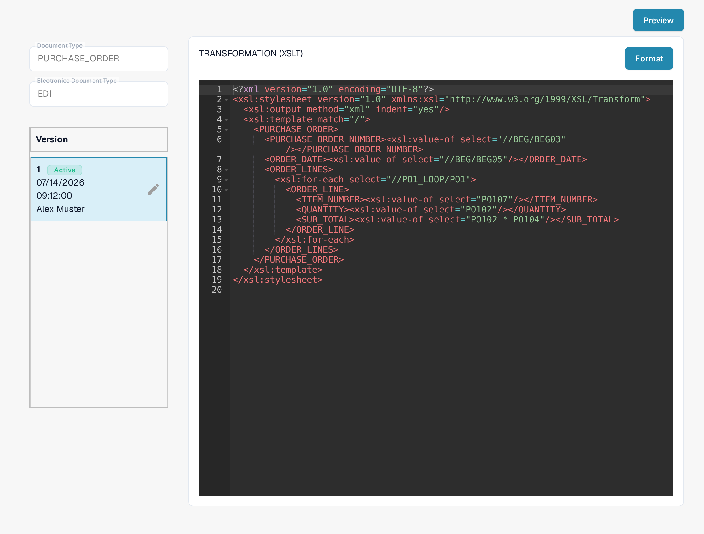
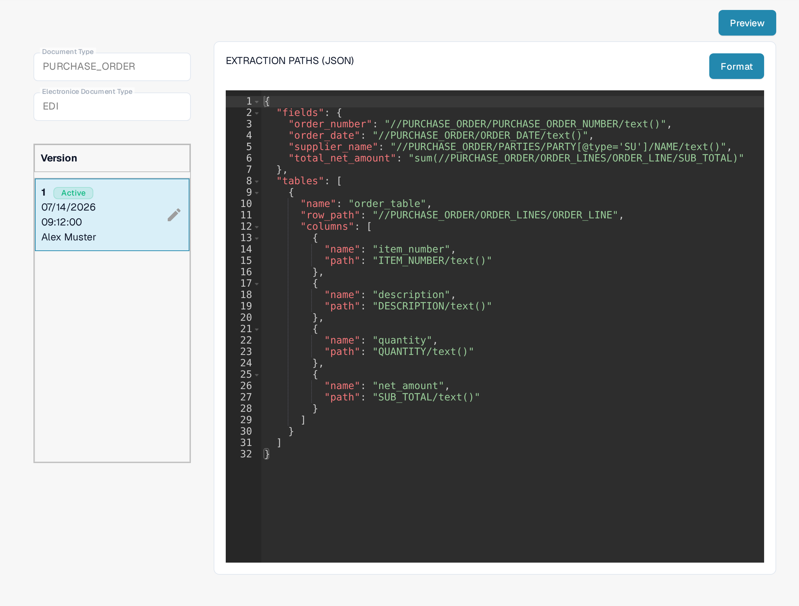

# Setting Up EDI Templates

An EDI template in DocBits is made of up to four files for one E-Doc format of a document type: a **Structure Descriptor**, a **Transformation**, an **Extraction Paths** file, and a **Preview**. You manage all of them under **Settings → Document Types → E-Doc**: open the format group (for example **EDI**), and each file is listed as a row with its **Status** (Default or Custom), **Type** (JSON or XSLT), **Version** and **Last Modified At**.

<figure><figcaption>
The EDI template files of a document type on the E-Doc settings page.
</figcaption></figure>

Click a row to open its editor. The detail page shows the **Document Type** and **Electronice Document Type** fields, the **Version** list on the left (with an **Active** badge on the version in use), the code editor in the middle, and a **Preview** button at the top right.

**Define the structure descriptor:**

* Identify the type of EDI message you are working with, e.g. ANSI X12, EDIFACT, or a custom format.
* Determine the segments, elements, and subelements within the EDI structure.
* Create a structure descriptor that accurately reflects the hierarchy and organization of the EDI message. This can be done using a special syntax such as XML or JSON.

For details, see the [EDI Structure Descriptor File Guide](edi-structure-descriptor-file-guide/).

**Set up transformations:**

* Use an appropriate tool or software that supports EDI transformations, such as an EDI translator.
* Define the rules for converting the EDI message to your system's internal format and vice versa.
* Configure the transformations to interpret and process segments, elements, and subelements according to your system's requirements. Test the transformations thoroughly to ensure that the data is correctly interpreted and formatted.

<figure><figcaption>
The Transformation (XSLT) editor with the version list on the left.
</figcaption></figure>

In the editor you can re-indent the code with **Format** and store your changes with **Save**. Editing a Default file creates a draft version first; activate a version from the version list to make it live. For details, see the [EDI Transformation File Guide](edi-transformation-file-guide.md).

**Configure extraction paths for optimal data extraction and formatting:**

* Identify the data fields to be extracted and transferred to your internal system.
* Define extraction paths or rules to extract the relevant data fields from the EDI messages.
* Consider the different variations and formats that may occur in the incoming EDI messages and ensure that the extraction paths are flexible enough to accommodate them.
* Validate the extraction results to ensure that the correct data fields are extracted and correctly formatted.

<figure><figcaption>
The Extraction Paths (JSON) editor with field and table paths.
</figcaption></figure>

For details, see the [EDI Extraction Paths File Guide](edi-extraction-paths-file-guide.md).

**Test the result with the preview:**

* Open the template you want to check and click **Preview** at the top right.
* Enter the ID of a processed document and start the test. The preview shows the transformed output so you can verify that the template produces the expected data.

For details, see the [EDI Preview File Guide](edi-preview-file-guide.md).

By carefully defining the structure descriptor, setting up transformations and configuring extraction paths, you can ensure that data extraction and formatting are performed optimally in your EDI templates. This will help improve the efficiency and accuracy of your electronic business communications.
