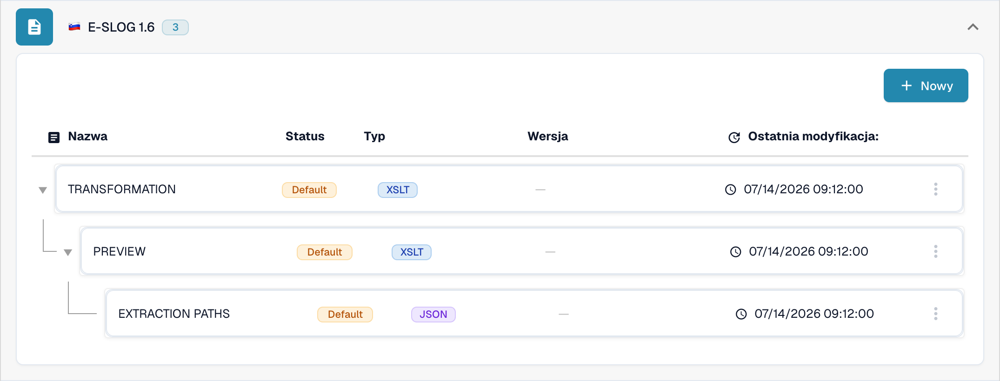
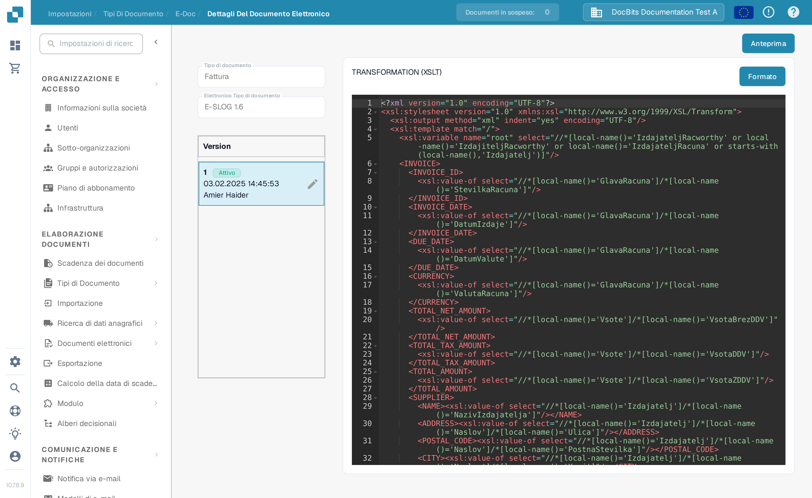

# eSLOG 1.6 i 2.0

**eSLOG 1.6** i **eSLOG 2.0** są w DocBits oddzielnymi formatami faktur elektronicznych. Wybierz wersję używaną przez przychodzące faktury słoweńskie. Poniższe zrzuty ekranu pokazują obecny polski interfejs Sandbox w organizacji testowej dokumentacji; nie dowodzą one, że faktura w którejś z tych wersji została przetworzona pomyślnie.

## Znajdowanie konfiguracji

1. Przejdź do **Ustawienia → Typy dokumentów → Faktura → E-Doc**.
2. Rozwiń **E-SLOG 1.6** albo **E-SLOG 2.0**. Każdy format ma trzy własne pozycje.

<figure><figcaption>E-SLOG 1.6 na liście E-Doc faktur.</figcaption></figure>

<figure><figcaption>E-SLOG 2.0 ma oddzielne konfiguracje dla tych samych trzech kroków.</figcaption></figure>

| Pozycja | Co kontroluje | Następny przewodnik |
| --- | --- | --- |
| **TRANSFORMATION (XSLT)** | Konwertuje dane źródłowe formatu na ustrukturyzowany XML. | [Transformacja](edi/edi-transformation-file-guide.md) |
| **PREVIEW (XSLT)** | Definiuje czytelny widok dokumentu. | [Podgląd](edi/edi-preview-file-guide.md) |
| **EXTRACTION PATHS (JSON)** | Mapuje wartości XML na pola i kolumny tabel DocBits. | [Ścieżki ekstrakcji](edi/edi-extraction-paths-file-guide.md) |

Kliknij wiersz, aby zobaczyć jego wersje i konfigurację. **Default** oznacza pozycję dostarczoną przez system. **Ostatnia modyfikacja** pokazuje, kiedy dana pozycja została ostatnio zmieniona. Przycisk **Nowy** tworzy dodatkową pozycję konfiguracji. Menu trzech kropek wiersza domyślnego oferuje **Dostosuj**, które tworzy kopię specyficzną dla organizacji, oraz **Usuwać** (widoczne dla administratorów). Sprawdź dokładnie wybraną pozycję przed użyciem opcji Usuwać.

<figure><figcaption>Panel wersji: plakietka <strong>Aktywny</strong> i ołówek przy aktywnej wersji.</figcaption></figure>

Wewnątrz konfiguracji ołówek przy aktywnej wersji tworzy szkic. Sprawdź szkic w panelu testowym **Podgląd** na reprezentatywnym, przesłanym identyfikatorze dokumentu, zanim aktywujesz go znacznikiem zatwierdzenia. Ikona kosza przy szkicu usuwa ten szkic. Rzeczywiste nazwy pól i ścieżki XML zależą od Twojego pliku eSLOG; szczegóły edytora znajdziesz w odpowiednim przewodniku powyżej.
