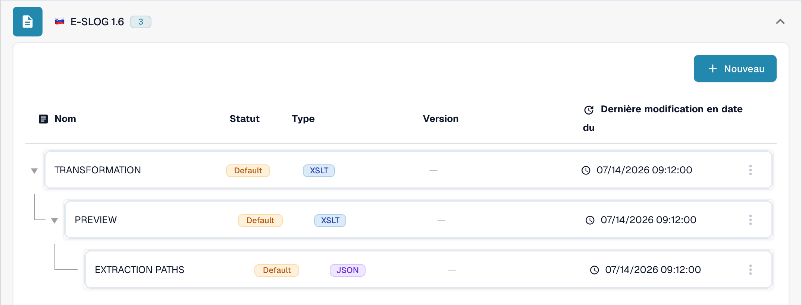

# eSLOG 1.6 et 2.0

**eSLOG 1.6** et **eSLOG 2.0** apparaissent comme des formats de facture électronique distincts dans DocBits. Choisissez la version utilisée par vos factures slovènes entrantes. Les captures d'écran ci-dessous montrent l'interface Sandbox française actuelle dans une organisation de test de documentation ; elles ne prouvent pas qu'une facture de l'une ou l'autre version a été traitée avec succès.

Pour la documentation officielle d'eSLOG, vous pouvez vous référer à [ce lien](https://epos.si/en/eslog). Les deux versions d'eSLOG sont activées par défaut.

## Rechercher les configurations

1. Accédez à **Paramètres → Types de Documents → Facture → E-Doc**.
2. Développez **E-SLOG 1.6** ou **E-SLOG 2.0**. Chaque format possède ses propres trois entrées.

<figure><figcaption>E-SLOG 1.6 dans la liste E-Doc de Facture.</figcaption></figure>

<figure><figcaption>E-SLOG 2.0 dispose de configurations séparées pour les trois mêmes étapes.</figcaption></figure>

| Entrée | Ce qu'elle contrôle | Guide suivant |
| --- | --- | --- |
| **TRANSFORMATION (XSLT)** | Convertit les données sources du format en XML structuré. | [Transformation](edi/edi-transformation-file-guide.md) |
| **PREVIEW (XSLT)** | Définit la vue lisible du document. | [Aperçu](edi/edi-preview-file-guide.md) |
| **EXTRACTION PATHS (JSON)** | Associe les valeurs XML aux champs et colonnes de tableau de DocBits. | [Chemins d'extraction](edi/edi-extraction-paths-file-guide.md) |

Cliquez sur une ligne pour afficher ses versions et sa configuration. **Default** identifie l'entrée fournie. **Dernière modification en date du** indique quand cette entrée a été modifiée pour la dernière fois. Le bouton **Nouveau** crée une entrée de configuration supplémentaire. Le menu à trois points d'une ligne par défaut propose **Personnaliser**, qui crée une copie spécifique à l'organisation, et **Supprimer** ; vérifiez attentivement la ligne sélectionnée avant d'utiliser Supprimer.

Dans une configuration, le crayon à côté d'une version active crée un brouillon. Vérifiez un brouillon avec le panneau de test **Aperçu** et un identifiant de document téléversé représentatif avant de l'activer avec la coche. L'icône corbeille d'un brouillon supprime ce brouillon. Les noms de champs et les chemins XML réels dépendent de votre fichier eSLOG ; utilisez le guide correspondant ci-dessus pour les détails de l'éditeur.
