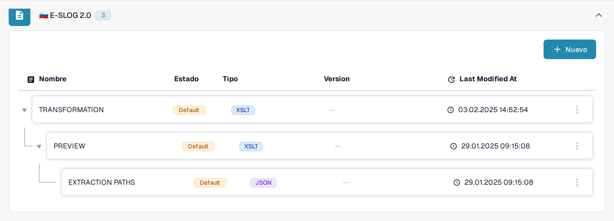

# eSLOG 1.6 y 2.0

**eSLOG 1.6** y **eSLOG 2.0** aparecen como formatos de factura electrónica separados en DocBits. Elija la versión que utiliza su factura eslovena entrante. Las siguientes capturas muestran la interfaz actual del Sandbox en español de una organización de pruebas de documentación; no demuestran que se haya procesado correctamente una factura de ninguna de las dos versiones.

## Buscar las configuraciones

1. Vaya a **Ajustes → Tipos de documentos → Factura → E-Doc**.
2. Despliegue **E-SLOG 1.6** o **E-SLOG 2.0**. Cada formato tiene sus propias tres entradas.

<figure><figcaption>E-SLOG 1.6 en la lista E-Doc de Factura.</figcaption></figure>

<figure><figcaption>E-SLOG 2.0 tiene configuraciones separadas para los mismos tres pasos.</figcaption></figure>

| Entrada | Qué controla | Guía siguiente |
| --- | --- | --- |
| **TRANSFORMATION (XSLT)** | Convierte los datos fuente del formato en XML estructurado. | [Transformación](edi/edi-transformation-file-guide.md) |
| **PREVIEW (XSLT)** | Define la vista legible del documento. | [Vista previa](edi/edi-preview-file-guide.md) |
| **EXTRACTION PATHS (JSON)** | Asigna los valores XML a los campos y columnas de tabla de DocBits. | [Rutas de extracción](edi/edi-extraction-paths-file-guide.md) |

Haga clic en una fila para ver sus versiones y su configuración. **Default** identifica la entrada proporcionada. **Last Modified At** muestra cuándo se cambió por última vez esa entrada. El botón **Nuevo** crea una entrada de configuración adicional. El menú de tres puntos de una fila **Default** ofrece **Personalizar**, que crea una copia específica de la organización, y **Borrar**; revise con atención la fila seleccionada antes de usar Borrar.

Dentro de una configuración, el lápiz junto a una versión activa crea un borrador. Compruebe el borrador con el panel de prueba **Preview** y un ID de documento subido representativo antes de activarlo con la marca de verificación. El icono de papelera de un borrador elimina ese borrador. Los nombres de campo y las rutas XML reales dependen de su archivo eSLOG; consulte la guía correspondiente de arriba para conocer los detalles del editor.
