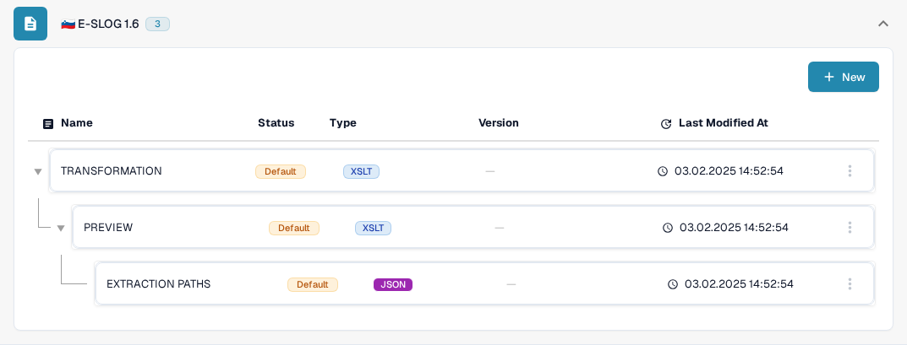

# eSLOG 1.6 and 2.0

**eSLOG 1.6** and **eSLOG 2.0** appear as separate electronic invoice formats in DocBits. Choose the version used by your incoming Slovenian invoice. The screenshots below show the current English Sandbox interface in a documentation test organization; they do not prove that an invoice of either version has been processed successfully.

## Find the configurations

1. Go to **Settings → Document Types → Invoice → E-Doc**.
2. Expand **E-SLOG 1.6** or **E-SLOG 2.0**. Each format has its own three entries.

<figure><figcaption>E-SLOG 1.6 in the Invoice E-Doc list.</figcaption></figure>

<figure><figcaption>E-SLOG 2.0 has separate configurations for the same three steps.</figcaption></figure>

| Entry | What it controls | Next guide |
| --- | --- | --- |
| **TRANSFORMATION (XSLT)** | Converts the format's source data into structured XML. | [Transformation](edi/edi-transformation-file-guide.md) |
| **PREVIEW (XSLT)** | Defines the readable document view. | [Preview](edi/edi-preview-file-guide.md) |
| **EXTRACTION PATHS (JSON)** | Maps XML values to DocBits fields and table columns. | [Extraction Paths](edi/edi-extraction-paths-file-guide.md) |

Click a row to see its versions and configuration. **Default** identifies the supplied entry. **Last Modified At** shows when that entry was last changed. The **New** button starts an additional configuration entry. The three-dot menu on a default row offers **Customize**, which creates an organization-specific copy, and **Delete**; review the selected row carefully before using Delete.

Inside a configuration, the pencil beside an active version creates a draft. Check a draft with the **Preview** test panel and a representative uploaded document ID before activating it with the checkmark. A draft's trash icon removes that draft. The actual field names and XML paths depend on your eSLOG file; use the corresponding guide above for the editor details.
