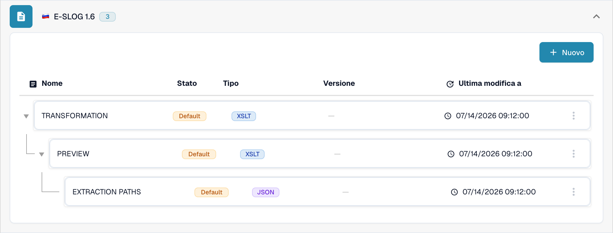
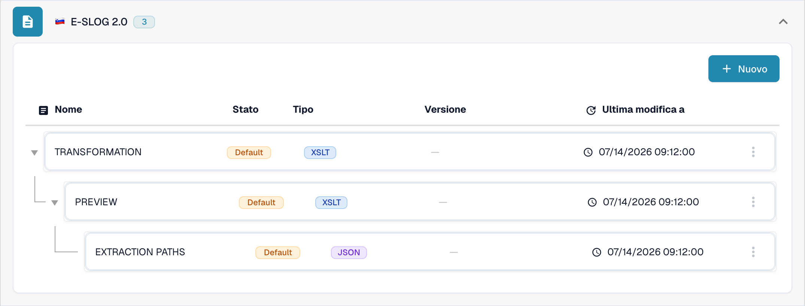
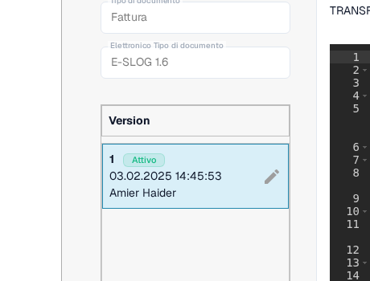

# eSLOG 1.6 e 2.0

**eSLOG 1.6** e **eSLOG 2.0** compaiono come formati di fattura elettronica separati in DocBits. Scegli la versione utilizzata dalle fatture slovene in arrivo. Gli screenshot qui sotto mostrano l'attuale interfaccia Sandbox italiana in un'organizzazione di documentazione di prova; non dimostrano che una fattura di una delle due versioni sia stata elaborata con successo.

## Trovare le configurazioni

1. Vai su **Impostazioni → Tipi di Documento → Fattura → E-Doc**.
2. Espandi **E-SLOG 1.6** oppure **E-SLOG 2.0**. Ogni formato ha tre voci proprie.

<figure><figcaption>E-SLOG 1.6 nell'elenco E-Doc delle fatture.</figcaption></figure>

<figure><figcaption>E-SLOG 2.0 ha configurazioni separate per gli stessi tre passaggi.</figcaption></figure>

| Voce | Cosa controlla | Guida successiva |
| --- | --- | --- |
| **TRANSFORMATION (XSLT)** | Converte i dati sorgente del formato in XML strutturato. | [Trasformazione](edi/edi-transformation-file-guide.md) |
| **PREVIEW (XSLT)** | Definisce la vista leggibile del documento. | [Anteprima](edi/edi-preview-file-guide.md) |
| **EXTRACTION PATHS (JSON)** | Mappa i valori XML nei campi e nelle tabelle di DocBits. | [Percorsi di estrazione](edi/edi-extraction-paths-file-guide.md) |

Fai clic su una riga per vederne le versioni e la configurazione. **Default** identifica la voce fornita. **Ultima modifica a** mostra quando quella voce è stata modificata l'ultima volta. Il pulsante **Nuovo** avvia una voce di configurazione aggiuntiva. Il menu a tre punti di una voce predefinita offre **Personalizzazione**, che crea una copia specifica dell'organizzazione, e **Cancellare** (visibile agli amministratori). Verifica bene la riga selezionata prima di usare Cancellare.

<figure><figcaption>Il pannello Versioni: badge <strong>Attivo</strong> e matita accanto alla versione attiva.</figcaption></figure>

All'interno di una configurazione, la matita accanto a una versione attiva crea una bozza. Verifica una bozza con il pannello di prova **Anteprima** e un ID documento caricato rappresentativo prima di attivarla con il segno di spunta. L'icona del cestino di una bozza rimuove quella bozza. I nomi dei campi e i percorsi XML effettivi dipendono dal tuo file eSLOG; usa la guida corrispondente qui sopra per i dettagli dell'editor.
