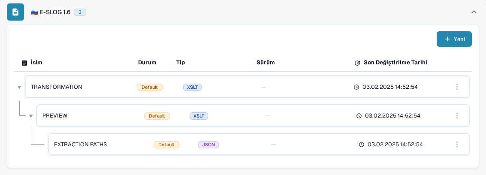
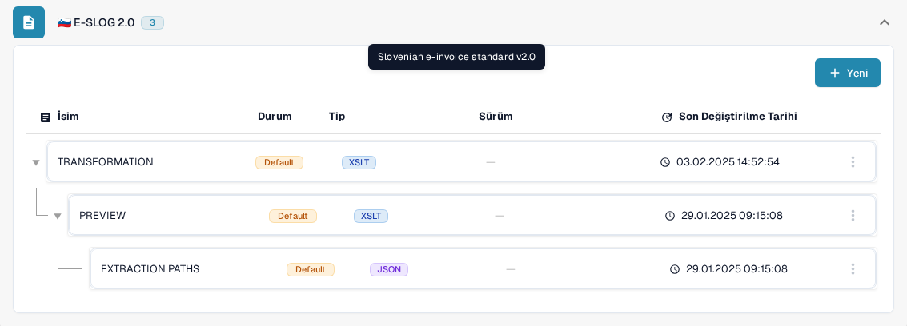

# eSLOG 1.6 ve 2.0

**eSLOG 1.6** ve **eSLOG 2.0**, DocBits'te ayrı elektronik fatura biçimleri olarak görünür. Gelen Slovenya faturalarınızda kullanılan sürümü seçin. Aşağıdaki ekran görüntüleri, bir dokümantasyon test kuruluşundaki mevcut Türkçe Sandbox arayüzünü gösterir; bu görüntüler, iki sürümden birinin faturasının başarıyla işlendiğini kanıtlamaz.

## Yapılandırmaları bulun

1. **Ayarlar → Belge Türleri → Fatura → E-Belge** yolunu izleyin.
2. **E-SLOG 1.6** veya **E-SLOG 2.0** öğesini genişletin. Her biçimin kendi üç kaydı vardır.

<figure><figcaption>Fatura E-Belge listesinde E-SLOG 1.6.</figcaption></figure>

<figure><figcaption>E-SLOG 2.0, aynı üç adım için ayrı yapılandırmalara sahiptir.</figcaption></figure>

| Kayıt | Ne kontrol eder |
| --- | --- |
| **TRANSFORMATION (XSLT)** | Biçimin kaynak verisini yapılandırılmış XML'e dönüştürür. |
| **PREVIEW (XSLT)** | Okunabilir belge görünümünü tanımlar. |
| **EXTRACTION PATHS (JSON)** | XML değerlerini DocBits alanlarına ve tablo sütunlarına eşler. |

Bir satıra tıklayarak sürümlerini ve yapılandırmasını görün. **Default**, DocBits tarafından sağlanan kaydı belirtir. **Son Değiştirilme Tarihi**, o kaydın en son ne zaman değiştirildiğini gösterir. **Yeni** düğmesi ek bir yapılandırma kaydı başlatır. Varsayılan satırdaki üç nokta menüsü, kuruluşa özel bir kopya oluşturan **Özelleştirmek** ve **Silme** seçeneklerini sunar; Silme'yi kullanmadan önce seçili satırı dikkatle kontrol edin.

Bir yapılandırmanın içinde, etkin sürümün yanındaki kalem simgesi bir taslak oluşturur. Taslağı **Önizleme** test panelinde ve temsilî bir yüklenmiş belge kimliğiyle kontrol edin, ardından onay işaretiyle etkinleştirin. Bir taslağin çöp kutusu simgesi o taslağı kaldırır. Gerçek alan adları ve XML yolları eSLOG dosyanıza bağlıdır.
