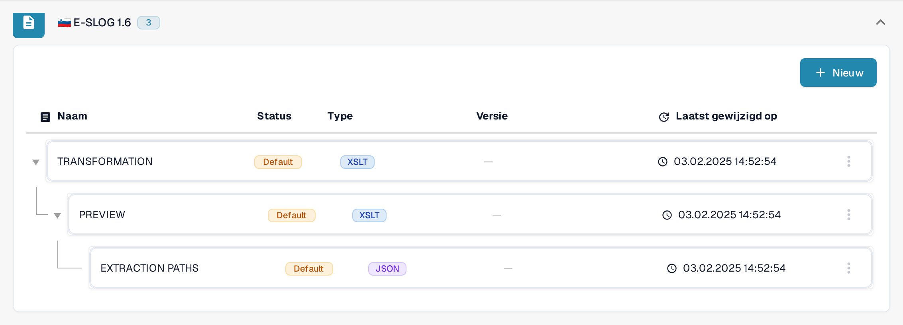

# eSLOG 1.6 en 2.0

**eSLOG 1.6** en **eSLOG 2.0** verschijnen in DocBits als aparte elektronische factuurformaten. Kies de versie die uw inkomende Sloveense facturen gebruiken. De onderstaande afbeeldingen tonen de huidige Nederlandse sandbox-interface in een documentatietestorganisatie; ze bewijzen niet dat een factuur van een van beide versies succesvol is verwerkt.

## De configuraties vinden

1. Ga naar **Instellingen → Documenttypen → Factuur → E-Doc**.
2. Vouw **E-SLOG 1.6** of **E-SLOG 2.0** open. Elk formaat heeft zijn eigen drie items.

<figure><figcaption>E-SLOG 1.6 in de E-Doc-lijst van Factuur.</figcaption></figure>

<figure><figcaption>E-SLOG 2.0 heeft aparte configuraties voor dezelfde drie stappen.</figcaption></figure>

| Item | Wat het stuurt | Volgende handleiding |
| --- | --- | --- |
| **TRANSFORMATION (XSLT)** | Zet de brondata van het formaat om naar gestructureerde XML. | [Transformatie](edi/edi-transformation-file-guide.md) |
| **PREVIEW (XSLT)** | Bepaalt de leesbare documentweergave. | [Voorbeeld](edi/edi-preview-file-guide.md) |
| **EXTRACTION PATHS (JSON)** | Wijst XML-waarden toe aan DocBits-velden en tabelkolommen. | [Extractiepaden](edi/edi-extraction-paths-file-guide.md) |

Klik op een rij om de versies en configuratie ervan te zien. **Default** markeert het meegeleverde item. **Laatst gewijzigd op** toont wanneer dat item voor het laatst is gewijzigd. De knop **Nieuw** start een extra configuratie-item. Het menu met de drie puntjes van een standaardrij biedt **Customize** (maakt een organisatieafhankelijke kopie) en **Delete**; controleer de geselecteerde rij zorgvuldig voordat u Delete gebruikt.

Opent u een configuratie, dan maakt het potloodicoon naast een actieve versie een concept. Controleer een concept met het testpaneel **Voorvertoning** en een representatieve geüploade document-ID voordat u het activeert met het vinkje. Het prullenbakicoon van een concept verwijdert dat concept. De daadwerkelijke veldnamen en XML-padnamen hangen af van uw eSLOG-bestand; gebruik de bijbehorende handleiding hierboven voor de details in de editor.
