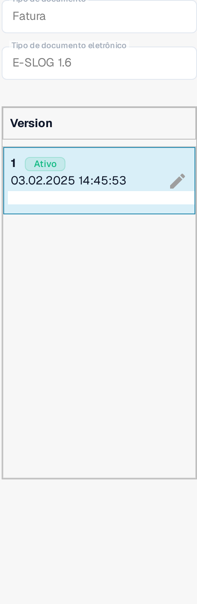

# eSLOG 1.6 e 2.0

**eSLOG 1.6** e **eSLOG 2.0** aparecem como formatos de fatura eletrónica separados no DocBits. Escolha a versão utilizada pelas suas faturas eslovenas recebidas. As capturas de ecrã abaixo mostram a interface Sandbox inglesa atual numa organização de documentação de teste; elas não provam que uma fatura de qualquer uma das versões tenha sido processada com sucesso.

## Localizar as configurações

1. Aceda a **Definições → Tipos de Documento → Fatura → E-Doc**.
2. Expanda **E-SLOG 1.6** ou **E-SLOG 2.0**. Cada formato tem as suas três entradas.

<figure><figcaption>E-SLOG 1.6 na lista E-Doc das faturas.</figcaption></figure>

<figure><figcaption>E-SLOG 2.0 tem configurações separadas para os mesmos três passos.</figcaption></figure>

| Entrada | O que controla | Guia seguinte |
| --- | --- | --- |
| **TRANSFORMATION (XSLT)** | Converte os dados de origem do formato em XML estruturado. | [Transformação](edi/edi-transformation-file-guide.md) |
| **PREVIEW (XSLT)** | Define a vista legível do documento. | [Pré-visualização](edi/edi-preview-file-guide.md) |
| **EXTRACTION PATHS (JSON)** | Mapeia os valores XML para campos e colunas de tabela do DocBits. | [Caminhos de extração](edi/edi-extraction-paths-file-guide.md) |

Clique numa linha para ver as suas versões e a configuração. **Padrão** identifica a entrada fornecida. **Última modificação em** mostra quando essa entrada foi alterada pela última vez. O botão **Novo** inicia uma entrada de configuração adicional. O menu de três pontos numa linha padrão oferece **Personalizar**, que cria uma cópia específica da organização, e **Eliminar**; verifique com atenção a linha selecionada antes de usar Eliminar.

<figure><figcaption>O painel de versões: selo <strong>Ativo</strong> e lápis junto à versão ativa.</figcaption></figure>

Dentro de uma configuração, o lápis junto a uma versão ativa cria um rascunho. Verifique um rascunho no painel de teste **Pré-visualização** com um ID de documento carregado representativo antes de o ativar com o sinal de verificação. O ícone de caixote do lixo de um rascunho remove esse rascunho. Os nomes reais dos campos e os caminhos XML dependem do seu ficheiro eSLOG; use o guia correspondente acima para os detalhes do editor.
