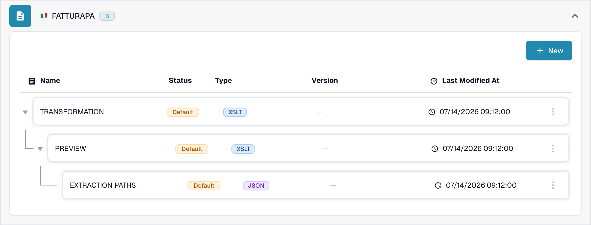
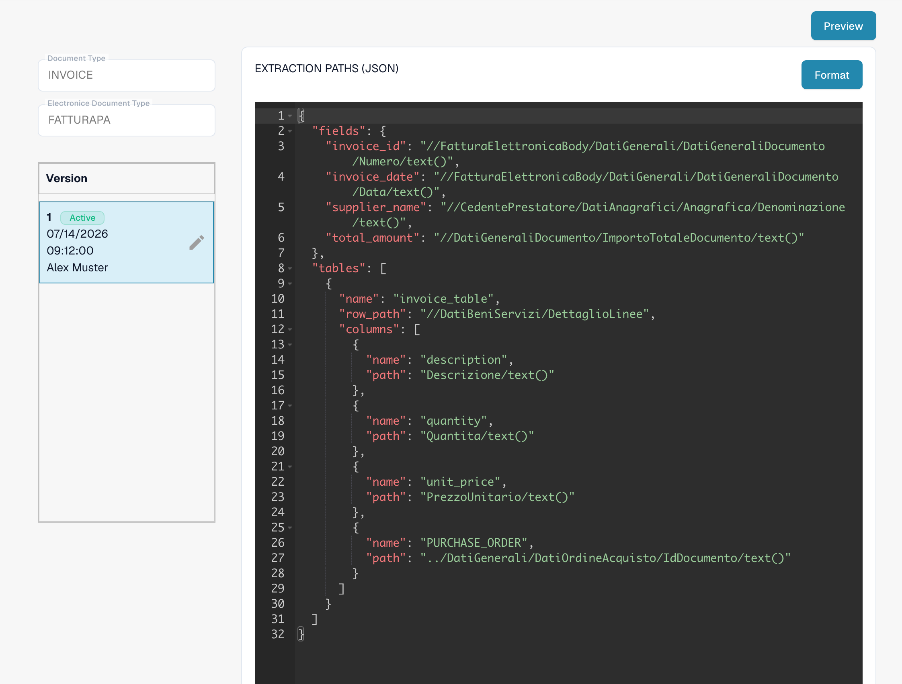
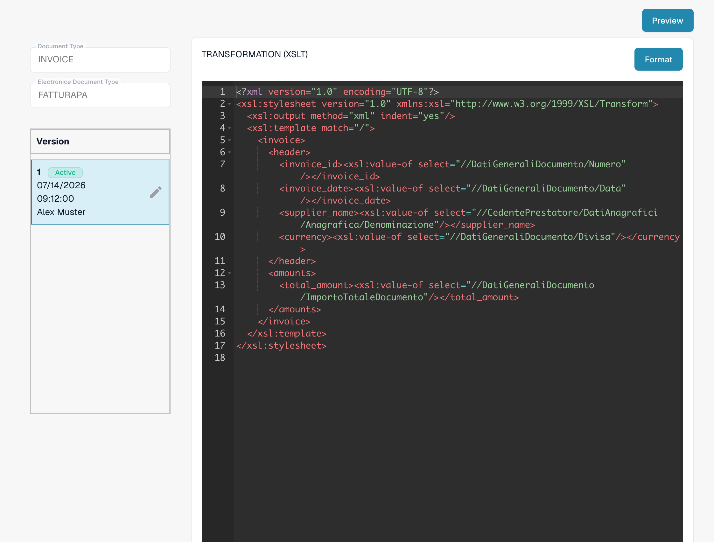
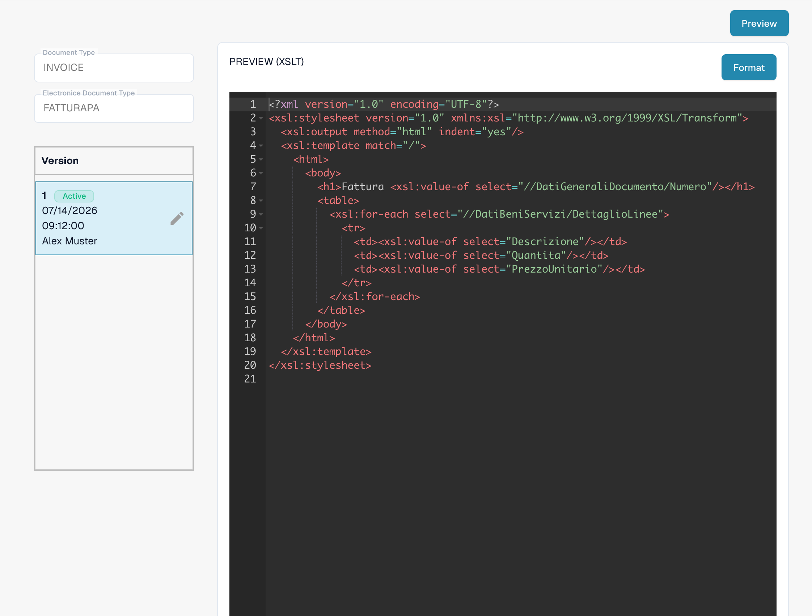

# FatturaPA: show an attribute on invoice lines

FatturaPA is the Italian electronic invoice format. This page explains where to check a line attribute, such as a purchase order number, before changing its mapping or the invoice preview. **Do not add a second `PURCHASE_ORDER` column without checking the active mapping first:** the current Sandbox mapping already contains one.

## Find the three FatturaPA files

Open **Settings → Document Types → E-Doc**, select **Invoice**, then expand **FATTURAPA**. The current list has three different files:

* **TRANSFORMATION (XSLT)** reads the source FatturaPA XML and produces the normalized invoice data.
* **PREVIEW (XSLT)** builds the visual HTML/PDF-style invoice preview from that data.
* **EXTRACTION PATHS (JSON)** maps the normalized values into DocBits fields and table columns.

<figure><figcaption>
The current FATTURAPA file list in the English Sandbox.
</figcaption></figure>

## Check the extracted line value

Open **EXTRACTION PATHS (JSON)**. In the active version, find the `tables` array and its `columns`. The visible Sandbox version already includes `{"name": "PURCHASE_ORDER", "path": "PURCHASE_ORDER"}`. Check the value in a real test invoice before editing it. If you need another attribute, identify its value in the normalized data, then add a distinct column name and the corresponding path in a draft version.

<figure><figcaption>
The active JSON extraction mapping already has a purchase order column.
</figcaption></figure>

## Change the transformation or preview only when needed

If the normalized value is missing, inspect **TRANSFORMATION (XSLT)** and the source XML path that should produce it. A change here affects the data used by later mapping and preview steps. If the value is extracted correctly but is absent from the visual invoice, inspect **PREVIEW (XSLT)** and the relevant table row in that template. The two XSLT files have different purposes.

<figure><figcaption>
Transformation reads source XML and builds normalized invoice fields.
</figcaption></figure>

<figure><figcaption>
Preview controls the visual invoice output.
</figcaption></figure>

Use the pencil on a version card to prepare a change. Review the draft and use **Preview** with a representative FatturaPA invoice before activating it. The screenshots show the current active versions; no draft was saved or preview test run in this Sandbox session.

The former instruction that all E-Documents have Great Britain as their origin is not a safe general rule. Check the invoice's country, currency and number format against the source document and your organisation's configuration.
