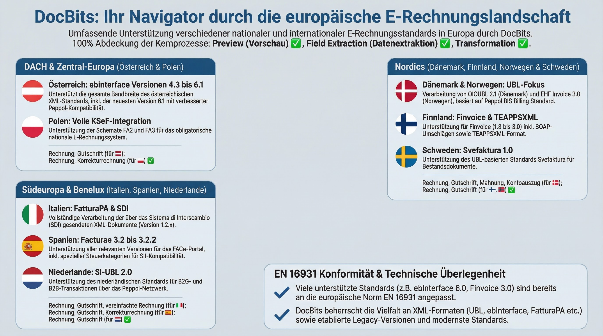
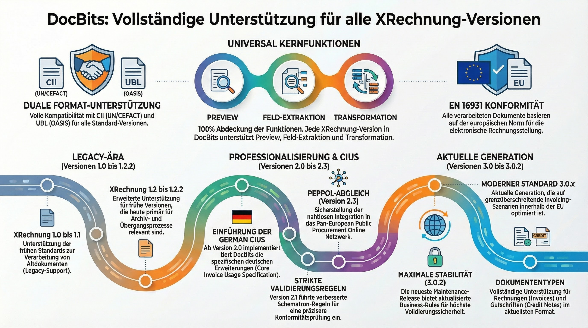
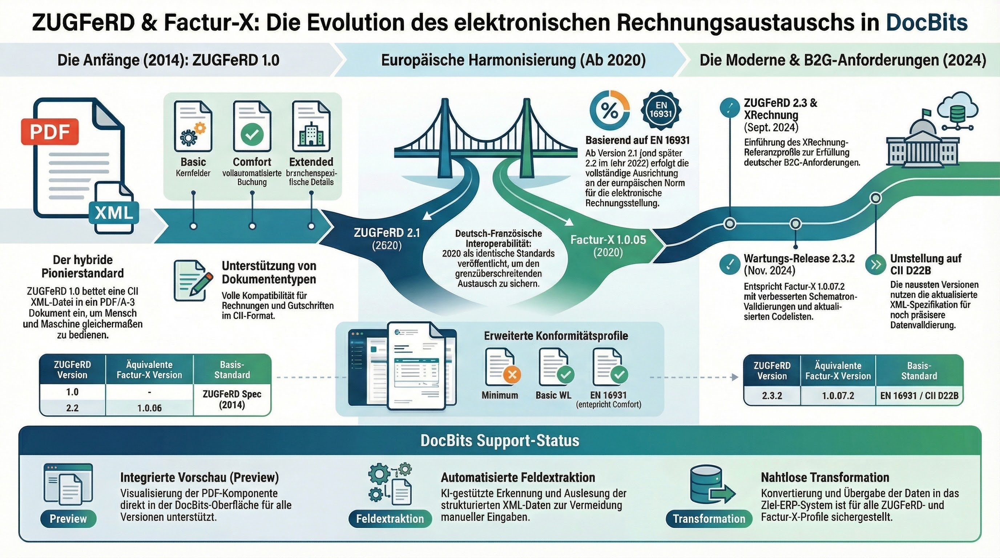
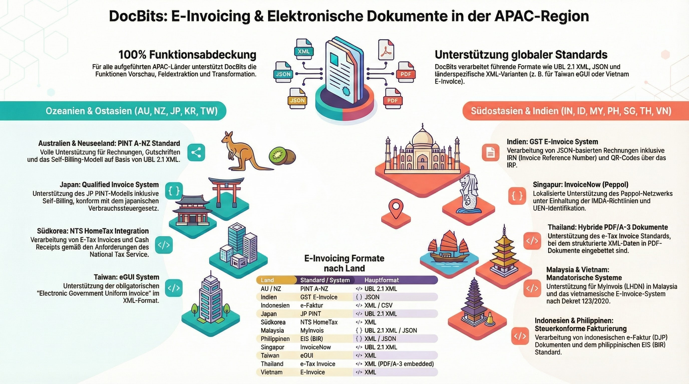
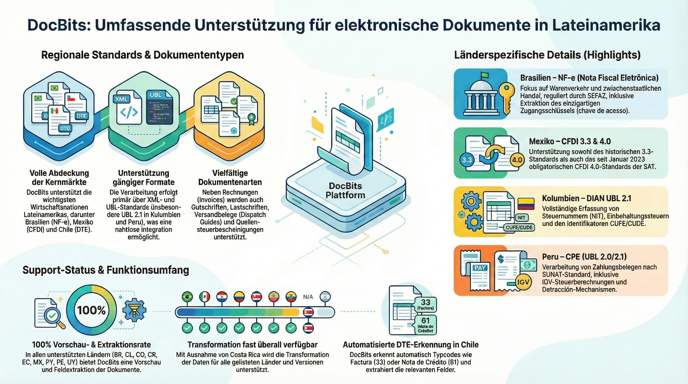
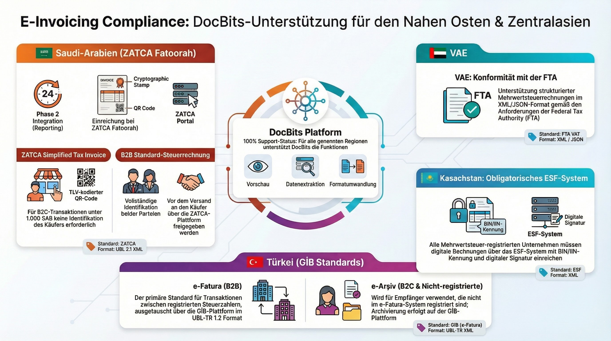
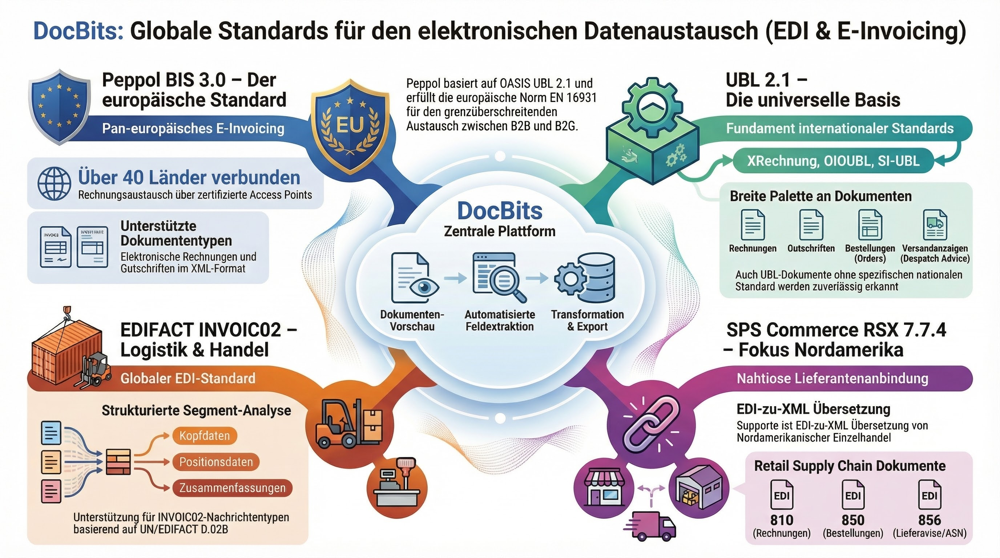

# Unterstützte elektronische Dokumente

DocBits unterstützt **120+ elektronische Rechnungs- und Dokumentenstandards** in **30+ Ländern**. Jedes Format wird automatisch erkannt, geparst und die Felder für eine nahtlose Dokumentenverarbeitung extrahiert.

## Wie elektronische Dokumente in DocBits funktionieren

1. **Hochladen** — XML/EDI-Datei ablegen oder per API/E-Mail empfangen
2. **Automatische Erkennung** — DocBits identifiziert den genauen Standard und die Version
3. **Vorschau** — Eine menschenlesbare HTML-Vorschau wird generiert
4. **Feldextraktion** — Schlüsselfelder (Rechnungsnummer, Beträge, Positionen) werden extrahiert
5. **Validierung & Export** — Daten werden validiert und in Ihr ERP-System exportiert


Für die detaillierte Konfiguration, siehe [EDI-Einstellungen](../README.md). Für Peppol, XRechnung und ZUGFeRD, siehe die dedizierten Seiten unten.


## Schnelllinks

| Thema | Link |
|-------|------|
| EDI-Übersicht | [EDI-Einstellungen](../README.md) |
| XRechnung (alle Versionen) | [XRechnung](../xrechnung/) |
| ZUGFeRD / Factur-X | [ZUGFeRD](../zugferd/) |
| Peppol BIS 3.0 | [Peppol BIS Billing](../peppol-bis-billing-3.0/) |
| Übersicht E-Rechnungsstandards | [Aktuell unterstützte Standards](../currently-supported-e-invoice-standards/) |

---

## Europa

<figure><figcaption>
Europäische E-Rechnungsstandards – Übersicht
</figcaption></figure>

### 🇩🇪 Deutschland

<figure><figcaption>
XRechnung — Alle 26 Versionen (CII &amp; UBL)
</figcaption></figure>

<figure><figcaption>
ZUGFeRD / Factur-X — Alle Versionen
</figcaption></figure>

### 🇦🇹 Österreich

| Standard | Seite |
|----------|-------|
| ebInterface (Übersicht) | [AUSTRIA EBINTERFACE](austria-ebinterface.md) |
| ebInterface 6.0 | [AUSTRIA EBINTERFACE 6.0](austria-ebinterface-6-0.md) |
| ebInterface 6.1 | [AUSTRIA EBINTERFACE 6.1](austria-ebinterface-6-1.md) |

### 🇩🇰 Dänemark

| Standard | Seite |
|----------|-------|
| OIOUBL (Übersicht) | [DENMARK OIOUBL](denmark-oioubl.md) |
| OIOUBL 2.1 | [OIOUBL 2.1](oioubl-2-1.md) |

### 🇫🇮 Finnland

| Standard | Seite |
|----------|-------|
| Finvoice 1.3 | [FINVOICE 1.3](finvoice-1-3.md) |
| Finvoice 2.0 | [FINVOICE 2.0](finvoice-2-0.md) |
| Finvoice 2.01 | [FINVOICE 2.01](finvoice-2-01.md) |
| Finvoice 3.0 | [FINVOICE 3.0](finvoice-3-0.md) |
| TEAPPSXML | [TEAPPSXML](teappsxml.md) |

### 🇫🇷 Frankreich

| Standard | Seite |
|----------|-------|
| Factur-X (Allgemein) | [FACTURX](facturx.md) |
| Factur-X 1.0.05 / ZUGFeRD 2.1 | [FACTURX 1.0.05](facturx-1-0-05-zugferd-2-1.md) |
| Factur-X 1.0.07.2 / ZUGFeRD 2.3.2 | [FACTURX 1.0.07.2](facturx-1-0-07-2-zugferd-2-3-2.md) |

### 🇩🇪 Deutschland

| Standard | Seite |
|----------|-------|
| XRechnung 1.0–3.0.2 (CII & UBL) | [26 Versionen](xrechnung-1-0-cii.md) — siehe vollständige Liste unten |
| ZUGFeRD 1.0–2.3.2 | [7 Versionen](zugferd-1-0.md) — siehe vollständige Liste unten |

Alle 26 XRechnung-Versionen

| Version | CII | UBL |
|---------|-----|-----|
| 1.0 | [CII](xrechnung-1-0-cii.md) | [UBL](xrechnung-1-0-ubl.md) |
| 1.1 | [CII](xrechnung-1-1-cii.md) | [UBL](xrechnung-1-1-ubl.md) |
| 1.2 | [CII](xrechnung-1-2-cii.md) | [UBL](xrechnung-1-2-ubl.md) |
| 1.2.1 | [CII](xrechnung-1-2-1-cii.md) | [UBL](xrechnung-1-2-1-ubl.md) |
| 1.2.2 | [CII](xrechnung-1-2-2-cii.md) | [UBL](xrechnung-1-2-2-ubl.md) |
| 2.0 | [CII](xrechnung-2-0-cii.md) | [UBL](xrechnung-2-0-ubl.md) |
| 2.0.1 | [CII](xrechnung-2-0-1-cii.md) | [UBL](xrechnung-2-0-1-ubl.md) |
| 2.1 | [CII](xrechnung-2-1-cii.md) | [UBL](xrechnung-2-1-ubl.md) |
| 2.2 | [CII](xrechnung-2-2-cii.md) | [UBL](xrechnung-2-2-ubl.md) |
| 2.3 | [CII](xrechnung-2-3-cii.md) | [UBL](xrechnung-2-3-ubl.md) |
| 3.0 | [CII](xrechnung-3-0-cii.md) | [UBL](xrechnung-3-0-ubl.md) |
| 3.0.1 | [CII](xrechnung-3-0-1-cii.md) | [UBL](xrechnung-3-0-1-ubl.md) |
| 3.0.2 | [CII](xrechnung-3-0-2-cii.md) | [UBL](xrechnung-3-0-2-ubl.md) |

Alle 7 ZUGFeRD-Versionen

| Version | Seite |
|---------|-------|
| ZUGFeRD 1.0 | [ZUGFERD 1.0](zugferd-1-0.md) |
| ZUGFeRD 1.0 Basic | [ZUGFERD 1.0 BASIC](zugferd-1-0-basic.md) |
| ZUGFeRD 1.0 Comfort | [ZUGFERD 1.0 COMFORT](zugferd-1-0-comfort.md) |
| ZUGFeRD 1.0 Extended | [ZUGFERD 1.0 EXTENDED](zugferd-1-0-extended.md) |
| ZUGFeRD 2.2 | [ZUGFERD 2.2](zugferd-2-2.md) |
| ZUGFeRD 2.3 | [ZUGFERD 2.3](zugferd-2-3.md) |
| ZUGFeRD 2.3.2 | [ZUGFERD 2.3.2](zugferd-2-3-2.md) |

### 🇮🇹 Italien

| Standard | Seite |
|----------|-------|
| FatturaPA | [FATTURAPA](fatturapa.md) |

### 🇳🇱 Niederlande

| Standard | Seite |
|----------|-------|
| SI-UBL 2.0 | [SI-UBL 2.0](si-ubl-2-0.md) |

### 🇳🇴 Norwegen

| Standard | Seite |
|----------|-------|
| EHF Invoice 3.0 | [EHF INVOICE 3.0](ehf-invoice-3-0.md) |

### 🇵🇱 Polen

| Standard | Seite |
|----------|-------|
| KSeF | [KSEF](ksef.md) |
| KSeF FA2 | [KSEF FA2](ksef-fa2.md) |
| KSeF FA3 | [KSEF FA3](ksef-fa3.md) |

### 🇪🇸 Spanien

| Standard | Seite |
|----------|-------|
| Facturae (Übersicht) | [FACTURAE](facturae.md) |
| Facturae 3.2 | [FACTURAE 3.2](facturae-3-2.md) |
| Facturae 3.2.1 | [FACTURAE 3.2.1](facturae-3-2-1.md) |
| Facturae 3.2.2 | [FACTURAE 3.2.2](facturae-3-2-2.md) |

### 🇸🇪 Schweden

| Standard | Seite |
|----------|-------|
| Svefaktura 1.0 | [SVEFAKTURA 1.0](svefaktura-1-0.md) |

---

## Asien-Pazifik

<figure><figcaption>
Asien-Pazifik E-Rechnungsstandards – Übersicht
</figcaption></figure>

### 🇦🇺 Australien / 🇳🇿 Neuseeland

| Standard | Seite |
|----------|-------|
| AUNZ PINT | [AUNZ PINT](aunz-pint.md) |
| AUNZ PINT Self-Billing | [AUNZ PINT SELF-BILLING](aunz-pint-self-billing.md) |
| PINT A-NZ | [PINT A-NZ](pint-a-nz.md) |

### 🇮🇳 Indien

| Standard | Seite |
|----------|-------|
| GST E-Invoice | [INDIA GST E-INVOICE](india-gst-e-invoice.md) |

### 🇮🇩 Indonesien

| Standard | Seite |
|----------|-------|
| E-Faktur | [INDONESIA E-FAKTUR](indonesia-e-faktur.md) |

### 🇯🇵 Japan

| Standard | Seite |
|----------|-------|
| JP PINT | [JP PINT](jp-pint.md) |
| JP PINT Self-Billing | [JP PINT SELF-BILLING](jp-pint-self-billing.md) |

### 🇰🇷 Korea

| Standard | Seite |
|----------|-------|
| E-Tax Invoice | [KOREA E-TAX INVOICE](korea-e-tax-invoice.md) |
| NTS | [KOREA NTS](korea-nts.md) |

### 🇲🇾 Malaysia

| Standard | Seite |
|----------|-------|
| MyInvois | [MYINVOIS](myinvois.md) |

### 🇵🇭 Philippinen

| Standard | Seite |
|----------|-------|
| EIS | [PHILIPPINES EIS](philippines-eis.md) |

### 🇸🇬 Singapur

| Standard | Seite |
|----------|-------|
| InvoiceNow | [INVOICENOW](invoicenow.md) |
| InvoiceNow SG | [INVOICENOW SG](invoicenow-sg.md) |

### 🇹🇼 Taiwan

| Standard | Seite |
|----------|-------|
| eGUI | [TAIWAN EGUI](taiwan-egui.md) |

### 🇹🇭 Thailand

| Standard | Seite |
|----------|-------|
| E-Tax Invoice | [THAILAND E-TAX INVOICE](thailand-e-tax-invoice.md) |

### 🇻🇳 Vietnam

| Standard | Seite |
|----------|-------|
| E-Invoice | [VIETNAM E-INVOICE](vietnam-e-invoice.md) |

---

## Lateinamerika

<figure><figcaption>
Lateinamerika E-Rechnungsstandards – Übersicht
</figcaption></figure>

### 🇦🇷 Argentinien

| Standard | Seite |
|----------|-------|
| AFIP (Factura A) | [ARGENTINA AFIP](argentina-afip.md) |
| Factura Electrónica (alle anderen Typen) | [ARGENTINA FACTURA ELECTRONICA](argentina-factura-electronica.md) |

### 🇧🇷 Brasilien

| Standard | Seite |
|----------|-------|
| NF-e | [BRAZIL NF-E](brazil-nfe.md) |
| NFC-e | [BRAZIL NFC-E](brazil-nfce.md) |
| CT-e | [BRAZIL CT-E](brazil-cte.md) |
| NFS-e | [BRAZIL NFS-E](brazil-nfse.md) |

### 🇨🇱 Chile

| Standard | Seite |
|----------|-------|
| DTE | [CHILE DTE](chile-dte.md) |

### 🇨🇴 Kolumbien

| Standard | Seite |
|----------|-------|
| DIAN | [COLOMBIA DIAN](colombia-dian.md) |

### 🇨🇷 Costa Rica

| Standard | Seite |
|----------|-------|
| Elektronische Rechnung | [COSTA RICA](costa-rica.md) |

### 🇪🇨 Ecuador

| Standard | Seite |
|----------|-------|
| SRI | [ECUADOR SRI](ecuador-sri.md) |

### 🇲🇽 Mexiko

| Standard | Seite |
|----------|-------|
| CFDI 3.3 | [MEXICO CFDI 3.3](mexico-cfdi-3-3.md) |
| CFDI 4.0 | [MEXICO CFDI 4.0](mexico-cfdi-4-0.md) |

### 🇵🇾 Paraguay

| Standard | Seite |
|----------|-------|
| DTE | [PARAGUAY DTE](paraguay-dte.md) |
| SIFEN | [PARAGUAY SIFEN](paraguay-sifen.md) |
| SIFEN 150 | [PARAGUAY SIFEN 150](paraguay-sifen-150.md) |

### 🇵🇪 Peru

| Standard | Seite |
|----------|-------|
| CPE | [PERU CPE](peru-cpe.md) |
| CPE UBL 2.0 | [PERU CPE UBL 2.0](peru-cpe-ubl-2-0.md) |
| CPE UBL 2.1 | [PERU CPE UBL 2.1](peru-cpe-ubl-2-1.md) |
| Factura Electronica | [PERU FACTURA ELECTRONICA](peru-factura-electronica.md) |

### 🇺🇾 Uruguay

| Standard | Seite |
|----------|-------|
| CFE | [URUGUAY CFE](uruguay-cfe.md) |
| CFE 24 | [URUGUAY CFE 24](uruguay-cfe-24.md) |
| CFE 25 | [URUGUAY CFE 25](uruguay-cfe-25.md) |
| E-Factura | [URUGUAY E-FACTURA](uruguay-e-factura.md) |
| E-Nota Credito | [URUGUAY E-NOTA CREDITO](uruguay-e-nota-credito.md) |

---

## Naher Osten & Zentralasien

<figure><figcaption>
Naher Osten &amp; Zentralasien E-Rechnungsstandards – Übersicht
</figcaption></figure>

### 🇰🇿 Kasachstan

| Standard | Seite |
|----------|-------|
| ESF | [KAZAKHSTAN ESF](kazakhstan-esf.md) |

### 🇸🇦 Saudi-Arabien

| Standard | Seite |
|----------|-------|
| ZATCA Fatoorah | [ZATCA FATOORAH](zatca-fatoorah.md) |
| ZATCA Reporting | [ZATCA REPORTING](zatca-reporting.md) |
| ZATCA Simplified | [ZATCA SIMPLIFIED](zatca-simplified.md) |
| ZATCA Tax Invoice | [ZATCA TAX INVOICE](zatca-tax-invoice.md) |

### 🇹🇷 Türkei

| Standard | Seite |
|----------|-------|
| E-Arsiv | [TURKEY E-ARSIV](turkey-e-arsiv.md) |
| E-Fatura | [TURKEY E-FATURA](turkey-e-fatura.md) |

### 🇦🇪 Vereinigte Arabische Emirate

| Standard | Seite |
|----------|-------|
| VAT Invoice | [UAE VAT INVOICE](uae-vat-invoice.md) |

---

## Internationale Standards

<figure><figcaption>
Internationale Standards – Übersicht (Peppol, UBL, EDIFACT, SPS Commerce)
</figcaption></figure>

| Standard | Seite |
|----------|-------|
| PEPPOL BIS 3.0 | [PEPPOL BIS 3.0](peppol-bis-3-0.md) |
| UBL 2.1 | [UBL 2.1](ubl-2-1.md) |
| INVOIC02 (EDIFACT) | [INVOIC02](invoic02.md) |
| SPS Commerce RSX 7.7.4 | [SPS COMMERCE RSX 7.7.4](sps-commerce-rsx-7-7-4.md) |
