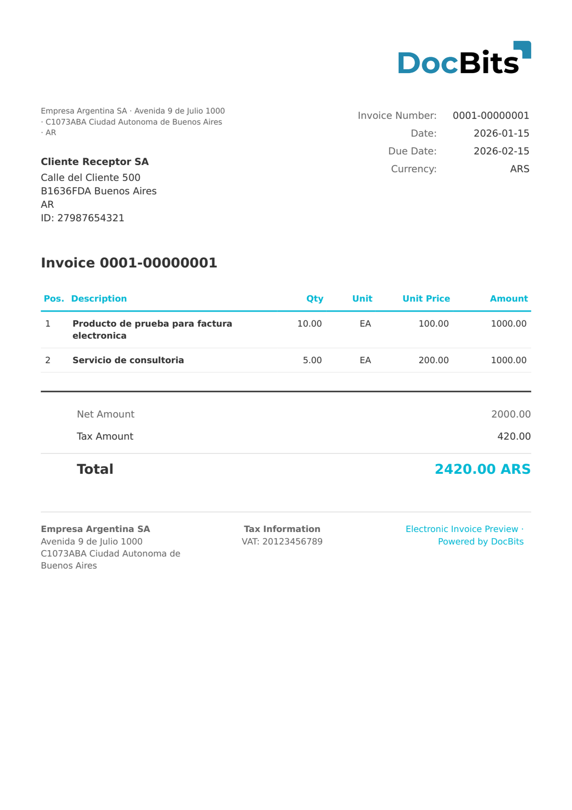

# 🇦🇷 ARGENTINA AFIP

| Proprietà | Valore |
|-----------|--------|
| **Paese / Regione** | Argentina |
| **Tipi di documento** | Fattura |
| **Formato** | XML |
| **Standard** | AFIP Comprobante Electrónico (Administración Federal de Ingresos Públicos) |
| **Lingua** | `es_AR` |

Lo standard ARGENTINA AFIP è il formato di fattura elettronica dell'autorità fiscale federale argentina (AFIP). I documenti sono identificati da `<tipoComprobante>` — ad esempio tipo `001` = Factura A. Ogni fattura include un numero CAE (Código de Autorización Electrónica) e un codice a barre per la convalida AFIP.

## Stato del supporto

| Componente | Stato |
|------------|-------|
| Anteprima | ✅ Supportato |
| Estrazione campi | ✅ Supportato |
| Trasformazione | ✅ Supportato |

## Anteprima predefinita

<figure><figcaption><p>Anteprima DocBits predefinita per una fattura ARGENTINA AFIP Factura A</p></figcaption></figure>

## Mappatura dei campi

### Campi di intestazione

| Campo DocBits | Elemento XML sorgente | Note |
|---|---|---|
| `invoice_id` | `<puntoVenta>` + `<numeroComprobante>` | Formato: `PPPP-NNNNNNNN` |
| `invoice_date` | `<cabecera>/<fechaEmision>` | |
| `due_date` | `<cabecera>/<fechaVencimiento>` | |
| `currency` | Fisso: `ARS` | Sempre Peso Argentino |
| `total_amount` | `<totales>/<total>` | |
| `net_amount` | `<totales>/<netoGravado>` o `<subtotal>` | |
| `tax_amount` | `<totales>/<totalIVA>` | |
| `supplier_name` | `<emisor>/<razonSocial>` | |
| `supplier_id` | `<emisor>/<CUIT>` o `<cabecera>/<CUIT>` | CUIT = codice fiscale argentino |
| `supplier_address` | `<emisor>/<domicilioComercial>/<calle>` + `<numero>` | |
| `supplier_postal_code` | `<emisor>/<domicilioComercial>/<codigoPostal>` | |
| `supplier_city` | `<emisor>/<domicilioComercial>/<localidad>` | |
| `supplier_country` | Fisso: `AR` | |
| `buyer_name` | `<receptor>/<razonSocial>` | |
| `buyer_id` | `<receptor>/<CUIT>` | |
| `buyer_address` | `<receptor>/<domicilio>/<calle>` + `<numero>` | |
| `buyer_postal_code` | `<receptor>/<domicilio>/<codigoPostal>` | |
| `buyer_city` | `<receptor>/<domicilio>/<localidad>` | |
| `buyer_country` | Fisso: `AR` | |
| `iban` | `<PAYMENT/IBAN>` | Solitamente vuoto |
| `bic` | `<PAYMENT/BIC>` | Solitamente vuoto |
| `payment_terms` | `<PAYMENT_TERMS>` | Solitamente vuoto |
| `purchase_order` | `<PURCHASE_ORDER>` | Solitamente vuoto |

### Tabella delle righe (`INVOICE_TABLE`)

Percorso riga: `<items>/<item>`

| Colonna | Attributo / Elemento sorgente | Note |
|---|---|---|
| `POSITION` | Attributo `@numero` | Numero di posizione |
| `DESCRIPTION` | `<descripcion>` | |
| `QUANTITY` | `<cantidad>` | |
| `UNIT` | `<unidadMedida>` | Codice unità AFIP (es. `7` = unità) |
| `UNIT_PRICE` | `<precioUnitario>` | |
| `VAT_RATE` | `<alicuotaIVA>` | es. `21.00` per l'IVA standard argentina |
| `VAT` | `<importeIVA>` | |
| `NET_AMOUNT` | `<subtotal>` | Totale riga prima delle tasse |

## Regola di classificazione

DocBits rileva i documenti ARGENTINA AFIP tramite il pattern regex:

```
<tipoComprobante>001\s*</tipoComprobante>
```

## Correlati

- [ARGENTINA FACTURA ELECTRONICA](argentina-factura-electronica.md)
- [Documenti elettronici supportati](./)
