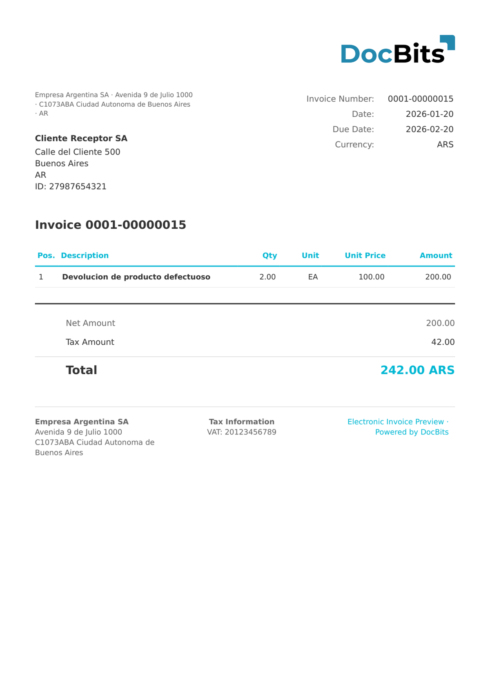

# 🇦🇷 ARGENTINA FACTURA ELECTRONICA

| Propiedad | Valor |
|-----------|-------|
| **País / Región** | Argentina |
| **Tipos de documento** | Factura |
| **Formato** | XML |
| **Estándar** | Argentina Factura Electrónica (tipos de comprobante AFIP más allá de Factura A) |
| **Idioma** | `es_AR` |

ARGENTINA FACTURA ELECTRONICA abarca el conjunto más amplio de documentos electrónicos AFIP argentinos más allá de la Factura A (tipo 001). Esto incluye Factura B (tipo 006), Factura C (tipo 011), Nota de Crédito (tipo 003) y otras variantes.

## Estado de soporte

| Componente | Estado |
|------------|--------|
| Vista previa | ✅ Compatible |
| Extracción de campos | ✅ Compatible |
| Transformación | ✅ Compatible |

## Vista previa predeterminada

<figure><figcaption>
Vista previa predeterminada de DocBits para un documento ARGENTINA FACTURA ELECTRONICA
</figcaption></figure>

## Mapeo de campos

### Campos de cabecera

| Campo DocBits | Elementos XML de origen | Notas |
|---|---|---|
| `invoice_id` | `//NumeroFactura`, `//cbte_nro`, `//CbteNro`, `//InvoiceNumber` | Múltiples rutas XPath de respaldo |
| `invoice_date` | `//FechaEmision`, `//cbte_fch`, `//CbteFch`, `//IssueDate` | |
| `due_date` | `//fechaVencimiento`, `//fechaVtoPago` | |
| `currency` | `//Moneda`, `//mon_id`, `//MonId`, respaldo: `ARS` | |
| `total_amount` | `//MontoTotal`, `//imp_total`, `//ImpTotal`, `//TotalAmount` | |
| `net_amount` | `//MontoNeto`, `//imp_neto`, `//ImpNeto`, `//NetAmount` | |
| `tax_amount` | `//MontoIVA`, `//imp_iva`, `//ImpIVA`, `//TaxAmount` | |
| `supplier_name` | `//NombreProveedor`, `//razon_social`, `//RazonSocial`, `//SellerName` | |
| `supplier_id` | `//CUITProveedor`, `//cuit`, `//Cuit`, `//SellerID` | |
| `buyer_name` | `//NombreComprador`, `//nombre_cliente`, `//NombreCliente`, `//BuyerName` | |
| `buyer_id` | `//CUITComprador`, `//doc_nro`, `//DocNro`, `//BuyerID` | |

### Tabla de líneas (`INVOICE_TABLE`)

Ruta de fila: `<items>/<item>`, `<Items>/<Item>` o `<Detalle>/<Linea>`

| Columna | Atributo / Elemento de origen | Notas |
|---|---|---|
| `POSITION` | `@numero`, `<numero>` o `position()` | |
| `DESCRIPTION` | `<descripcion>`, `<Descripcion>` | |
| `QUANTITY` | `<cantidad>`, `<Cantidad>` | |
| `UNIT_PRICE` | `<precioUnitario>`, `<PrecioUnitario>` | |
| `VAT_RATE` | `<alicuotaIVA>`, `<AlicuotaIVA>` | |
| `VAT` | `<importeIVA>`, `<ImporteIVA>` | |
| `NET_AMOUNT` | `<subtotal>`, `<Subtotal>`, `<importe>` | |

## Regla de clasificación

Los documentos con valores de `<tipoComprobante>` distintos de `001` (p.ej. `003`, `006`, `011`) se enrutan a este estándar.

## Relacionados

- [ARGENTINA AFIP](argentina-afip.md)
- [Documentos electrónicos compatibles](./)
