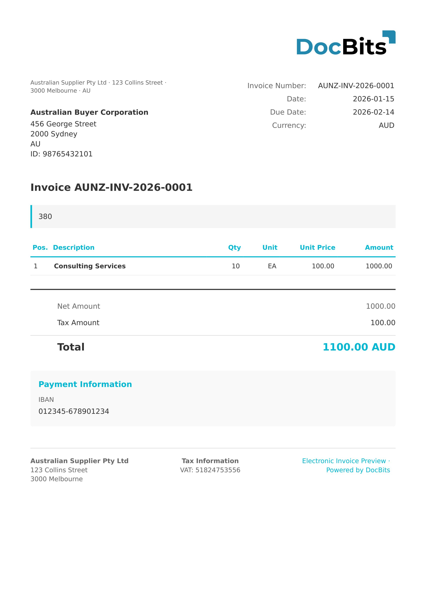

# 🇦🇺 AUNZ PINT

| Svojstvo | Vrednost |
|----------|-------|
| **Država / Regija** | Australija / Novi Zeland |
| **Tipovi dokumenata** | Faktura, Knjižno odobrenje |
| **Format** | UBL 2.1 XML |
| **Standard** | PINT A-NZ (Peppol International Model for Australia-New Zealand) |
| **Locale** | `en_AU` |

AUNZ PINT je australijsko/novozelandska implementacija Peppol International (PINT) modela fakturisanja. Definiše format fakture zasnovan na UBL 2.1 prilagođen A-NZ regulatornim zahtevima, uključujući ABN/NZBN identifikaciju, obradu GST i usklađenost sa specifikacijama A-NZ Peppol Authority. DocBits podržava standardne tipove dokumenata Faktura i Knjižno odobrenje pod elektronskim tipom dokumenta `PINT A-NZ`, kao i Self-Billing varijantu.

## Status podrške

| Komponenta | Status |
|-----------|--------|
| Pregled | ✅ Podržano |
| Ekstrakcija polja | ✅ Podržano |
| Transformacija | ✅ Podržano |

## Podrazumevani pregled

<figure><figcaption>
Podrazumevani DocBits pregled za AUNZ PINT fakturu
</figcaption></figure>

## Mapiranje polja

### Polja zaglavlja

| DocBits polje | Izvorni XPath (UBL 2.1) | Napomene |
|---|---|---|
| `invoice_id` | `cbc:ID` | Broj fakture |
| `invoice_date` | `cbc:IssueDate` | ISO 8601 datum |
| `due_date` | `cbc:DueDate` | Datum dospeća |
| `currency` | `cbc:DocumentCurrencyCode` | Tipično `AUD` ili `NZD` |
| `total_amount` | `cbc:PayableAmount` (u `cac:LegalMonetaryTotal`) | Ukupno sa GST |
| `net_amount` | `cbc:TaxExclusiveAmount` (u `cac:LegalMonetaryTotal`) | Podtotal bez GST |
| `tax_amount` | `cbc:TaxAmount` (u `cac:TaxTotal`) | Iznos GST |
| `purchase_order` | `cbc:BuyerReference` | Referenca narudžbenice kupca |
| `payment_terms` | `cbc:Note` (u `cac:PaymentTerms`) | Uslovi plaćanja u slobodnom tekstu |
| `supplier_name` | `cac:AccountingSupplierParty/cac:Party/cac:PartyName/cbc:Name` | Naziv kompanije dobavljača |
| `supplier_id` | `cac:AccountingSupplierParty/cac:Party/cbc:EndpointID` | ABN (schemeID 0151) |
| `supplier_tax_id` | `cac:AccountingSupplierParty/cac:Party/cac:PartyTaxScheme/cbc:CompanyID` | ABN ili GST broj |
| `supplier_street` | `cac:AccountingSupplierParty/cac:Party/cac:PostalAddress/cbc:StreetName` | Ulica dobavljača |
| `supplier_city` | `cac:AccountingSupplierParty/cac:Party/cac:PostalAddress/cbc:CityName` | Grad dobavljača |
| `supplier_postal_code` | `cac:AccountingSupplierParty/cac:Party/cac:PostalAddress/cbc:PostalZone` | Poštanski broj dobavljača |
| `supplier_country` | `cac:AccountingSupplierParty/cac:Party/cac:PostalAddress/cac:Country/cbc:IdentificationCode` | ISO kod države (`AU` ili `NZ`) |
| `buyer_name` | `cac:AccountingCustomerParty/cac:Party/cac:PartyName/cbc:Name` | Naziv kompanije kupca |
| `buyer_id` | `cac:AccountingCustomerParty/cac:Party/cbc:EndpointID` | ABN/NZBN (schemeID 0151) |
| `buyer_street` | `cac:AccountingCustomerParty/cac:Party/cac:PostalAddress/cbc:StreetName` | Ulica kupca |
| `buyer_city` | `cac:AccountingCustomerParty/cac:Party/cac:PostalAddress/cbc:CityName` | Grad kupca |
| `buyer_postal_code` | `cac:AccountingCustomerParty/cac:Party/cac:PostalAddress/cbc:PostalZone` | Poštanski broj kupca |
| `buyer_country` | `cac:AccountingCustomerParty/cac:Party/cac:PostalAddress/cac:Country/cbc:IdentificationCode` | ISO kod države |
| `iban` | `cac:PaymentMeans/cac:PayeeFinancialAccount/cbc:ID` | ID računa za plaćanje |

### Tabela stavki (`INVOICE_TABLE`)

Putanja reda: `cac:InvoiceLine`

| Kolona | Izvorni XPath (UBL 2.1) | Napomene |
|---|---|---|
| `POSITION` | `cbc:ID` | Broj reda |
| `DESCRIPTION` | `cac:Item/cbc:Description` | Opis proizvoda/usluge |
| `QUANTITY` | `cbc:InvoicedQuantity` | Količina (kod jedinice u `@unitCode`) |
| `UNIT` | `cbc:InvoicedQuantity/@unitCode` | Kod jedinice (npr. `C62` = komad, `EA` = svaki) |
| `UNIT_PRICE` | `cac:Price/cbc:PriceAmount` | Jedinična cena bez GST |
| `VAT_RATE` | `cac:Item/cac:ClassifiedTaxCategory/cbc:Percent` | Stopa GST u % |
| `VAT` | *(izračunato iz iznosa poreza)* | Iznos GST po redu |
| `NET_AMOUNT` | `cbc:LineExtensionAmount` | Ukupno reda bez GST |

## Pravila klasifikacije

DocBits prepoznaje PINT A-NZ dokumente podudaranjem elementa `CustomizationID`:

| Obrazac | Tip pravila | Elektronski tip dokumenta |
|---------|-----------|--------------------------|
| `urn:peppol.org:pint:billing-1@aunz` | STRING_CONTAINS | PINT A-NZ (Faktura) |
| `urn:peppol.org:pint:selfbilling-1@aunz` | STRING_CONTAINS | PINT A-NZ (Self-Billing faktura) |

Oba obrasca se klasifikuju pod elektronski tip dokumenta `PINT A-NZ`. Koreni element je `<Invoice>` za standardne fakture i `<CreditNote>` za knjižna odobrenja.

### A-NZ specifične funkcije

- **ABN/NZBN identifikatori**: Koristi `schemeID="0151"` za Australian Business Numbers i New Zealand Business Numbers
- **Porez GST**: Koristi poresku kategoriju `S` (standardna stopa) sa GST poreskom šemom
- **CustomizationID**: Mora sadržati sufiks `@aunz` da bi se klasifikovao kao PINT A-NZ (vs. globalni PINT)

## Takođe pogledajte

- [AUNZ PINT Self-Billing](aunz-pint-self-billing.md)
- [PINT A-NZ](pint-a-nz.md)
- [Podržani elektronski dokumenti](./)
