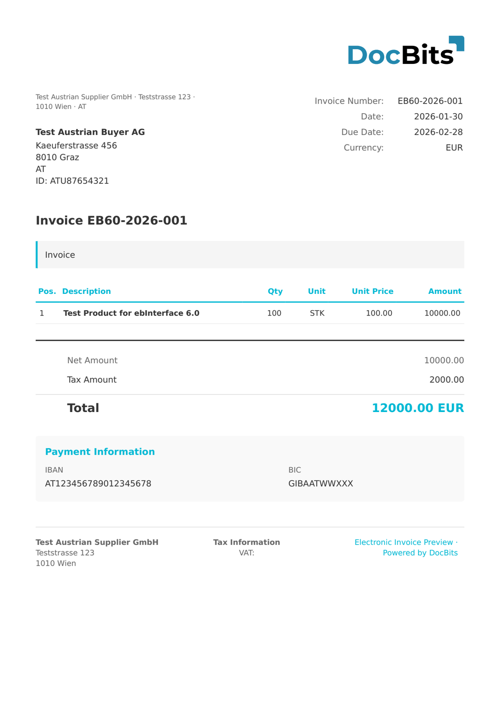

# 🇦🇹 AUSTRIA EBINTERFACE

| Svojstvo | Vrednost |
|----------|-------|
| **Zemlja/Regija** | Austrija |
| **Tipovi dokumenata** | Faktura, Knjižno odobrenje |
| **Format** | XML |
| **Standard** | ebInterface (verzije 4.3 – 6.1) |
| **Locale** | `de_AT` |

ebInterface je austrijski standard za elektronsko fakturisanje koji održava Austrijska savezna privredna komora (WKO — Wirtschaftskammer Osterreich). Definiše strukturirani XML format za elektronske fakture koji se prvenstveno koristi u B2G (posao-vlada) i B2B transakcijama u Austriji. DocBits podržava sve verzije od 4.3 do 6.1, pri čemu je svaka identifikovana svojim XML imenskim prostorom.

## Status podrške

| Komponenta | Status |
|-----------|--------|
| Pregled | ✅ Podržano |
| Mapiranje polja | ✅ Podržano |
| Transformacija | ✅ Podržano |

## Podrazumevani pregled

<figure><figcaption>
Podrazumevani DocBits pregled za AUSTRIA EBINTERFACE fakturu
</figcaption></figure>

## Mapiranje polja

### Polja zaglavlja

| DocBits polje | Izvorni XML element | Napomene |
|---|---|---|
| `invoice_id` | `eb:InvoiceNumber` | Broj fakture |
| `invoice_date` | `eb:InvoiceDate` | ISO 8601 datum |
| `due_date` | `eb:PaymentConditions/eb:DueDate` | Datum dospijeća |
| `delivery_date` | `eb:Delivery/eb:Date` | Datum isporuke |
| `currency` | `@eb:InvoiceCurrency` | Koreni atribut, uvek `EUR` za AT |
| `total_amount` | `eb:TotalGrossAmount` | Bruto ukupno sa PDV |
| `net_amount` | `eb:Tax/eb:VAT/eb:VATItem/eb:TaxedAmount` | Neto poreska osnovica |
| `tax_amount` | `eb:Tax/eb:VAT/eb:VATItem/eb:Amount` | Iznos PDV |
| `purchase_order` | `eb:OrderReference/eb:OrderID` | Referenca naloga za nabavku |
| `payment_terms` | `eb:PaymentConditions/eb:Comment` | Uslovi plaćanja u slobodnom tekstu |
| `supplier_name` | `eb:Biller/eb:Address/eb:Name` | Naziv firme izdavaoca |
| `supplier_tax_id` | `eb:Biller/eb:VATIdentificationNumber` | Austrijski UID (npr. ATU12345678) |
| `supplier_street` | `eb:Biller/eb:Address/eb:Street` | Ulica izdavaoca |
| `supplier_city` | `eb:Biller/eb:Address/eb:Town` | Grad izdavaoca |
| `supplier_postal_code` | `eb:Biller/eb:Address/eb:ZIP` | Poštanski broj izdavaoca |
| `supplier_country` | `eb:Biller/eb:Address/eb:Country/@eb:CountryCode` | ISO kod zemlje |
| `supplier_email` | `eb:Biller/eb:Address/eb:Email` | E-pošta izdavaoca |
| `supplier_iban` | `eb:PaymentMethod/eb:UniversalBankTransaction/eb:BeneficiaryAccount/eb:IBAN` | IBAN izdavaoca |
| `customer_name` | `eb:InvoiceRecipient/eb:Address/eb:Name` | Naziv firme primaoca |
| `customer_tax_id` | `eb:InvoiceRecipient/eb:VATIdentificationNumber` | UID primaoca |
| `customer_street` | `eb:InvoiceRecipient/eb:Address/eb:Street` | Ulica primaoca |
| `customer_city` | `eb:InvoiceRecipient/eb:Address/eb:Town` | Grad primaoca |
| `customer_postal_code` | `eb:InvoiceRecipient/eb:Address/eb:ZIP` | Poštanski broj primaoca |
| `customer_country` | `eb:InvoiceRecipient/eb:Address/eb:Country/@eb:CountryCode` | ISO kod zemlje |
| `iban` | `eb:PaymentMethod/eb:UniversalBankTransaction/eb:BeneficiaryAccount/eb:IBAN` | IBAN za plaćanje |
| `bic` | `eb:PaymentMethod/eb:UniversalBankTransaction/eb:BeneficiaryAccount/eb:BIC` | BIC za plaćanje |

### Tabela stavki (`INVOICE_TABLE`)

Putanja redova: `eb:Details/eb:ItemList/eb:ListLineItem`

| Kolona | Izvorni XML element | Napomene |
|---|---|---|
| `POSITION` | Sekvencijalni indeks | Broj reda od 1 |
| `DESCRIPTION` | `eb:Description` | Opis proizvoda/usluge |
| `QUANTITY` | `eb:Quantity` | Numerička količina |
| `UNIT` | `eb:Quantity/@eb:Unit` | Šifra jedinice (npr. `STK` = komad) |
| `UNIT_PRICE` | `eb:UnitPrice` | Jedinična cena bez PDV |
| `VAT_RATE` | `eb:VAT/eb:VATItem/eb:VATRate` | Stopa PDV u % |
| `VAT` | `eb:VAT/eb:VATItem/eb:TaxedAmount` | Iznos PDV po red |
| `NET_AMOUNT` | `eb:LineItemAmount` | Ukupno red bez PDV |

## Pravilo klasifikacije

DocBits otkriva verziju ebInterface-a podudaranjem XML imenskog prostora:

| Verzija | Imenski prostor |
|---------|-----------|
| ebInterface 4.3 | `http://www.ebinterface.at/schema/4p3/` |
| ebInterface 5.0 | `http://www.ebinterface.at/schema/5p0/` |
| ebInterface 6.0 | `http://www.ebinterface.at/schema/6p0/` |
| ebInterface 6.1 | `http://www.ebinterface.at/schema/6p1/` |

Sve verzije dele koreni element `<eb:Invoice>` sa odgovarajućim URI-jem imenskog prostora.

## Povezano

- [Austria ebInterface 6.0](austria-ebinterface-6-0.md)
- [Austria ebInterface 6.1](austria-ebinterface-6-1.md)
- [Podržani elektronski dokumenti](./)