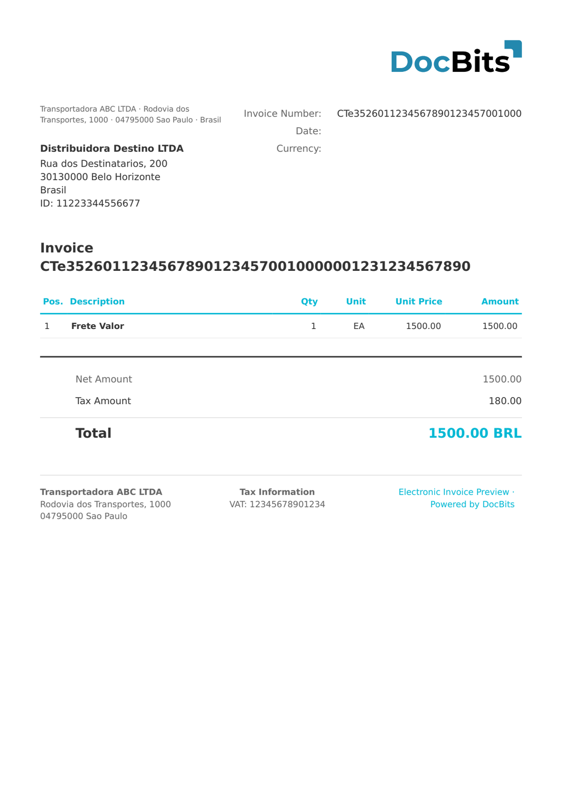

# 🇧🇷 BRAZIL CT-E

| Propriedade | Valor |
|-------------|-------|
| **País / Região** | Brasil |
| **Tipos de Documento** | Fatura de Transporte (Conhecimento de Transporte Eletrônico) |
| **Formato** | XML |
| **Norma** | CT-e 3.0 (conhecimento eletrónico de frete/transporte) |
| **Localidade** | `pt_BR` |

CT-e (Conhecimento de Transporte Eletrônico, `<mod>57</mod>`) é o documento eletrónico de transporte brasileiro emitido por empresas de logística e carga. Documenta o serviço de transporte, o valor da carga, os municípios de origem e destino (`cMunIni` / `cMunFim`) e o preço do frete (`vTPrest`). Ao contrário da NF-e, o CT-e utiliza `cteProc` como elemento raiz e referencia documentos NF-e associados.

## Estado de Suporte

| Componente | Estado |
|------------|--------|
| Pré-visualização | ✅ Suportado |
| Extração de Campos | ✅ Suportado |
| Transformação | ✅ Suportado |

## Pré-visualização Padrão

<figure><figcaption><p>Pré-visualização padrão do DocBits para um documento BRAZIL CT-E</p></figcaption></figure>

## Mapeamento de Campos

### Campos de Cabeçalho

| Campo DocBits | XPath de Origem | Notas |
|---|---|---|
| `invoice_id` | `//*[local-name()='ide']/*[local-name()='nCT']` | Número do CT-e |
| `invoice_date` | `//*[local-name()='ide']/*[local-name()='dhEmi']` | ISO 8601 com offset BRT |
| `currency` | Fixo: `BRL` | Sempre Real Brasileiro |
| `total_amount` | `//*[local-name()='vPrest']/*[local-name()='vTPrest']` | Valor total do serviço de transporte |
| `net_amount` | `//*[local-name()='vPrest']/*[local-name()='vRec']` | Valor a receber |
| `tax_amount` | `//*[local-name()='ICMS']//*[local-name()='vICMS']` | ICMS sobre o serviço de transporte |
| `supplier_name` | `//*[local-name()='emit']/*[local-name()='xNome']` | Nome da transportadora (emit) |
| `supplier_id` | `//*[local-name()='emit']/*[local-name()='CNPJ']` | CNPJ da transportadora |
| `buyer_name` | `//*[local-name()='dest']/*[local-name()='xNome']` | Nome do destinatário (dest) |
| `buyer_id` | `//*[local-name()='dest']/*[local-name()='CNPJ']` | CNPJ do destinatário |

> O CT-e não inclui uma tabela de itens — o serviço de transporte é um encargo único ao nível do documento.

## Regra de Classificação

O DocBits deteta documentos BRAZIL CT-E através de:

```
http://www.portalfiscal.inf.br/cte
```

no namespace XML (elemento raiz `<cteProc>`).

## Relacionados

- [BRAZIL NF-E](brazil-nfe.md)
- [BRAZIL NFC-E](brazil-nfce.md)
- [BRAZIL NFS-E](brazil-nfse.md)
- [Documentos Eletrónicos Suportados](./)
