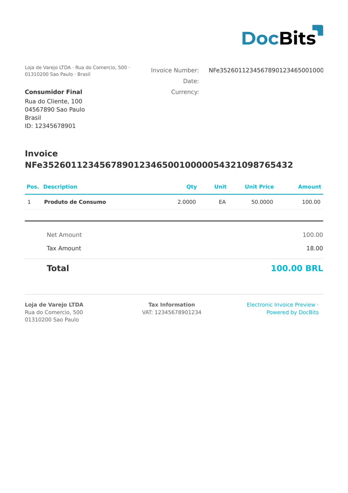

# 🇧🇷 BRAZIL NF-E

| Propiedad | Valor |
|-----------|-------|
| **País / Región** | Brasil |
| **Tipos de documento** | Factura (Nota Fiscal Eletrônica) |
| **Formato** | XML |
| **Estándar** | NF-e 4.0 (Nota Fiscal Eletrônica — bienes y comercio interestatal) |
| **Idioma** | `pt_BR` |

NF-e (Nota Fiscal Eletrônica, `<mod>55</mod>`) es la factura electrónica brasileña para bienes y comercio interestatal, regulada por la SEFAZ. Cada NF-e contiene una clave de acceso única de 44 dígitos (`chNFe`), líneas de producto detalladas y datos fiscales multicapa (ICMS, IPI, PIS, COFINS). DocBits clasifica NF-e detectando el namespace `http://www.portalfiscal.inf.br/nfe`.

## Estado de soporte

| Componente | Estado |
|------------|--------|
| Vista previa | ✅ Compatible |
| Extracción de campos | ✅ Compatible |
| Transformación | ✅ Compatible |

## Vista previa predeterminada

<figure><figcaption><p>Vista previa predeterminada de DocBits para un documento BRAZIL NF-E</p></figcaption></figure>

## Mapeo de campos

### Campos de cabecera

| Campo DocBits | XPath de origen | Notas |
|---|---|---|
| `invoice_id` | `//*[local-name()='ide']/*[local-name()='nNF']` | Número de Nota Fiscal |
| `invoice_date` | `//*[local-name()='ide']/*[local-name()='dhEmi']` | ISO 8601 con desplazamiento BRT |
| `currency` | Fijo: `BRL` | Siempre Real Brasileño |
| `total_amount` | `//*[local-name()='ICMSTot']/*[local-name()='vNF']` | Valor total de la NF-e |
| `net_amount` | `//*[local-name()='ICMSTot']/*[local-name()='vProd']` | Total de productos |
| `tax_amount` | `//*[local-name()='ICMSTot']/*[local-name()='vICMS']` | Importe total del impuesto ICMS |
| `supplier_name` | `//*[local-name()='emit']/*[local-name()='xNome']` | Nombre de la empresa emisora |
| `supplier_id` | `//*[local-name()='emit']/*[local-name()='CNPJ']` o `CPF` | CNPJ (14 dígitos) o CPF (11 dígitos) |
| `buyer_name` | `//*[local-name()='dest']/*[local-name()='xNome']` | Nombre de la empresa receptora |
| `buyer_id` | `//*[local-name()='dest']/*[local-name()='CNPJ']` o `CPF` | CNPJ o CPF |

### Tabla de líneas (`INVOICE_TABLE`)

Ruta de fila: `//*[local-name()='det']`

| Columna | XPath relativo | Notas |
|---|---|---|
| `POSITION` | `@nItem` | Número de posición secuencial |
| `ITEM_CODE` | `*[local-name()='prod']/*[local-name()='cProd']` | Código de producto |
| `DESCRIPTION` | `*[local-name()='prod']/*[local-name()='xProd']` | Descripción del producto |
| `NCM_CODE` | `*[local-name()='prod']/*[local-name()='NCM']` | Clasificación arancelaria NCM |
| `CFOP_CODE` | `*[local-name()='prod']/*[local-name()='CFOP']` | Código de operación fiscal |
| `UNIT` | `*[local-name()='prod']/*[local-name()='uCom']` | Unidad de medida |
| `QUANTITY` | `*[local-name()='prod']/*[local-name()='qCom']` | Cantidad comercial |
| `UNIT_PRICE` | `*[local-name()='prod']/*[local-name()='vUnCom']` | Precio unitario |
| `TOTAL_AMOUNT` | `*[local-name()='prod']/*[local-name()='vProd']` | Total de línea |
| `ICMS_AMOUNT` | `*[local-name()='imposto']/*[local-name()='ICMS']//*[local-name()='vICMS']` | Impuesto ICMS por línea |
| `PIS_AMOUNT` | `*[local-name()='imposto']/*[local-name()='PIS']//*[local-name()='vPIS']` | Impuesto PIS por línea |
| `COFINS_AMOUNT` | `*[local-name()='imposto']/*[local-name()='COFINS']//*[local-name()='vCOFINS']` | Impuesto COFINS por línea |
| `VAT_RATE` | `*[local-name()='imposto']/*[local-name()='ICMS']//*[local-name()='pICMS']` | Tasa ICMS (%) |

## Regla de clasificación

DocBits detecta documentos BRAZIL NF-E comprobando la presencia de la cadena:

```
http://www.portalfiscal.inf.br/nfe
```

en el namespace XML (`mod=55` para NF-e, `mod=65` para NFC-e se distinguen por separado).

## Relacionados

- [BRAZIL NFC-E](brazil-nfce.md)
- [BRAZIL CT-E](brazil-cte.md)
- [BRAZIL NFS-E](brazil-nfse.md)
- [Documentos electrónicos compatibles](./)
