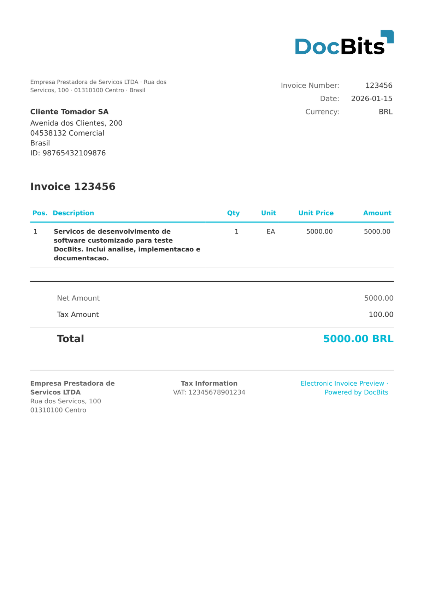

# 🇧🇷 BRAZIL NFS-E

| Propriedade | Valor |
|-------------|-------|
| **País / Região** | Brasil |
| **Tipos de Documento** | Fatura de Serviços (Nota Fiscal de Serviços Eletrônica) |
| **Formato** | XML |
| **Norma** | NFS-e 2.04 (norma nacional ABRASF para faturas municipais de serviços) |
| **Localidade** | `pt_BR` |

NFS-e (Nota Fiscal de Serviços Eletrônica) é a fatura eletrónica brasileira para serviços, emitida a nível municipal. O DocBits suporta o esquema da norma ABRASF (Associação Brasileira das Secretarias de Finanças das Capitais). Os documentos NFS-e utilizam uma estrutura XML diferente da NF-e: o imposto principal é ISS (Imposto Sobre Serviços) em vez de ICMS, e o fornecedor/comprador são denominados `PrestadorServico` / `TomadorServico`. O elemento `Discriminacao` contém a descrição do serviço em texto livre.

## Estado de Suporte

| Componente | Estado |
|------------|--------|
| Pré-visualização | ✅ Suportado |
| Extração de Campos | ✅ Suportado |
| Transformação | ✅ Suportado |

## Pré-visualização Padrão

<figure><figcaption><p>Pré-visualização padrão do DocBits para um documento BRAZIL NFS-E</p></figcaption></figure>

## Mapeamento de Campos

### Campos de Cabeçalho

| Campo DocBits | XPath de Origem | Notas |
|---|---|---|
| `invoice_id` | `//*[local-name()='Numero']` | Número da NFS-e |
| `invoice_date` | `//*[local-name()='DataEmissao']` | Data de emissão ISO 8601 |
| `currency` | Fixo: `BRL` | Sempre Real Brasileiro |
| `total_amount` | `//*[local-name()='ValorServicos']` | Valor bruto do serviço |
| `net_amount` | `//*[local-name()='ValorLiquidoNfse']` | Valor líquido após deduções |
| `tax_amount` | `//*[local-name()='ValorIss']` | ISS (imposto municipal sobre serviços) |
| `supplier_name` | `//*[local-name()='PrestadorServico']//*[local-name()='RazaoSocial']` | Nome do prestador de serviços |
| `supplier_id` | `//*[local-name()='PrestadorServico']//*[local-name()='Cnpj']` | CNPJ do prestador |
| `buyer_name` | `//*[local-name()='TomadorServico']//*[local-name()='RazaoSocial']` | Nome do tomador de serviços |
| `buyer_id` | `//*[local-name()='TomadorServico']//*[local-name()='Cnpj']` | CNPJ do tomador |

> A NFS-e descreve um único serviço no elemento `Discriminacao` em vez de itens de linha. Não é extraída nenhuma `INVOICE_TABLE`.

## Regra de Classificação

O DocBits deteta documentos BRAZIL NFS-E através do namespace:

```
http://www.abrasf.org.br/nfse.xsd
```

## Relacionados

- [BRAZIL NF-E](brazil-nfe.md)
- [BRAZIL NFC-E](brazil-nfce.md)
- [BRAZIL CT-E](brazil-cte.md)
- [Documentos Eletrónicos Suportados](./)
