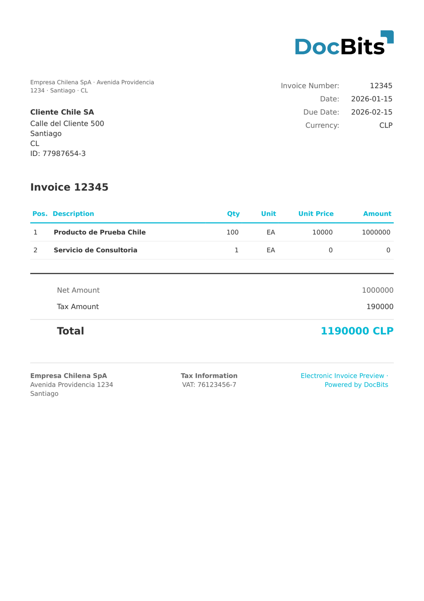

# 🇨🇱 CHILE DTE

| Eigenschap | Waarde |
|----------|-------|
| **Land / Regio** | Chili |
| **Documenttypen** | Factuur (Factura), Creditnota, Debietnota, Verzendgids |
| **Formaat** | XML |
| **Standaard** | DTE (Documento Tributario Electrónico), SII |
| **Landinstellingen** | `es_CL` |

DTE (Documento Tributario Electrónico) is de Chileense elektronische belastingdocumentstandaard gereguleerd door de Servicio de Impuestos Internos (SII). Alle DTE-documenten delen de naamruimte `http://www.sii.cl/SiiDte`. DocBits detecteert automatisch de DTE-typecode (`TipoDTE`) en stuurt door naar de juiste extractieregels:

| Typecode | Documenttype |
|-----------|--------------|
| 33 | Factura Electrónica (Invoice) |
| 34 | Factura No Afecta o Exenta (Tax-exempt invoice) |
| 52 | Guía de Despacho (Dispatch Guide) |
| 56 | Nota de Débito (Debit Note) |
| 61 | Nota de Crédito (Credit Note) |

## Ondersteuningsstatus

| Component | Status |
|-----------|--------|
| Voorvertoning | ✅ Ondersteund |
| Veldextractie | ✅ Ondersteund |
| Transformatie | ✅ Ondersteund |

## Standaard Voorvertoning

<figure><figcaption>
Standaard DocBits-voorvertoning voor een CHILE DTE FACTURA (type 33)
</figcaption></figure>

## Veldtoewijzing

### Kopvelden

| DocBits-veld | Bron-XML-element | Opmerkingen |
|---|---|---|
| `invoice_id` | `Folio` | Documentfolionummer |
| `invoice_date` | `FchEmis` | ISO 8601-uitgiftedatum |
| `due_date` | `FchVenc` | Vervaldatum betaling |
| `currency` | Vast: `CLP` | Altijd Chileense peso |
| `total_amount` | `MntTotal` | Totaalbedrag incl. btw |
| `net_amount` | `MntNeto` | Netto belastbaar bedrag |
| `tax_amount` | `IVA` | Btw-bedrag (standaardtarief 19%) |
| `supplier_name` | `RznSoc` (Emisor) | Naam uitgevende onderneming |
| `supplier_id` | `RUTEmisor` | RUT van uitgever (bijv. `76123456-7`) |
| `supplier_address` | `DirOrigen` | Straatadres uitgever |
| `supplier_city` | `CiudadOrigen` | Stad van uitgever |
| `supplier_country` | Vast: `CL` | Altijd Chili |
| `buyer_name` | `RznSocRecep` | Naam ontvangende onderneming |
| `buyer_id` | `RUTRecep` | RUT van ontvanger |
| `buyer_address` | `DirRecep` | Straatadres ontvanger |
| `buyer_city` | `CiudadRecep` | Stad van ontvanger |
| `buyer_country` | Vast: `CL` | Altijd Chili |

### Regelitemtabel (`INVOICE_TABLE`)

Rijpad: `Detalle`

| Kolom | Bron-XML-element | Opmerkingen |
|---|---|---|
| `POSITION` | `NroLinDet` | Regelvolgnummer |
| `DESCRIPTION` | `NmbItem` | Artikelnaam |
| `QUANTITY` | `QtyItem` | Hoeveelheid |
| `UNIT` | `UnmdItem` | Meeteenheid |
| `UNIT_PRICE` | `PrcItem` | Eenheidsprijs excl. btw |
| `VAT_RATE` | `TasaIVA` (uit koptekst) | Btw-tarief in % (doorgaans 19%) |
| `VAT` | Berekend | Btw per regel |
| `NET_AMOUNT` | `MontoItem` | Regeltotaal |

## Classificatieregels

DocBits detecteert Chile DTE-documenten door de XML-naamruimte en `TipoDTE` te koppelen:

| Type elektronisch document | Patroon |
|--------------------------|---------|
| CHILE DTE FACTURA | `http://www.sii.cl/SiiDte` + `<TipoDTE>33</TipoDTE>` |
| CHILE DTE FACTURA ELECTRONICA | `http://www.sii.cl/SiiDte` + `<TipoDTE>34</TipoDTE>` |
| CHILE DTE GUIA DESPACHO | `http://www.sii.cl/SiiDte` + `<TipoDTE>52</TipoDTE>` |
| CHILE DTE NOTA CREDITO | `http://www.sii.cl/SiiDte` + `<TipoDTE>61</TipoDTE>` |

Het omhullende element is `<EnvioDTE>` en elke DTE is verpakt in `<DTE><Documento>`.

## Gerelateerd

- [Momenteel ondersteunde e-factuurstandaarden](../../currently-supported-e-invoice-standards/)
- [Ondersteunde elektronische documenten](./)
