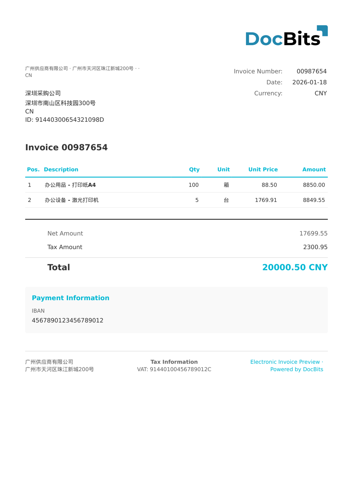

# 🇨🇳 CHINA FAPIAO

| Property             | Value                                                            |
| -------------------- | ---------------------------------------------------------------- |
| **Country / Region** | China                                                            |
| **Document Types**   | General VAT Invoice (普通发票), Special VAT Invoice (专用发票), E-Fapiao |
| **Format**           | XML                                                              |
| **Standard**         | Fapiao (发票), State Taxation Administration                       |
| **Locale**           | `zh_CN`                                                          |

Fapiao (发票) is the Chinese tax invoice standard issued under the authority of the State Taxation Administration (STA / 国家税务总局). All Fapiao documents share the `urn:china:tax:fapiao:1.0` namespace. DocBits auto-detects the Fapiao type via the `fapiao_type` element and routes to the appropriate extraction rules:

| fapiao\_type value | Document Type                                      |
| ------------------ | -------------------------------------------------- |
| 普通发票               | General VAT Invoice (FAPIAO / GENERAL VAT INVOICE) |
| 专用发票               | Special VAT Invoice (SPECIAL VAT INVOICE)          |
| 电子发票               | E-Fapiao (E-FAPIAO)                                |

## Support Status

| Component        | Status      |
| ---------------- | ----------- |
| Preview          | ✅ Supported |
| Field Extraction | ✅ Supported |
| Transformation   | ✅ Supported |

## Default Preview

<figure><figcaption>
Default DocBits preview for a China Fapiao General VAT Invoice (普通发票)
</figcaption></figure>

## Field Mapping

### Header Fields

| DocBits Field      | Source XML Element          | Notes                                  |
| ------------------ | --------------------------- | -------------------------------------- |
| `invoice_id`       | `fapiao_head/fapiao_number` | Fapiao number — 8 digits (发票号码)        |
| `invoice_date`     | `fapiao_head/issue_date`    | Issue date (ISO 8601)                  |
| `currency`         | Fixed: `CNY`                | Always Chinese Yuan Renminbi           |
| `total_amount`     | `total/total_with_tax`      | Total amount incl. VAT (价税合计)          |
| `net_amount`       | `total/total_amount`        | Net taxable amount excl. VAT (金额)      |
| `tax_amount`       | `total/total_tax`           | Total VAT amount (税额)                  |
| `supplier_name`    | `seller/name`               | Seller company name (销售方名称)            |
| `supplier_id`      | `seller/taxpayer_id`        | Seller taxpayer ID — 18 chars (纳税人识别号) |
| `supplier_address` | `seller/address`            | Seller address                         |
| `supplier_country` | Fixed: `CN`                 | Always China                           |
| `iban`             | `seller/bank_account`       | Seller bank account number             |
| `buyer_name`       | `buyer/name`                | Buyer company name (购买方名称)             |
| `buyer_id`         | `buyer/taxpayer_id`         | Buyer taxpayer ID (纳税人识别号)             |
| `buyer_address`    | `buyer/address`             | Buyer address                          |
| `buyer_country`    | Fixed: `CN`                 | Always China                           |

### Line Item Table (`INVOICE_TABLE`)

Row path: `items/item`

| Column        | Source XML Element | Notes                                      |
| ------------- | ------------------ | ------------------------------------------ |
| `POSITION`    | `seq`              | Line sequence number                       |
| `DESCRIPTION` | `name` + `spec`    | Item name and specification (concatenated) |
| `QUANTITY`    | `quantity`         | Quantity                                   |
| `UNIT`        | `unit`             | Unit of measure (e.g. 箱, 台, 项)             |
| `UNIT_PRICE`  | `unit_price`       | Unit price excl. VAT                       |
| `VAT_RATE`    | `tax_rate`         | VAT rate in % (typically 6%, 9%, or 13%)   |
| `VAT`         | `tax_amount`       | VAT amount per line                        |
| `NET_AMOUNT`  | `amount`           | Line total excl. VAT                       |

## Classification Rules

DocBits detects China Fapiao documents by matching the XML namespace and `fapiao_type`:

| Electronic Document Type  | Pattern                                                        |
| ------------------------- | -------------------------------------------------------------- |
| CHINA GENERAL VAT INVOICE | `urn:china:tax:fapiao:1.0` + `<fapiao_type>普通发票</fapiao_type>` |
| CHINA SPECIAL VAT INVOICE | `urn:china:tax:fapiao:1.0` + `<fapiao_type>专用发票</fapiao_type>` |
| CHINA E-FAPIAO            | `urn:china:tax:fapiao:1.0` + `<fapiao_type>电子发票</fapiao_type>` |

The root element is `<fapiao>` with namespace `urn:china:tax:fapiao:1.0`. Classification uses the **first-match-wins** principle, sorted by pattern length (longest first).

## Related

* [Currently Supported E-Invoice Standards](../../currently-supported-e-invoice-standards/)
* [Supported Electronic Documents](./)
