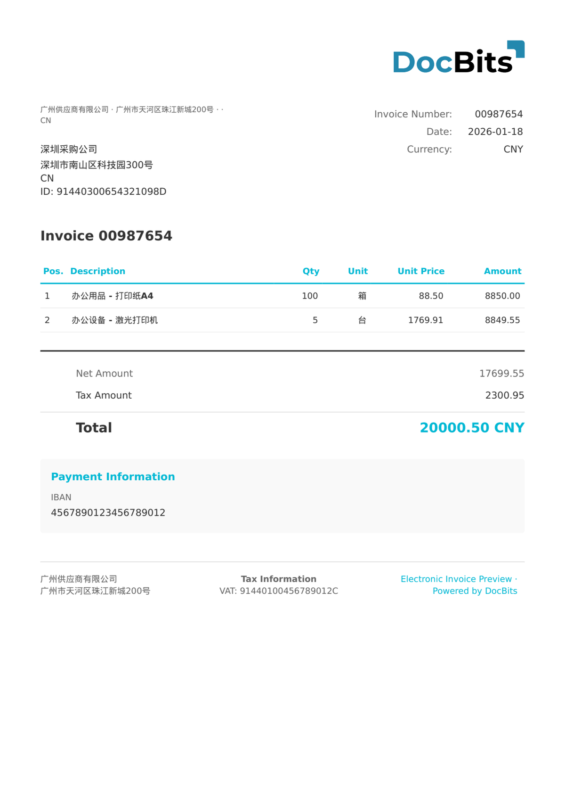

# 🇨🇳 China Fapiao

| Propriété | Valeur |
|----------|-------|
| **Pays / Région** | China |
| **Types de documents** | General VAT Invoice (普通发票), Special VAT Invoice (专用发票), E-Fapiao |
| **Format** | XML |
| **Norme** | Fapiao (发票), State Taxation Administration |
| **Locale** | `zh_CN` |

Fapiao (发票) est la norme de facture fiscale chinoise émise sous l'autorité de la State Taxation Administration (STA / 国家税务总局). Tous les documents Fapiao partagent le namespace `urn:china:tax:fapiao:1.0`. DocBits détecte automatiquement le type de Fapiao via l'élément `fapiao_type` et achemine vers les règles d'extraction appropriées :

| Valeur fapiao_type | Type de document |
|-------------------|--------------|
| 普通发票 | General VAT Invoice (FAPIAO / GENERAL VAT INVOICE) |
| 专用发票 | Special VAT Invoice (SPECIAL VAT INVOICE) |
| 电子发票 | E-Fapiao (E-FAPIAO) |

## Statut de prise en charge

| Composant | Statut |
|-----------|--------|
| Aperçu | ✅ Supported |
| Extraction des champs | ✅ Supported |
| Transformation | ✅ Supported |

## Aperçu par défaut

<figure><figcaption>
Aperçu par défaut DocBits pour une China Fapiao General VAT Invoice (普通发票)
</figcaption></figure>

## Mappage des champs

### Champs d'en-tête

| Champ DocBits | Élément XML source | Remarques |
|---|---|---|
| `invoice_id` | `fapiao_head/fapiao_number` | Numéro Fapiao — 8 chiffres (发票号码) |
| `invoice_date` | `fapiao_head/issue_date` | Date d'émission (ISO 8601) |
| `currency` | Fixe : `CNY` | Toujours yuan renminbi chinois |
| `total_amount` | `total/total_with_tax` | Montant total TTC (价税合计) |
| `net_amount` | `total/total_amount` | Montant net HT (金额) |
| `tax_amount` | `total/total_tax` | Montant total de la TVA (税额) |
| `supplier_name` | `seller/name` | Nom de l'entreprise vendeuse (销售方名称) |
| `supplier_id` | `seller/taxpayer_id` | Identifiant fiscal du vendeur — 18 caractères (纳税人识别号) |
| `supplier_address` | `seller/address` | Adresse du vendeur |
| `supplier_country` | Fixe : `CN` | Toujours Chine |
| `iban` | `seller/bank_account` | Numéro de compte bancaire du vendeur |
| `buyer_name` | `buyer/name` | Nom de l'entreprise acheteuse (购买方名称) |
| `buyer_id` | `buyer/taxpayer_id` | Identifiant fiscal de l'acheteur (纳税人识别号) |
| `buyer_address` | `buyer/address` | Adresse de l'acheteur |
| `buyer_country` | Fixe : `CN` | Toujours Chine |

### Tableau des lignes (`INVOICE_TABLE`)

Chemin de la ligne : `items/item`

| Colonne | Élément XML source | Remarques |
|---|---|---|
| `POSITION` | `seq` | Numéro de séquence de la ligne |
| `DESCRIPTION` | `name` + `spec` | Désignation et spécification de l'article (concaténées) |
| `QUANTITY` | `quantity` | Quantité |
| `UNIT` | `unit` | Unité de mesure (ex. 箱, 台, 项) |
| `UNIT_PRICE` | `unit_price` | Prix unitaire HT |
| `VAT_RATE` | `tax_rate` | Taux de TVA en % (généralement 6 %, 9 % ou 13 %) |
| `VAT` | `tax_amount` | Montant de TVA par ligne |
| `NET_AMOUNT` | `amount` | Total de la ligne HT |

## Règles de classification

DocBits détecte les documents China Fapiao en faisant correspondre le namespace XML et le `fapiao_type` :

| Type de document électronique | Modèle |
|--------------------------|---------|
| CHINA GENERAL VAT INVOICE | `urn:china:tax:fapiao:1.0` + `<fapiao_type>普通发票</fapiao_type>` |
| CHINA SPECIAL VAT INVOICE | `urn:china:tax:fapiao:1.0` + `<fapiao_type>专用发票</fapiao_type>` |
| CHINA E-FAPIAO | `urn:china:tax:fapiao:1.0` + `<fapiao_type>电子发票</fapiao_type>` |

L'élément racine est `<fapiao>` avec le namespace `urn:china:tax:fapiao:1.0`. La classification utilise le principe **premier résultat gagnant**, trié par longueur de motif (le plus long d'abord).

## Voir aussi

- [Normes de e-facturation actuellement prises en charge](../../currently-supported-e-invoice-standards/)
- [Documents électroniques pris en charge](./)
