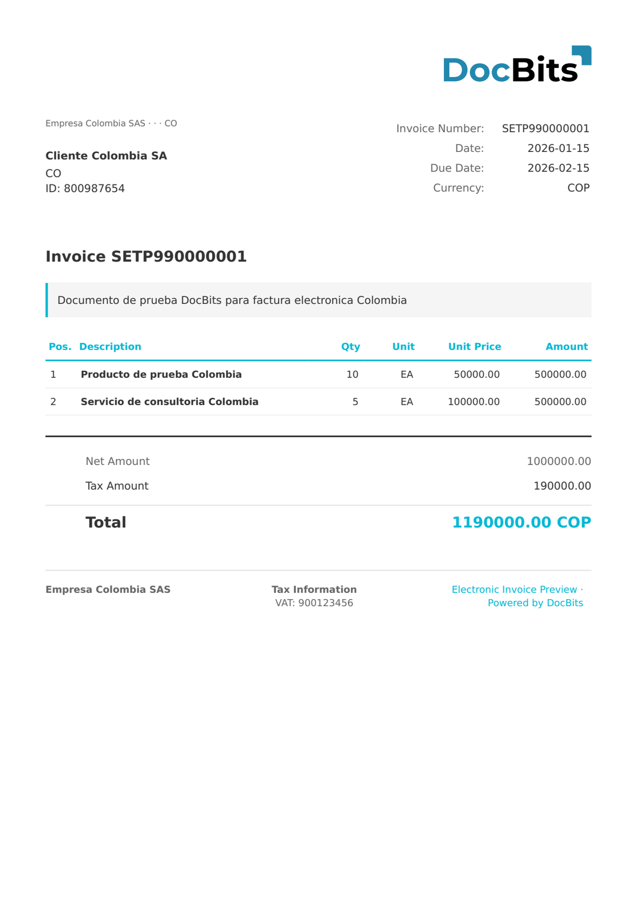

# 🇨🇴 COLOMBIA DIAN

| Property             | Value                                                                           |
| -------------------- | ------------------------------------------------------------------------------- |
| **Country / Region** | Colombia                                                                        |
| **Document Types**   | Invoice (Factura Electrónica), Credit Note (Nota de Crédito), Documento Soporte |
| **Format**           | XML (UBL 2.1)                                                                   |
| **Standard**         | DIAN 2.1 (Dirección de Impuestos y Aduanas Nacionales)                          |
| **Locale**           | `es_CO`                                                                         |

The Colombian electronic invoicing standard is regulated by the **DIAN** (Dirección de Impuestos y Aduanas Nacionales). It is based on UBL 2.1 with DIAN-specific extensions (`sts:DianExtensions`). DocBits detects Colombia DIAN documents via the DIAN namespace and routes by `CustomizationID`:

| CustomizationID | Document Type                                      |
| --------------- | -------------------------------------------------- |
| 10              | Factura Electrónica de Venta (FACTURA ELECTRONICA) |
| 20              | Nota de Crédito (Credit Note)                      |
| 91              | Nota de Crédito por devolución                     |
| 92              | Nota de Débito                                     |
| DS              | Documento Soporte (DOCUMENTO SOPORTE)              |

The DIAN identifier (**NIT** — Número de Identificación Tributaria) uses `schemeID="31"` in the UBL `CompanyID` element.

## Support Status

| Component        | Status      |
| ---------------- | ----------- |
| Preview          | ✅ Supported |
| Field Extraction | ✅ Supported |
| Transformation   | ✅ Supported |

## Default Preview

<figure><figcaption>
Default DocBits preview for a COLOMBIA FACTURA ELECTRONICA (CustomizationID 10)
</figcaption></figure>

## Field Mapping

### Header Fields

| DocBits Field   | Source XML Element                                  | Notes                                             |
| --------------- | --------------------------------------------------- | ------------------------------------------------- |
| `invoice_id`    | `cbc:ID`                                            | Invoice number with prefix (e.g. `SETP990000001`) |
| `invoice_date`  | `cbc:IssueDate`                                     | Issue date (ISO 8601)                             |
| `due_date`      | `cbc:DueDate`                                       | Payment due date                                  |
| `currency`      | `cbc:DocumentCurrencyCode`                          | Always `COP` (Colombian Peso)                     |
| `total_amount`  | `cac:LegalMonetaryTotal/cbc:PayableAmount`          | Total payable incl. IVA                           |
| `net_amount`    | `cac:LegalMonetaryTotal/cbc:TaxExclusiveAmount`     | Net amount excl. IVA                              |
| `tax_amount`    | `cac:TaxTotal/cbc:TaxAmount`                        | Total IVA amount (standard rate 19%)              |
| `supplier_name` | `cac:AccountingSupplierParty//cbc:RegistrationName` | Supplier legal name                               |
| `supplier_id`   | `cac:AccountingSupplierParty//cbc:CompanyID`        | Supplier NIT (schemeID=31)                        |
| `buyer_name`    | `cac:AccountingCustomerParty//cbc:RegistrationName` | Buyer legal name                                  |
| `buyer_id`      | `cac:AccountingCustomerParty//cbc:CompanyID`        | Buyer NIT (schemeID=31)                           |

### Line Item Table (`INVOICE_TABLE`)

Row path: `cac:InvoiceLine` (or `cac:CreditNoteLine`)

| Column        | Source XML Element          | Notes                             |
| ------------- | --------------------------- | --------------------------------- |
| `POSITION`    | `cbc:ID`                    | Line number                       |
| `DESCRIPTION` | `cac:Item/cbc:Description`  | Product or service description    |
| `QUANTITY`    | `cbc:InvoicedQuantity`      | Quantity with unit code attribute |
| `UNIT_PRICE`  | `cac:Price/cbc:PriceAmount` | Unit price excl. IVA              |
| `NET_AMOUNT`  | `cbc:LineExtensionAmount`   | Line total excl. IVA              |

## Classification Rules

DocBits detects Colombia DIAN documents by the DIAN namespace string:

| Electronic Document Type     | Pattern                                                                                    |
| ---------------------------- | ------------------------------------------------------------------------------------------ |
| COLOMBIA FACTURA ELECTRONICA | `http://www.dian.gov.co/contratos/facturaelectronica/v1/Structures` + `DianExtensions`     |
| COLOMBIA DOCUMENTO SOPORTE   | `http://www.dian.gov.co/contratos/facturaelectronica/v1/Structures` + `CustomizationID=DS` |

The root element is `<Invoice>` (UBL 2.1) for invoices, `<CreditNote>` for credit notes. All documents include a `<sts:DianExtensions>` block with DIAN authorization data (`InvoiceAuthorization`, `CUFE`/`CUDE` UUID, QR code).

## Related

* [Currently Supported E-Invoice Standards](../../currently-supported-e-invoice-standards/)
* [Supported Electronic Documents](./)
