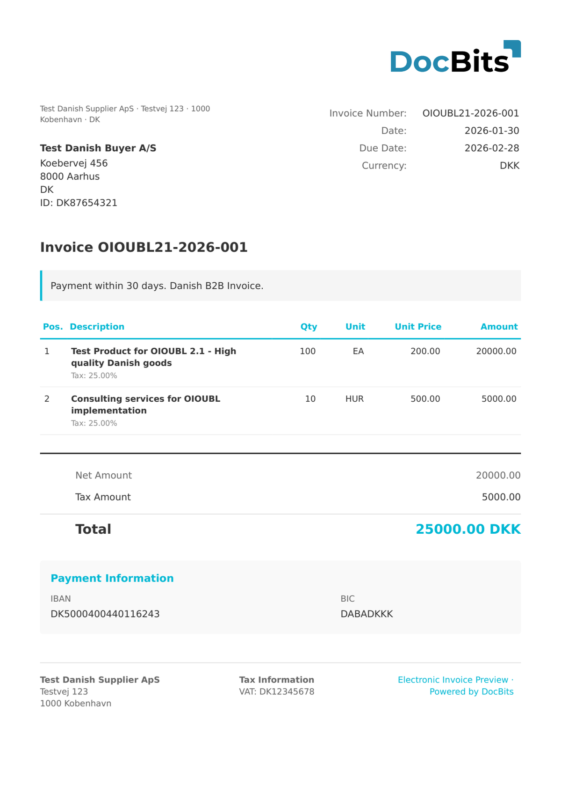

# 🇩🇰 Denmark OIOUBL 2.1

| Propriedade | Valor |
|----------|-------|
| **País / Região** | Dinamarca |
| **Tipos de Documento** | Fatura (Faktura), Nota de Crédito |
| **Formato** | XML (UBL 2.1) |
| **Padrão** | OIOUBL 2.1 (Offentlig Information Online UBL) |
| **Localidade** | `da_DK` |

O OIOUBL (Offentlig Information Online UBL) é o padrão dinamarquês de faturação eletrónica baseado no UBL 2.1. É obrigatório para faturas emitidas a entidades do setor público dinamarquês e amplamente utilizado em transações B2B. O DocBits deteta documentos OIOUBL 2.1 pela presença de `<cbc:CustomizationID>OIOUBL-2.1</cbc:CustomizationID>`. O identificador de perfil `urn:www.nesubl.eu:profiles:profile5:ver2.0` indica o perfil de fatura NES (Northern European Subset).

## Estado de Suporte

| Componente | Estado |
|-----------|--------|
| Pré-visualização | ✅ Suportado |
| Extração de Campos | ✅ Suportado |
| Transformação | ✅ Suportado |

## Pré-visualização Padrão

<figure><figcaption>
Pré-visualização padrão do DocBits para uma fatura Denmark OIOUBL 2.1 (Faktura)
</figcaption></figure>

## Mapeamento de Campos

### Campos de Cabeçalho

| Campo DocBits | Elemento XML de Origem | Notas |
|---|---|---|
| `invoice_id` | `cbc:ID` | Número da fatura |
| `invoice_date` | `cbc:IssueDate` | Data de emissão em ISO 8601 |
| `due_date` | `cbc:DueDate` | Data de vencimento do pagamento |
| `invoice_type` | `cbc:InvoiceTypeCode` | Código UNCL 1001 (380=Fatura, 381=Nota de Crédito) |
| `currency` | `cbc:DocumentCurrencyCode` | Sempre `DKK` (Coroa Dinamarquesa) |
| `purchase_order` | `cac:OrderReference/cbc:ID` | Número de referência do pedido do comprador |
| `buyer_reference` | `cbc:BuyerReference` | Referência interna do comprador / número de localização EAN |
| `note` | `cbc:Note` | Instruções de pagamento em texto livre ou notas |
| `net_amount` | `cac:LegalMonetaryTotal/cbc:TaxExclusiveAmount` | Valor líquido excl. IVA |
| `tax_amount` | `cac:TaxTotal/cbc:TaxAmount` | Valor total de IVA (taxa padrão de 25%) |
| `total_amount` | `cac:LegalMonetaryTotal/cbc:PayableAmount` | Valor total incl. IVA |
| `tax_rate` | `cac:TaxTotal/cac:TaxSubtotal/cac:TaxCategory/cbc:Percent` | Taxa de IVA em % |
| `supplier_name` | `cac:AccountingSupplierParty/cac:Party/cac:PartyName/cbc:Name` | Nome da empresa fornecedora |
| `supplier_id` | `cac:AccountingSupplierParty/cac:Party/cac:PartyIdentification/cbc:ID` | Número CVR (ex. `DK12345678`) |
| `supplier_vat` | `cac:AccountingSupplierParty/cac:Party/cac:PartyTaxScheme/cbc:CompanyID` | Número de IVA/CVR |
| `supplier_address` | `cac:AccountingSupplierParty/.../cbc:StreetName` | Morada do fornecedor |
| `supplier_city` | `cac:AccountingSupplierParty/.../cbc:CityName` | Cidade do fornecedor |
| `supplier_postal_code` | `cac:AccountingSupplierParty/.../cbc:PostalZone` | Código postal do fornecedor |
| `supplier_country` | `cac:AccountingSupplierParty/.../cbc:IdentificationCode` | Código de país ISO (`DK`) |
| `customer_name` | `cac:AccountingCustomerParty/cac:Party/cac:PartyName/cbc:Name` | Nome da empresa cliente |
| `customer_id` | `cac:AccountingCustomerParty/cac:Party/cac:PartyIdentification/cbc:ID` | Número CVR |
| `customer_vat` | `cac:AccountingCustomerParty/cac:Party/cac:PartyTaxScheme/cbc:CompanyID` | Número de IVA/CVR |
| `customer_address` | `cac:AccountingCustomerParty/.../cbc:StreetName` | Morada do cliente |
| `customer_city` | `cac:AccountingCustomerParty/.../cbc:CityName` | Cidade do cliente |
| `customer_postal_code` | `cac:AccountingCustomerParty/.../cbc:PostalZone` | Código postal do cliente |
| `customer_country` | `cac:AccountingCustomerParty/.../cbc:IdentificationCode` | Código de país ISO (`DK`) |
| `iban` | `cac:PaymentMeans/cac:PayeeFinancialAccount/cbc:ID` | Conta bancária / IBAN |
| `bic` | `cac:PaymentMeans/cac:PayeeFinancialAccount/cac:FinancialInstitutionBranch/cbc:ID` | Código BIC/SWIFT |

### Tabela de Linhas de Artigo (`INVOICE_TABLE`)

Caminho de linha: `cac:InvoiceLine`

| Coluna | Elemento XML de Origem | Notas |
|---|---|---|
| `POSITION` | `cbc:ID` | Número de sequência da linha |
| `DESCRIPTION` | `cac:Item/cbc:Name` | Nome do artigo / descrição |
| `QUANTITY` | `cbc:InvoicedQuantity` | Quantidade faturada |
| `UNIT_PRICE` | `cac:Price/cbc:PriceAmount` | Preço unitário excl. IVA |
| `NET_AMOUNT` | `cbc:LineExtensionAmount` | Total da linha excl. IVA |

## Regra de Classificação

O DocBits deteta documentos OIOUBL 2.1 fazendo a correspondência com o elemento `CustomizationID`:

| Tipo de Documento Eletrónico | Padrão |
|--------------------------|---------|
| OIOUBL 2.1 | `<cbc:CustomizationID>OIOUBL-2\.1\s*</cbc:CustomizationID>` |

O elemento raiz é `<Invoice>` (ou `<CreditNote>`) no namespace UBL 2.1 `urn:oasis:names:specification:ubl:schema:xsd:Invoice-2`.

## Relacionados

- [Padrões de E-Fatura Atualmente Suportados](../../currently-supported-e-invoice-standards/)
- [Documentos Eletrónicos Suportados](./)
