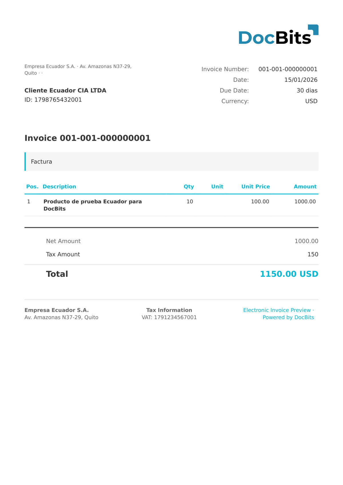

# 🇪🇨 Ecuador SRI

| Svojstvo | Vrednost |
|---------|---------|
| **Zemlja / Region** | Ekvador |
| **Tipovi dokumenata** | Factura (Faktura), Nota de Crédito, Nota de Débito, Guía de Remisión, Comprobante de Retención |
| **Format** | XML |
| **Standard** | SRI (Servicio de Rentas Internas) |
| **Lokalizacija** | `es_EC` |

Standard elektronske fakture Ecuador SRI se izdaje pod nadležnošću Servicio de Rentas Internas (SRI), ekvadorskog poreskog organa. Dokumenti koriste vlasnički XML format sa korenskim elementom `<factura id="comprobante" version="X.X.X">`. DocBits automatski detektuje verziju iz atributa `version` i tip dokumenta iz `codDoc`:

| Atribut version | Tip dokumenta |
|----------------|---------------|
| `1.0.0` | SRI 1.0.0 |
| `1.1.0` | SRI 1.1.0 |
| `2.0.0` | SRI 2.0.0 |
| `2.1.0` | SRI 2.1.0 / FACTURA ELECTRONICA |

Broj fakture je složen od tri polja: `estab-ptoEmi-secuencial` (npr. `001-001-000000001`). `claveAcceso` je 49-cifreni pristupni ključ koji SRI izdaje za autentifikaciju dokumenata. Ekvador koristi **Američki dolar (USD)** kao zvaničnu valutu.

## Status podrške

| Komponenta | Status |
|-----------|--------|
| Pregled | ✅ Podržano |
| Ekstrakcija polja | ✅ Podržano |
| Transformacija | ✅ Podržano |

## Podrazumevani pregled

<figure><figcaption>
Podrazumevani DocBits pregled za Ecuador SRI Factura Electrónica (verzija 2.1.0)
</figcaption></figure>

## Mapiranje polja

### Polja zaglavlja

| DocBits polje | Izvorni XML element | Napomene |
|---|---|---|
| `invoice_id` | `estab` + `ptoEmi` + `secuencial` | Složeno: `001-001-000000001` |
| `invoice_date` | `infoFactura/fechaEmision` | Format datuma `DD/MM/YYYY` |
| `due_date` | `infoFactura/pagos/pago/plazo` + `unidadTiempo` | Rok plaćanja (npr. `30 dias`) |
| `currency` | Fiksno: `USD` | Uvek Američki dolar (zvanična valuta Ekvadora) |
| `invoice_type` | Fiksno: `Factura` | Oznaka tipa dokumenta |
| `net_amount` | `infoFactura/totalSinImpuestos` | Neto ukupno bez PDV-a |
| `tax_amount` | `infoFactura/totalConImpuestos/totalImpuesto/valor` | Iznos PDV-a (IVA) |
| `total_amount` | `infoFactura/importeTotal` | Ukupan iznos sa PDV-om |
| `supplier_name` | `infoTributaria/razonSocial` | Naziv kompanije izdavaoca |
| `supplier_id` | `infoTributaria/ruc` | RUC — 13-cifreni poreski identifikacioni broj |
| `supplier_tax_id` | `infoTributaria/ruc` | RUC (isto kao supplier_id) |
| `supplier_address` | `infoTributaria/dirMatriz` | Adresa sedišta izdavaoca |
| `payment_terms` | `infoFactura/pagos/pago/formaPago` | Kod načina plaćanja SRI |
| `buyer_name` | `infoFactura/razonSocialComprador` | Naziv kompanije kupca |
| `buyer_id` | `infoFactura/identificacionComprador` | RUC ili CI kupca |

### Tabela stavki (`INVOICE_TABLE`)

Putanja reda: `detalles/detalle`

| Kolona | Izvorni XML element | Napomene |
|---|---|---|
| `POSITION` | Sekvencijalni indeks | Broj reda počevši od 1 |
| `DESCRIPTION` | `descripcion` | Opis stavke |
| `QUANTITY` | `cantidad` | Količina |
| `UNIT_PRICE` | `precioUnitario` | Jedinična cena bez PDV-a |
| `VAT_RATE` | `impuestos/impuesto/tarifa` | Stopa PDV-a u % (npr. 15%) |
| `VAT` | `impuestos/impuesto/valor` | Iznos PDV-a po redu |
| `NET_AMOUNT` | `precioTotalSinImpuesto` | Ukupno po redu bez PDV-a |

## Pravila klasifikacije

DocBits detektuje Ecuador SRI dokumente podudaranjem korenskog elementa i atributa verzije:

| Tip elektronskog dokumenta | Obrazac |
|---------------------------|---------|
| ECUADOR SRI / FACTURA ELECTRONICA | `<factura id="comprobante"` (bilo koja verzija) |
| ECUADOR SRI 1.0.0 | `<factura id="comprobante" version="1.0.0">` |
| ECUADOR SRI 1.1.0 | `<factura id="comprobante" version="1.1.0">` |
| ECUADOR SRI 2.0.0 | `<factura id="comprobante" version="2.0.0">` |
| ECUADOR SRI 2.1.0 | `<factura id="comprobante" version="2.1.0">` |

Korenski element je `<factura>` sa `id="comprobante"`. Atribut `version` određuje specifičnu SRI verziju. Klasifikacija koristi princip **prvog podudaranja**, sortiran po dužini obrasca (najduži/najspecifičniji prvi).

## Povezano

- [Trenutno podržani standardi e-faktura](../../currently-supported-e-invoice-standards/)
- [Podržani elektronski dokumenti](./)
