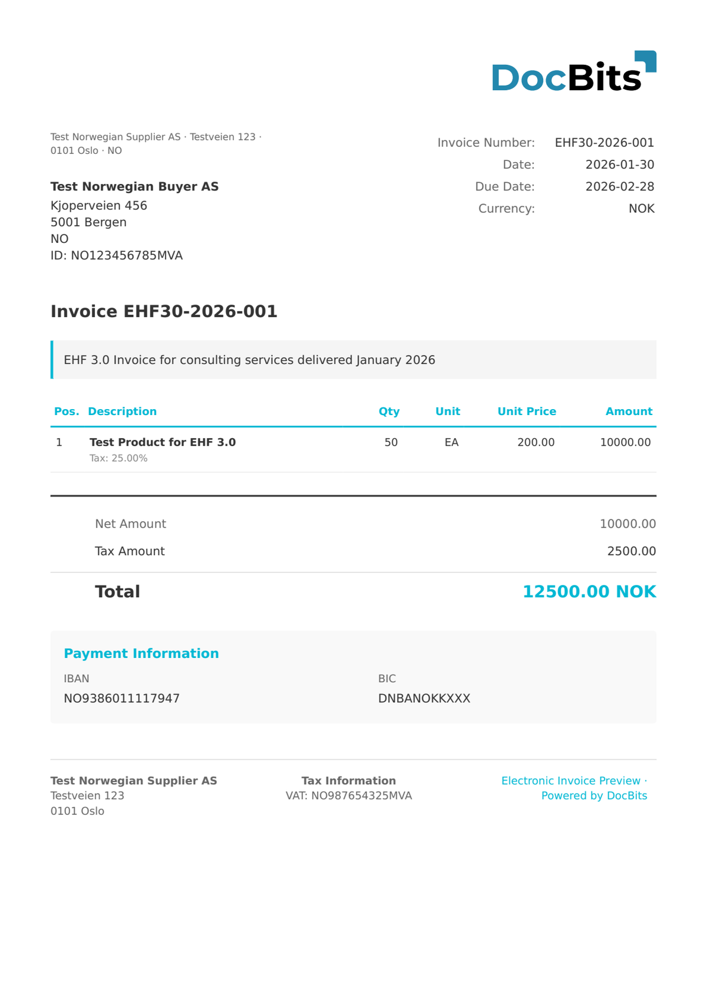

# 🇳🇴 EHF INVOICE 3.0

| Property             | Value                                             |
| -------------------- | ------------------------------------------------- |
| **Country / Region** | Norway                                            |
| **Document Types**   | Invoice, Credit Note                              |
| **Format**           | UBL 2.1 XML                                       |
| **Standard**         | EHF Invoice 3.0 (based on Peppol BIS Billing 3.0) |

EHF (Elektronisk Handelsformat) Invoice 3.0 is the Norwegian e-invoicing standard maintained by the Agency for Public Management and eGovernment (Difi). Version 3.0 is aligned with Peppol BIS Billing 3.0, making Norwegian e-invoices interoperable across the European Peppol network.

## Support Status

| Component        | Status      |
| ---------------- | ----------- |
| Preview          | ✅ Supported |
| Field Extraction | ✅ Supported |
| Transformation   | ✅ Supported |

## Default Preview

<figure><figcaption>
Default DocBits preview for a Norway EHF Invoice 3.0
</figcaption></figure>

## Related

* [Supported Electronic Documents](./)
* [Peppol BIS 3.0](peppol-bis-3-0.md)
