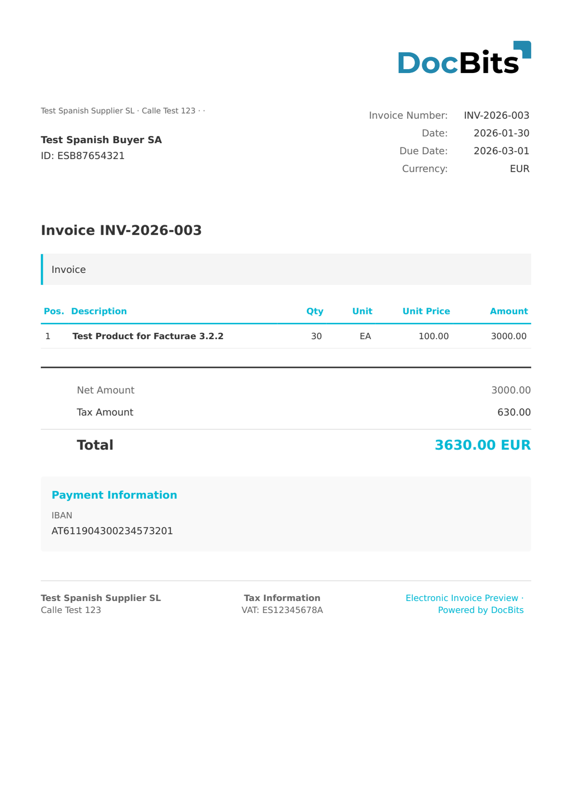

# 🇪🇸 FACTURAE 3.2.2

| Property             | Value                                    |
| -------------------- | ---------------------------------------- |
| **Country / Region** | Spain                                    |
| **Document Types**   | Invoice, Credit Note, Corrective Invoice |
| **Format**           | XML                                      |
| **Standard**         | Facturae 3.2.2                           |

Facturae 3.2.2 is the latest version of the Spanish e-invoicing standard. It includes updated tax handling for SII (Suministro Inmediato de Información) compatibility and improved support for corrective invoices.

## Support Status

| Component        | Status      |
| ---------------- | ----------- |
| Preview          | ✅ Supported |
| Field Extraction | ✅ Supported |
| Transformation   | ✅ Supported |

## Default Preview

<figure><figcaption>
Default DocBits preview for a Spain Facturae 3.2.2 invoice
</figcaption></figure>

## Related

* [Supported Electronic Documents](./)
