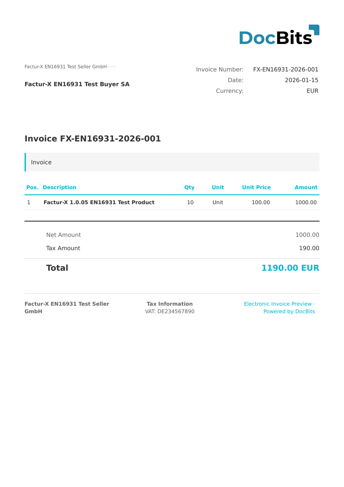

# 🇫🇷 FACTURX 1.09 - ZUGFERD 2.5

| Property | Value |
|----------|-------|
| **Country / Region** | France / Germany |
| **Document Types** | Invoice, Credit Note |
| **Format** | CII (PDF/A-3 embedded) |
| **Standard** | Factur-X 1.09 / ZUGFeRD 2.5 |
| **Based On** | EN 16931 |

Factur-X 1.09 is the French publication equivalent to ZUGFeRD 2.5 (FeRD/FNFE-MPE common publication, June 2026). Its CII XML uses the UN/CEFACT D22B base, which is backwards-compatible with D16B, so the full Factur-X 1.08 / ZUGFeRD 2.4 extraction and transformation contract continues to apply. The EXTENDED profile adds new fields for payment means and BIC, a third-party payee (factor), and the allowance/charge tax-exemption reason.

All five profiles are supported: MINIMUM, BASIC WL, BASIC, EN 16931 (COMFORT) and EXTENDED.

## Support Status

| Component | Status |
|-----------|--------|
| Preview | ✅ Supported |
| Field Extraction | ✅ Supported |
| Transformation | ✅ Supported |

## Default Preview

<figure><figcaption>
Default DocBits preview for a Factur-X 1.09 / ZUGFeRD 2.5 invoice
</figcaption></figure>

## Related

- [ZUGFeRD 2.5](zugferd-2-5.md)
- [ZUGFeRD Configuration](../zugferd/)
- [ZUGFeRD Field Mapping](../zugferd/versions/)
- [Supported Electronic Documents](./)
